# Suppr Backend 核心功能实现与运行文档

> 本文档详细描述 suppr-backend 项目各核心功能的实现原理和运行机制。
> 项目基于 Spring Boot 3.5.3 + Java 21 构建，面向中国医学研究人员提供 AI 学术研究服务。

---

## 目录

1. [系统架构概览](#1-系统架构概览)
2. [认证与授权](#2-认证与授权)
3. [用户管理](#3-用户管理)
4. [积分系统](#4-积分系统)
5. [会员体系](#5-会员体系)
6. [AI 文献搜索（LLM Session）](#6-ai-文献搜索llm-session)
7. [深度研究（Deep Research）](#7-深度研究deep-research)
8. [文件翻译](#8-文件翻译)
9. [购物车与支付](#9-购物车与支付)
10. [内容分享](#10-内容分享)
11. [API 开放平台](#11-api-开放平台)
12. [异步处理架构](#12-异步处理架构)
13. [SSE 流式架构](#13-sse-流式架构)
14. [定时任务](#14-定时任务)

---

## 1. 系统架构概览

### 1.1 双 Profile 部署模式

后端通过 Spring Profile 拆分为两个独立部署：

| Profile    | 用途                                      | 运行方式               |
| ---------- | ----------------------------------------- | ---------------------- |
| `api`      | REST 接口服务、SSE 流式推送、Web 请求处理 | Undertow，64 工作线程  |
| `consumer` | Kafka 消息消费、长耗时异步任务处理        | 独立进程，无 HTTP 端口 |

两者共享同一套代码和基础设施（MySQL、MongoDB、Redis、Kafka），通过 `@Profile` 注解控制 Bean 加载。

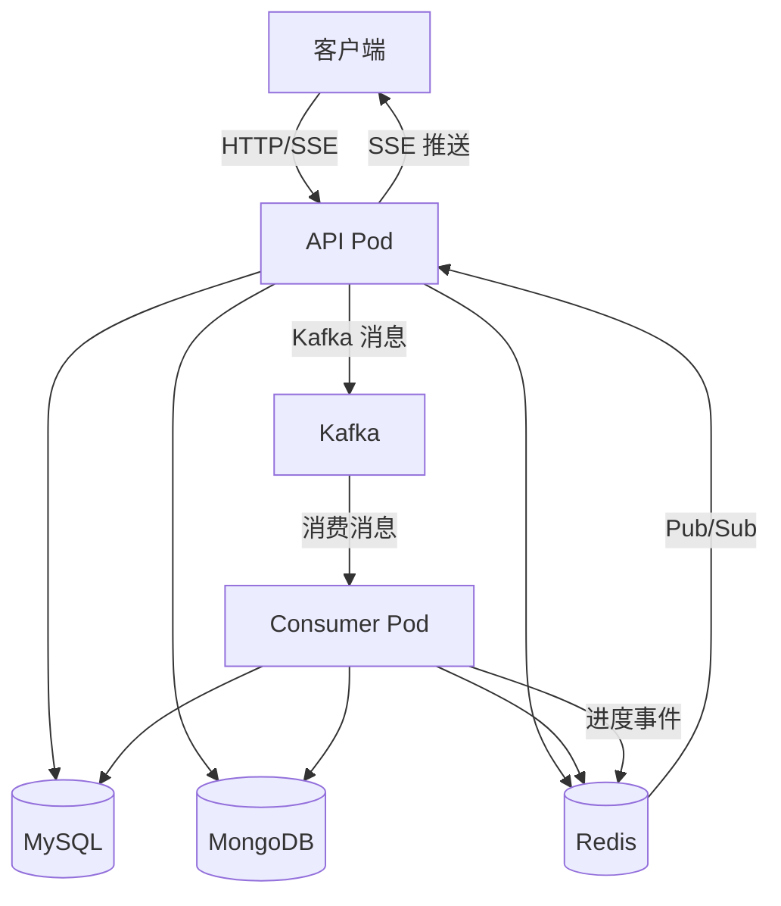

### 1.2 分层架构

```
Controller → Service → DAO → Database
     ↓
  Exception → GlobalExceptionHandler → R<T> 统一响应
```

- **Controller 层**：REST 端点定义，参数校验，通过 `@CurrentUid` 注入当前用户 ID
- **Service 层**：业务逻辑，事务管理
- **DAO 层**：MyBatis Mapper 接口 + XML 映射
- **Model 层**：数据库实体类

### 1.3 基础设施组件

| 组件                 | 用途                                      | 配置                   |
| -------------------- | ----------------------------------------- | ---------------------- |
| **MySQL** (HikariCP) | 用户、订单、会话、积分等关系数据          | 连接池 max=2           |
| **MongoDB**          | 研究文章、链接缓存等文档数据              | MongoRepository        |
| **Redis**            | JWT Token 存储、缓存、Pub/Sub 多 Pod 广播 | max=4 连接             |
| **Kafka**            | 异步任务处理（翻译、深度研究）            | 手动 ACK，12h max poll |
| **MinIO**            | S3 兼容对象存储（最大 2GB 文件）          | —                      |

### 1.4 统一响应格式 R\<T\>

**核心类**：`common/api/R.java`

所有 API 响应统一包装为：

```json
{
  "code": 0,
  "data": { ... },
  "msg": ""
}
```

工厂方法：

```java
R.success(data)                    // code=0，成功返回数据
R.fail(ResultCode.XXX)             // 业务错误码
R.fail(ResultCode.XXX, "自定义消息") // 自定义错误消息
```

### 1.5 异常处理体系

**错误码规范**（`common/api/ResultCode.java`）：

| 区间      | 领域              | HTTP 状态码 |
| --------- | ----------------- | ----------- |
| 0         | 成功              | 200         |
| 1-99      | 核心系统错误      | 500         |
| 100-199   | 外部服务错误      | 502         |
| 1000-1999 | 认证/授权         | 401         |
| 2000-2999 | 用户管理          | 400         |
| 3000-3999 | 积分/额度         | 400         |
| 4000-4999 | 微信集成          | 400         |
| 5000-5999 | 支付              | 402         |
| 6000-6999 | 内容/互动         | 400         |
| 7000-7999 | 文件管理          | 400         |
| 8000-8999 | AI 服务           | 400         |
| 9000-9999 | 流式/SSE/翻译/API | 400         |

**异常类继承体系**：

```
BusinessException（基类）
├── UserException          — 用户管理错误，如 userNotFound()
├── PaymentException       — 支付错误，如 refundFailed()
├── FileException          — 文件操作错误
├── LlmServiceException    — LLM 集成错误
├── SseException           — 流式传输错误
│   └── DeepResearchSseException
└── JwtAuthenticationException — 认证失败
```

**全局异常处理器**（`common/exception/handlers/GlobalExceptionHandler.java`）自动：

1. 根据错误码区间映射 HTTP 状态码
2. 返回标准化 `R<Object>` 响应
3. 按严重程度分级日志（warn=业务异常，error=系统异常）
4. SSE 异常走流式错误响应

---

## 2. 认证与授权

### 2.1 用户 JWT 认证

**核心类**：

- `util/JwtUtil.java` — Token 生成与解析
- `interceptor/JwtInterceptor.java` — 请求拦截验证

**Token 生成**：

```java
generateToken(String nickname, String unionId, String uid, String from)
```

- 签名密钥：`auth.signing-key`（配置文件）
- 有效期：43200 分钟（30 天）
- Claims：`sub`(uid)、`nickname`、`union_id`、`from`

**请求验证流程**：

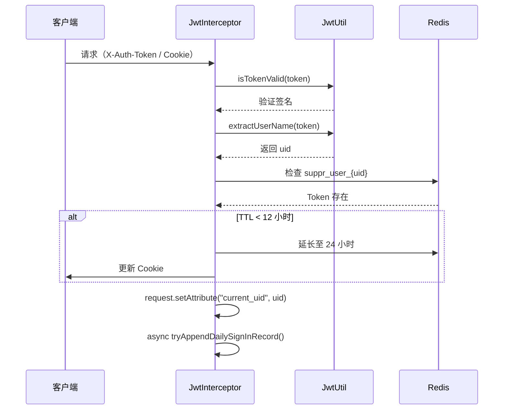

**Token 传递方式**：

- HTTP Header：`X-Auth-Token`
- Cookie：`suppr.session-token`（HttpOnly=false，Secure=true，30天有效期）

**自动续期**：Redis 中 Token 剩余有效期 < 12 小时时，自动延长至 24 小时并更新 Cookie。

### 2.2 管理员认证

**核心类**：

- `util/AdminJwtUtil.java` — 独立签名密钥
- `interceptor/AdminJwtInterceptor.java` — 管理员拦截器

与用户 JWT 结构相同，但使用独立的签名密钥（`auth.admin-signing-key`）和 Header（`X-Admin-Auth-Token`）。Cookie 名为 `admin-suppr.session-token`，Redis 键为 `admin_suppr_user_{uid}`。

**管理员登录流程**（微信扫码）：

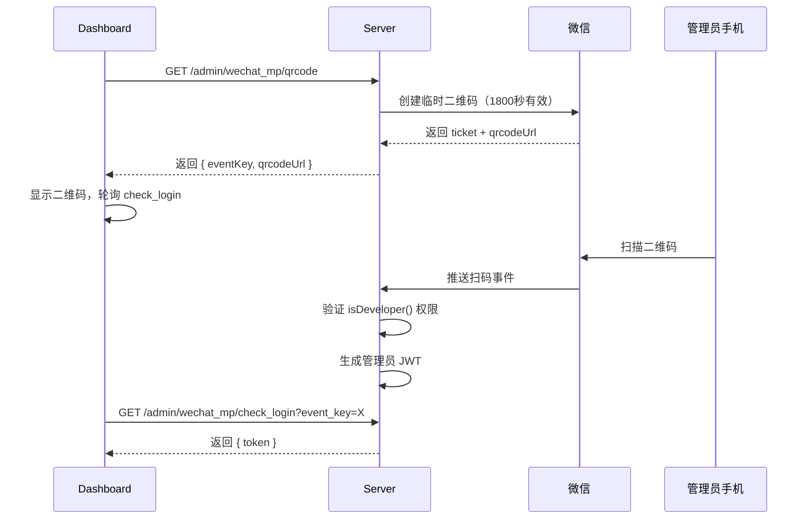

**关键限制**：只有 `isDeveloper()=true` 的用户才能以管理员身份登录。

### 2.3 API Key 认证

**核心类**：

- `interceptor/ApiKeyAuthInterceptor.java` — API Key 验证拦截器
- `util/ApiKeyUtil.java` — Key 格式校验与哈希

**Key 格式**：`sk-<32字节随机Base64URL编码>`

**认证流程**：

1. 从 `X-API-Key` Header 或 `Authorization: Bearer` Header 提取 Key
2. 格式校验：必须以 `sk-` 开头且为合法 Base64
3. SHA-256 哈希后查数据库
4. 校验 Key 状态（active）和有效期
5. 校验 Scope 权限：
   - `/api/v1/translations/**` → 需要 `FILE_TRANSLATION` scope
   - `/api/v1/docs/**` → 需要 `DOC_SEARCH` scope
6. 存入 request attribute `apiKeyTab` 供 Controller 使用

### 2.4 拦截器链与公开路径

**注册顺序**（`autoconfiguration/WebMvcConfiguration.java`）：

| 顺序 | 拦截器                 | 作用                           |
| ---- | ---------------------- | ------------------------------ |
| 1    | `UserAgentInterceptor` | 过滤爬虫                       |
| 2    | `RateLimitInterceptor` | 频率限制                       |
| 3    | `LogInterceptor`       | 请求日志                       |
| 4    | `AdminJwtInterceptor`  | 管理员认证（仅 `/admin/**`）   |
| 5    | `JwtInterceptor`       | 用户认证（全局，排除公开路径） |

**公开路径**（无需认证）：

```
/ping, /enum/list, /file/**, /wechat_mp/**, /wechat_ma/auth,
/wechat_ma/exchange_token, /wechat_pay/notify/**,
/ai_session/share/**, /cart/promotion, /cart/get_products,
/cart/plans, /share/square, /share/detail,
/deep_research/share/stream/**, /admin/**, /api/v1/**, ...
```

### 2.5 @CurrentUid 注解

**定义**：`common/annotation/CurrentUid.java`
**解析器**：`common/annotation/CurrentUidMethodArgumentResolver.java`

```java
// Controller 中使用
@GetMapping("/me")
public R<UserInfo> me(@CurrentUid String uid) {
    return R.success(userService.findByUid(uid));
}

// 解析器从 request attribute 中取值
String uid = webRequest.getAttribute("current_uid", REQUEST_SCOPE);
```

---

## 3. 用户管理

### 3.1 微信公众号 OAuth 登录

**核心类**：

- `controller/WechatMpController.java` — 端点定义
- `service/impl/WechatMpServiceImpl.java` — 业务逻辑

**流程**：

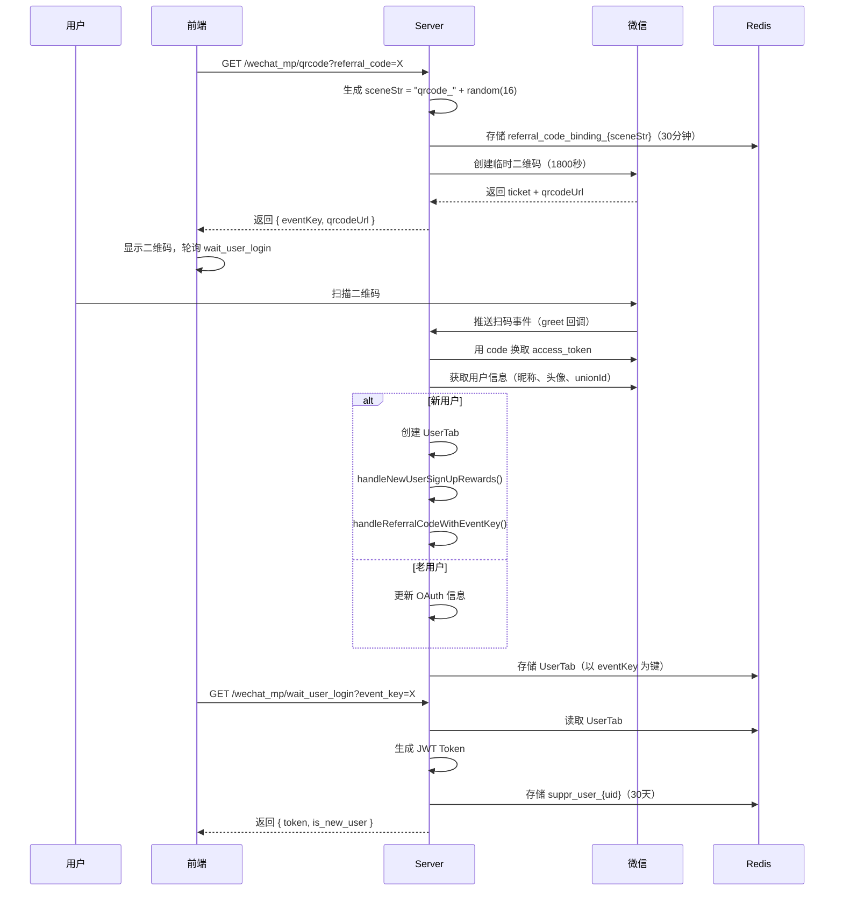

### 3.2 微信小程序登录

**核心类**：

- `controller/WechatMinappController.java`
- `service/impl/WechatMaServiceImpl.java`

**流程**：

1. 小程序获取微信授权 code
2. `POST /wechat_ma/auth` 提交 code + 可选 referralCode
3. 服务端调用 `wxMaService.jsCode2SessionInfo(code)` 换取 openId、unionId
4. 若新用户：创建 UserTab → 发放注册奖励 → 处理邀请码
5. 生成 JWT Token，存入 Redis
6. 返回 `AuthResponse { token }`

**桌面端到小程序过渡**：通过 `generateTemporaryToken()` 生成 1 小时有效的临时 Token（UUID），存储在 Redis `temporary_token:{token}` 中。

### 3.3 邀请码系统

**核心类**：`service/impl/UserServiceImpl.java`、`service/impl/UserRewardServiceImpl.java`

- **生成邀请码**：`generateReferralCode(uid)` — 6 位随机字母数字
- **绑定关系**：`bindReferralCode(ReferralCodeBindingTab)` — 记录邀请人与被邀请人
- **奖励发放**：`handleReferralRewards()` — 邀请双方各获得积分奖励
- **统计查询**：`getReferralCodeStat(uid)` — 返回邀请人数和累计积分

### 3.4 新用户注册奖励

**方法**：`UserRewardServiceImpl.handleNewUserSignUpRewards(UserTab, String context)`

| 奖励     | 数量                        | 有效期 | 条件                                          |
| -------- | --------------------------- | ------ | --------------------------------------------- |
| 注册积分 | 500 点                      | 1 个月 | PointType=SIGN_UP 无记录                      |
| 免费会员 | 7 天                        | 7 天   | 无 FREE_TRIAL 零元订单（SKU=MEMBER_BASIC_7D） |
| 会员积分 | 由 SKU 配置（默认 5000 点） | 7 天   | 伴随免费会员发放                              |
| API 积分 | 2000 点                     | —      | 无既有 API 注册积分                           |

---

## 4. 积分系统

### 4.1 积分类型

**枚举**：`enums/PointType.java`

| 类别         | 类型                       | 说明       |
| ------------ | -------------------------- | ---------- |
| **免费积分** | `SIGN_UP`                  | 注册赠送   |
|              | `INVITED_REGISTRATION`     | 被邀请注册 |
|              | `INVITING_OTHERS`          | 邀请他人   |
|              | `SIGN_IN`                  | 每日签到   |
|              | `SHARE_LIKED`              | 分享被点赞 |
| **消费记录** | `REGULAR_SEARCH`           | 普通搜索   |
|              | `FLAGSHIP_SEARCH`          | 旗舰搜索   |
|              | `DEEP_RESEARCH`            | 深度研究   |
|              | `FILE_TRANSLATION`         | 文件翻译   |
| **购买积分** | `POINT_PACKAGE`            | 积分包     |
|              | `MEMBERSHIP_POINT_PACKAGE` | 会员积分包 |
|              | `API_POINT_PACKAGE`        | API 积分包 |
| **系统操作** | `EXPIRATION`               | 过期扣除   |
|              | `REFUND_WITHDRAWAL`        | 退款回收   |

### 4.2 数据库表结构

| 表名                       | 模型类                  | 用途                             |
| -------------------------- | ----------------------- | -------------------------------- |
| `user_available_point_tab` | `UserAvailablePointTab` | 可用积分（含过期时间、来源订单） |
| `user_frozen_point_tab`    | `UserFrozenPointTab`    | 冻结积分（关联操作 ID 和类型）   |
| `user_consumed_point_tab`  | `UserConsumedPointTab`  | 消费记录                         |
| `user_point_record_tab`    | `UserPointRecordTab`    | 全量积分流水（收入/支出）        |

### 4.3 积分生命周期

**核心类**：`service/impl/PointServiceImpl.java`

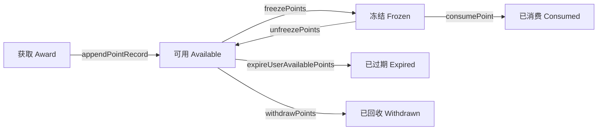

#### 获取（Award）

```java
appendPointRecord(UUID uid, PointType type, Long point, String description, ValidityPeriod validityPeriod)
```

- 创建 `UserAvailablePointTab` 记录（含过期时间）
- 创建 `UserPointRecordTab` 审计记录

#### 冻结（Freeze）

```java
freezePoints(String uid, Long freezeAmount, PointType operationType,
             String operationId, String operationDescription, boolean exactAmount)
```

- 按过期时间排序（最先过期的优先冻结，FIFO）
- 创建 `UserFrozenPointTab` 记录，关联操作 ID
- `exactAmount=true`：积分不足则抛异常
- `exactAmount=false`：允许部分冻结

#### 消费（Consume）

```java
consumePoint(String uid, PointType type, String description, Long totalPoint, boolean exactAmount)
```

- 获取未冻结的可用积分（通过视图 `UserAvailablePointTabWithTotalFrozenPoint`）
- 创建 `UserConsumedPointTab` 消费记录
- 更新 `UserAvailablePointTab`（扣减或删除）
- 积分不足时抛出 `ConsumePointZeroException`

#### 过期（Expire）

- 定时任务每小时执行
- 查找 `expire_time <= now` 的可用积分
- 批量处理（每批 100 条）：创建负数流水 → 标记软删除

#### 回收（Withdraw）

```java
withdrawPoints(String uid, long amount, String reason)
withdrawPointsByOrderId(String uid, String orderId)
```

- 退款时回收积分，按过期时间排序（最先过期的优先扣减）
- 支持按订单 ID 精确回收

### 4.4 有效期枚举

`ValidityPeriod` 定义了积分有效窗口：

| 枚举值                   | 说明              |
| ------------------------ | ----------------- |
| `TODAY`                  | 当日 23:59:59     |
| `ONE_DAY`、`ONE_WEEK`    | 相对发放时间      |
| `ONE_MONTH` ~ `ONE_YEAR` | 按月计算          |
| `NO_EXPIRY`              | 设置为 9999-12-31 |

---

## 5. 会员体系

### 5.1 会员数据模型

**模型**：`model/MembershipTab.java`
**DAO**：`dao/MembershipTabDao.java`

```java
public class MembershipTab {
    UUID uid;                        // 用户 ID
    LocalDateTime expireTime;        // 到期时间
    String productId;                // V2: 关联商品
    String skuId;                    // V2: SKU 规格
    LocalDateTime lastPointGrantTime; // V2: 上次发放月度积分的时间
    String orderId;                  // V2: 关联订单
}
```

### 5.2 会员类型

会员等级通过 `ProductTab.tierRank` 区分，数值越高等级越高。典型会员时长：

- 1 个月会员
- 3 个月会员
- 1 年会员
- 7 天免费试用（新用户专享，SKU=MEMBER_BASIC_7D，orderType=FREE_TRIAL）

### 5.3 V2 积分发放策略

**入口**：`PointServiceImpl.createMembershipPointPackages()`

#### 月制会员（≥1个月）

调用 `createMonthlyPointPackages(uid, productInfo, baseTime, months)`：

- 将积分拆分为 N 个独立积分包（每月一个）
- 第 i 个包：起始时间 `baseTime + 30*(i-1)` 天，过期时间 `baseTime + 30*i` 天
- 每包积分量：`productInfo.getPointAmountPerMonth()`
- 优势：月度刷新，退款可按比例回收

#### 短期会员（按天，如7天试用）

调用 `createDailyPointPackages(uid, productInfo, baseTime, validityPeriod)`：

- 创建单个积分包，覆盖整个有效期
- 积分量：`productInfo.getPointAmount()`

### 5.4 月度积分自动发放

**定时任务**：`cron/MembershipPointCronTask.java`

```
Cron: 0 30 1 * * ?（每日凌晨 1:30）
```

逻辑：

1. 查询所有未过期会员
2. 检查 `lastPointGrantTime` 是否在本月已发放
3. 未发放则创建当月积分包
4. 更新 `lastPointGrantTime`

### 5.5 升级与续费逻辑

**升级检测**（`CartServiceImpl.createAndSubmitOrderBySku()`）：

- 比较目标商品与当前会员的 `tierRank`
- `targetTierRank > currentTierRank` → 升级（orderType=UPGRADE）
- `skip_upgrade=true` → 跳过升级检测，全价购买（orderType=PURCHASE）
- **零元升级**：升级差价为 0 时直接创建 SUCCESS 订单并发放积分
- **付费升级**：计算按比例的升级差价，走正常支付流程

**topUp 升级检测**（`handleMembershipTopUp()`）：

- 仅 `orderType=UPGRADE` 的订单走实时升级路径（替换 product/sku + 补发积分 + ACTIVE）
- 其他类型（PURCHASE / CARD_UPGRADE / ADMIN_GIFT / FREE_TRIAL）一律进 QUEUED

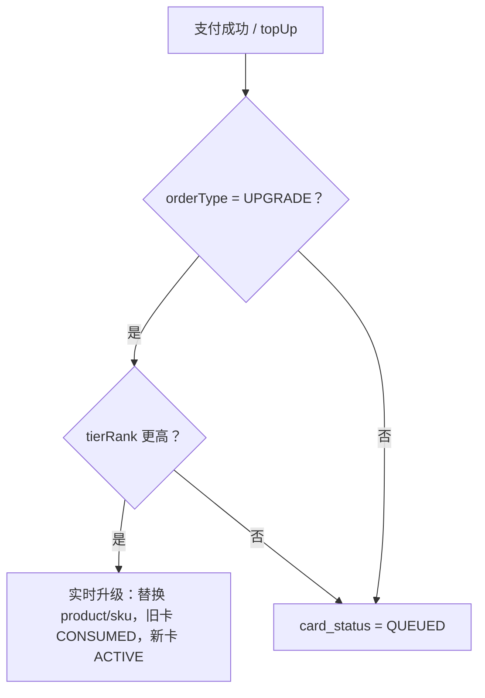

### 5.6 会员与积分消费的关系

有效会员用户使用 AI 服务时，服务层检查 `membershipTabDao.findNonExpiredMembershipByUid(uid, now)`：

- 有效会员 → 部分服务跳过积分扣减，返回 `PointInfo.membership=true`
- 无会员 → 正常积分冻结/消费流程

---

## 6. AI 文献搜索（LLM Session）

### 6.1 核心类

| 类                       | 路径                                        | 职责      |
| ------------------------ | ------------------------------------------- | --------- |
| `LlmSessionController`   | `controller/LlmSessionController.java`      | REST 端点 |
| `V2LlmSessionController` | `controller/v2/V2LlmSessionController.java` | V2 版端点 |
| `AiSessionService`       | `service/AiSessionService.java`             | 服务接口  |
| `AiSessionServiceImpl`   | `service/impl/AiSessionServiceImpl.java`    | 业务逻辑  |

### 6.2 搜索模式与积分消耗

**枚举**：`dto/llm/LlmSearchMode.java`

| 模式          | 积分消耗 | 说明                   |
| ------------- | -------- | ---------------------- |
| `REGULAR`     | 10 点    | 普通搜索               |
| `FLAGSHIP`    | 20 点    | 旗舰模型搜索（需会员） |
| `PURE_SEARCH` | 5 点     | 纯文献检索             |
| `DEEP`        | 30 点    | 深度搜索               |

### 6.3 会话创建与搜索流程

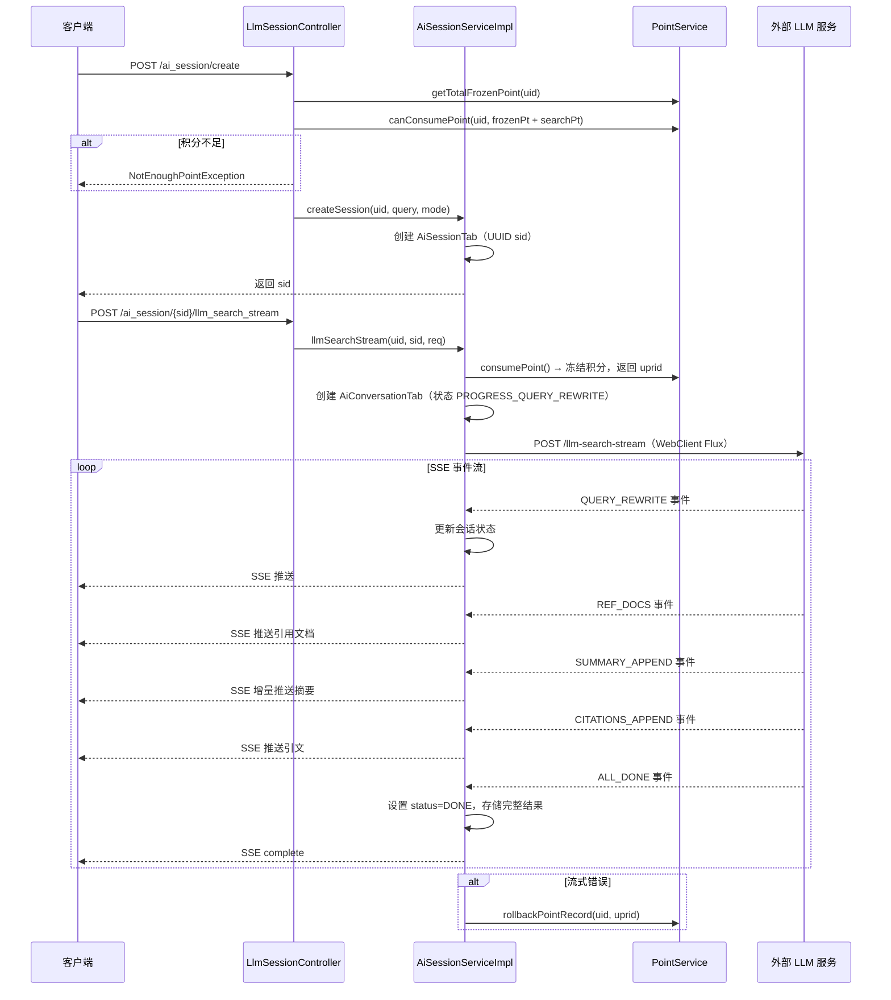

### 6.4 SSE 事件类型

| 事件               | 说明             |
| ------------------ | ---------------- |
| `QUERY_REWRITE`    | 查询改写结果     |
| `REF_DOCS`         | 引用文献列表     |
| `SUMMARY_APPEND`   | 摘要内容增量追加 |
| `CITATIONS_APPEND` | 引文信息增量追加 |
| `ALL_DONE`         | 搜索完成信号     |

### 6.5 积分冻结/消费流程

1. 搜索开始时调用 `pointService.consumePoint()` 冻结对应积分，获得记录 ID `uprid`
2. 搜索成功完成 → 积分正式消费
3. 搜索出错 → 调用 `pointService.rollbackPointRecord(uid, uprid)` 回滚积分

---

## 7. 深度研究（Deep Research）

### 7.1 核心类

| 类                               | 路径                                                           | 职责                   |
| -------------------------------- | -------------------------------------------------------------- | ---------------------- |
| `DeepResearchController`         | `controller/DeepResearchController.java`                       | REST + SSE 端点        |
| `DeepResearchSessionServiceImpl` | `service/impl/DeepResearchSessionServiceImpl.java`             | 会话管理               |
| `DeepResearchSessionManager`     | `service/impl/deepresearch/DeepResearchSessionManager.java`    | Kafka 消费后的核心处理 |
| `DeepResearchSseEmitterManager`  | `service/impl/deepresearch/DeepResearchSseEmitterManager.java` | SSE 连接管理           |
| `DeepResearchRedisEventHandler`  | `service/impl/deepresearch/DeepResearchRedisEventHandler.java` | Redis Pub/Sub 广播     |
| `DeepResearchTaskProducer`       | `kafka/DeepResearchTaskProducer.java`                          | Kafka 生产者           |
| `DeepResearchTaskConsumer`       | `kafka/DeepResearchTaskConsumer.java`                          | Kafka 消费者           |

### 7.2 Kafka 异步处理架构

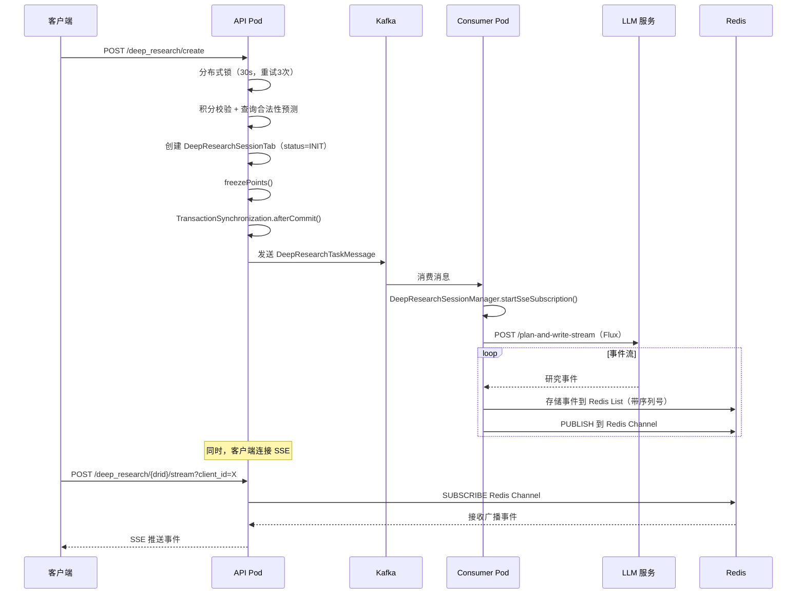

### 7.3 Redis Pub/Sub → SSE 流式推送

**数据结构**：

```java
// SSE 连接管理
ConcurrentHashMap<String, ConcurrentHashMap<String, SseEmitter>>
//              drid                clientId         emitter

// Redis 事件存储
Redis List: drid → [RedisEvent{seq, drid, data}, ...]
Redis Key:  position_prefix + drid → 当前序列号（AtomicInteger）
```

**广播流程**：

1. Consumer Pod 从 LLM 服务收到事件
2. 递增序列号，存入 Redis List（带 TTL = 2 小时）
3. 发布事件到 Redis Channel（`deep-research.redis.channel-name`）
4. 所有 API Pod 上的 `DeepResearchRedisEventHandler` 收到消息
5. 查找当前 Pod 上关联该 `drid` 的所有 `SseEmitter`
6. 向每个 Emitter 发送事件：`emitter.send(SseEmitter.event().id(seqNum).data(data))`

### 7.4 重连机制（last_event_id）

**端点**：`POST /deep_research/{drid}/stream?client_id=X&last_event_id=Y`

**处理逻辑**（`DeepResearchSseEmitterManager.handleStream()`）：

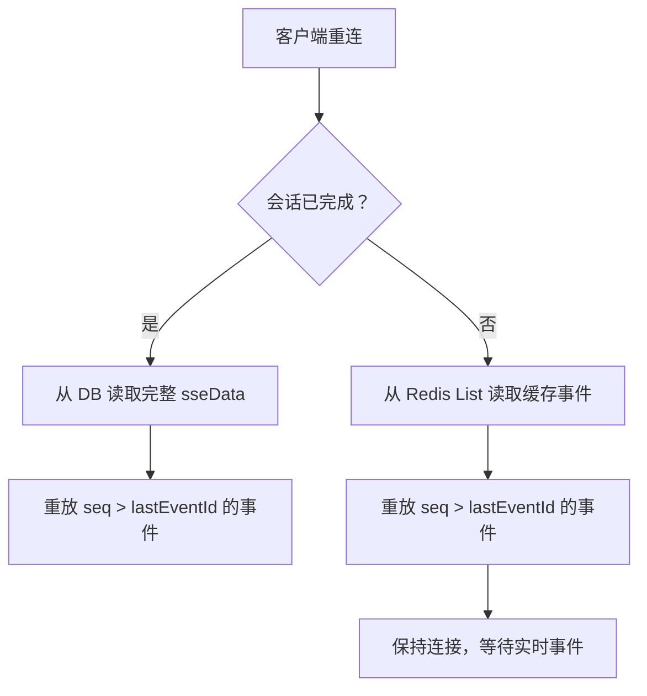

### 7.5 重试与错误处理

- **重试次数**：通过配置 `deep-research.retry-count` 控制
- **重试追踪**：`AtomicInteger retryCount` + `retryErrorMsgs` 字段
- **重试逻辑**：LLM 流出错时调用 `handleRetryOrFinalError()`，未超限则重试
- **错误事件**：发送 `CustomError` 类型事件，所有连接的客户端收到后可展示错误

### 7.6 SSE 事件类型

```
PreSearchPlan → PreSearchStart → PreSearchSearch → PreSearchEnd
→ WritePlan → WriteStart → WriteThinkNextStep → WriteSearch → WriteWrite → WriteEnd
→ WriteFileReady（文件 URL）→ TokenUsage → AllDone
```

特殊事件：`CustomError`（错误信息）、`RetryReload`（重试通知）

### 7.7 会话状态流转

```
INIT → WRITE → DONE
         ↘ ERROR
```

### 7.8 超时配置

| 配置项                   | 值                    | 说明              |
| ------------------------ | --------------------- | ----------------- |
| `SSE_TIMEOUT_MS`         | 7,200,000ms（2小时）  | SseEmitter 超时   |
| `EVENT_STREAM_TIMEOUT`   | 12 小时               | WebClient 流超时  |
| Spring MVC async timeout | 3,000,000ms（50分钟） | HTTP 异步请求超时 |

---

## 8. 文件翻译

### 8.1 核心类

| 类                           | 路径                                           | 职责                     |
| ---------------------------- | ---------------------------------------------- | ------------------------ |
| `FileTranslationController`  | `controller/FileTranslationController.java`    | REST 端点                |
| `FileTranslationServiceImpl` | `service/impl/FileTranslationServiceImpl.java` | 业务逻辑                 |
| `FileTranslateTaskProducer`  | `kafka/FileTranslateTaskProducer.java`         | Kafka 生产者（智能分区） |
| `FileTranslateTaskConsumer`  | `kafka/FileTranslateTaskConsumer.java`         | Kafka 消费者（并发控制） |

### 8.2 两阶段处理流程

#### 阶段一：预翻译（Pre-Translate）

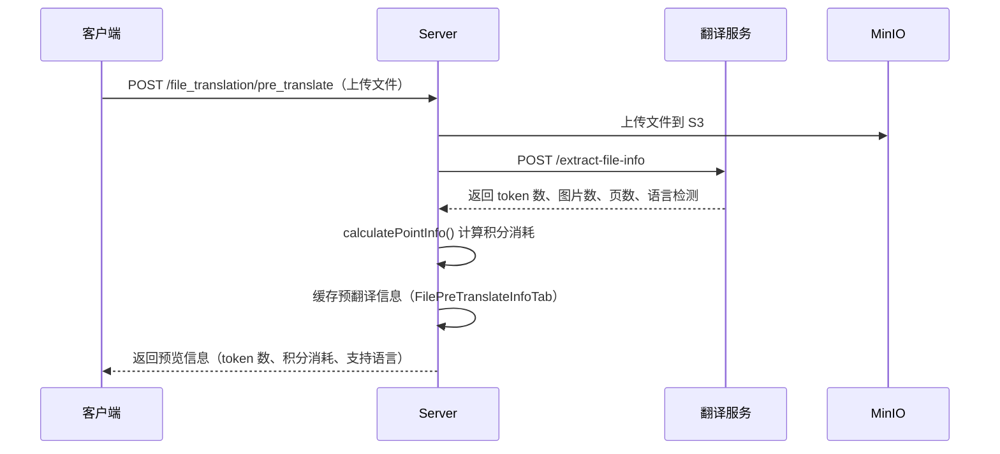

支持的上传方式：

- `POST /pre_translate` — 文件上传（MultipartFile）
- `POST /pre_translate_url` — URL 链接（含缓存）
- `POST /pre_translate_binary_file` — 原始二进制文件
- `POST /pre_translate_html` — HTML 内容

#### 阶段二：正式翻译（Start Translate）

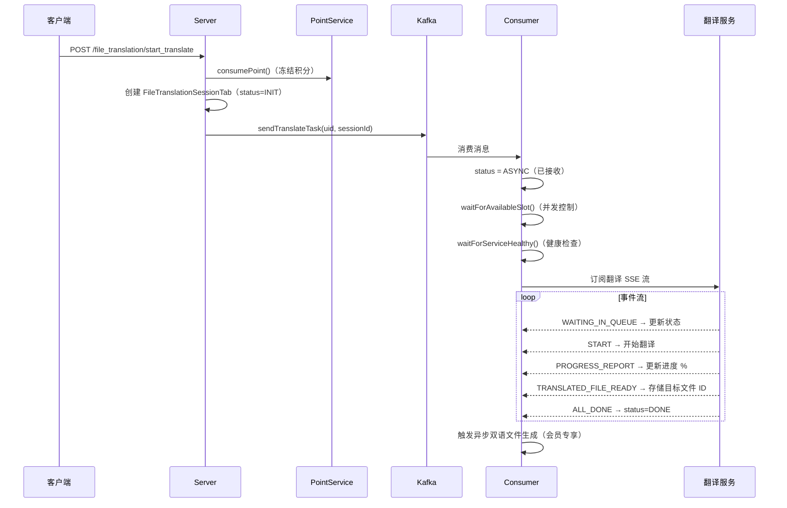

### 8.3 Kafka Consumer 并发控制

**核心机制**（`FileTranslateTaskConsumer`）：

| 控制项           | 实现                                                  | 说明                     |
| ---------------- | ----------------------------------------------------- | ------------------------ |
| 每用户并发限制   | Redis 计数器 `file_translation:active_tasks:{uid}`    | 会员 3 个，非会员 1 个   |
| 等待检查间隔     | 2 秒轮询，30 秒一次日志                               | `waitForAvailableSlot()` |
| 翻译服务健康检查 | `/health-check` 端点，超时 2 秒                       | 5 秒重试间隔             |
| 任务执行器       | `CompletableFuture.runAsync(fileTranslationExecutor)` | 专用线程池               |
| 分区追踪         | Redis 标记分区忙碌状态，12 小时 TTL                   | 智能分区选择             |

### 8.4 智能分区选择

`FileTranslateTaskProducer.sendTranslateTask()`：

1. 通过 Redis MGET 批量检查所有分区的忙碌状态
2. 优先选择空闲分区
3. 无空闲分区时回退到 Round-Robin
4. 发送后标记该分区为忙碌（12 小时 TTL）

### 8.5 停止信号机制

- 设置 Redis Key：`file_translation:stop:{sessionId}`（值为停止原因）
- Consumer 每 1 秒检查一次
- 检测到信号后：释放 Flux 订阅 → 回滚积分 → 标记 session ERROR
- 任务完成后自动清理停止信号

### 8.6 双语对照文件生成

- **触发时机**：翻译完成（ALL_DONE）后异步触发
- **限制**：仅会员用户自动生成
- **技术**：通过 Gotenberg 服务将源文件和译文合并为 PDF
- **存储**：上传到 MinIO，URL 存储在 `FileTranslationSessionTab.dualFileUrl`
- **手动触发**：`POST /file_translation/dual_concat_files/{sessionId}`

### 8.7 会话状态流转

```
INIT → ASYNC → WAIT_IN_QUEUE → PROGRESS → DONE
                                         ↘ ERROR
```

### 8.8 支持的文件格式

| 格式       | 扩展名                     |
| ---------- | -------------------------- |
| Word       | .docx, .doc                |
| Excel      | .xlsx, .xls                |
| PowerPoint | .pptx, .ppt                |
| PDF        | .pdf（仅预览，不支持输出） |

---

## 9. 购物车与支付

### 9.1 核心类

| 类                    | 路径                                  | 职责              |
| --------------------- | ------------------------------------- | ----------------- |
| `CartController`      | `controller/CartController.java`      | 购物车 + 订单端点 |
| `CartServiceImpl`     | `service/impl/CartServiceImpl.java`   | 订单业务逻辑      |
| `WechatPayController` | `controller/WechatPayController.java` | 支付回调（公开）  |
| `RefundServiceImpl`   | `service/impl/RefundServiceImpl.java` | 退款逻辑          |

### 9.2 订单创建与提交流程

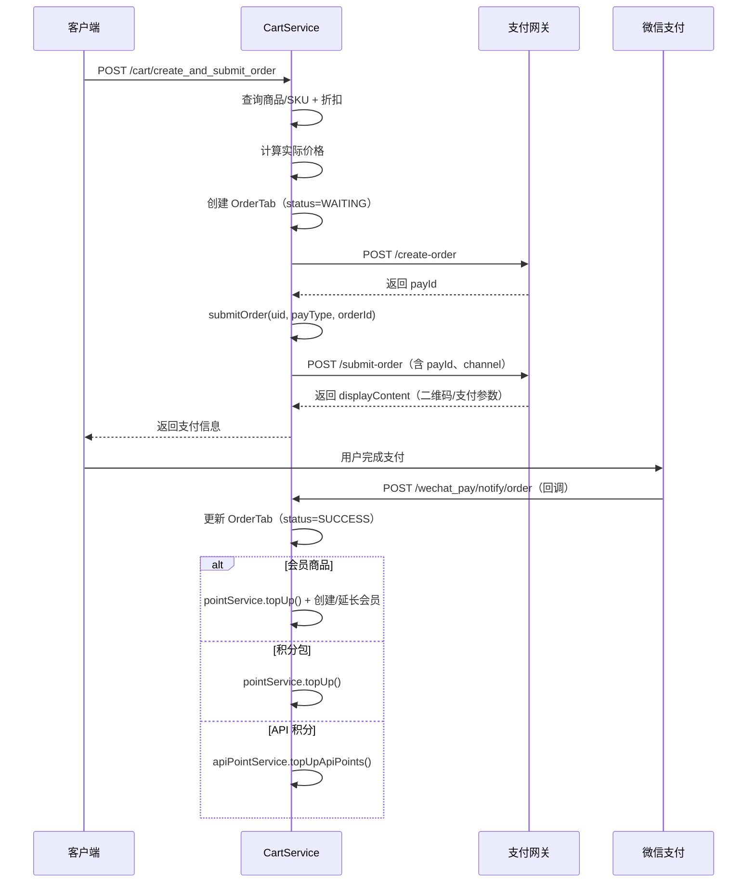

### 9.3 订单状态流转

```
WAITING（待支付）→ SUCCESS（已支付）→ REFUND（已退款）
           ↘ CLOSED（已关闭/取消）
```

### 9.4 微信支付集成

**回调处理**（`WechatPayController.parseOrderNotifyResult()`）：

1. 接收 `POST /wechat_pay/notify/order` 回调
2. 验证订单存在且状态为 WAITING
3. 原子更新状态：`WAITING → SUCCESS`
4. 根据商品类型发放权益（积分/会员/API 积分）

**小程序支付**：提交订单时注入 `openId`，支持 `WX_LITE` 渠道。

### 9.5 退款处理流程

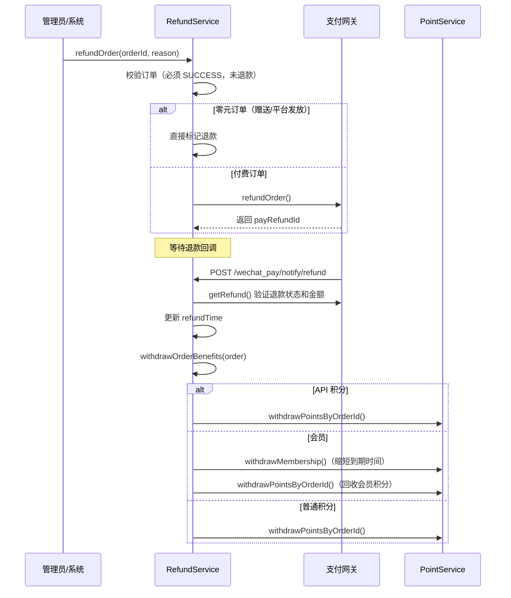

---

## 10. 内容分享

### 10.1 核心类

| 类                      | 路径                                    | 职责         |
| ----------------------- | --------------------------------------- | ------------ |
| `ShareSquareController` | `controller/ShareSquareController.java` | REST 端点    |
| `ShareServiceImpl`      | `service/impl/ShareServiceImpl.java`    | 分享业务逻辑 |

### 10.2 可分享内容

| 类型         | 来源                                 | itemType        |
| ------------ | ------------------------------------ | --------------- |
| AI 对话      | `AiSessionTab` + `AiConversationTab` | `conversation`  |
| 深度研究报告 | `DeepResearchSessionTab`             | `deep_research` |

### 10.3 分享流程

1. **创建分享项**：前端生成 `ShareItemTab` 记录
2. **公开到广场**：`POST /share/share_to_square`
   - 校验分享归属和封禁状态
   - 设置 `shareToSquare=true`
   - 生成 URL Slug：标题拼音 + Unix 时间戳
3. **异步封面生成**：调用 LLM 生成封面图 prompt → Gotenberg 转 PNG → 上传 CDN

### 10.4 分享访问方式

| 方式     | 参数                             | 说明         |
| -------- | -------------------------------- | ------------ |
| UUID     | `shareId`                        | 直接查找     |
| URL Slug | `sharePinyin` + `shareTimestamp` | SEO 友好链接 |

### 10.5 点赞系统

**端点**：`POST /share/like_or_dislike`

| 操作      | 行为                                          |
| --------- | --------------------------------------------- |
| `LIKE`    | 插入/更新 `ShareLikeTab`（like_type=LIKE）    |
| `DISLIKE` | 插入/更新 `ShareLikeTab`（like_type=DISLIKE） |
| `REMOVE`  | 删除 `ShareLikeTab` 记录                      |

响应包含总点赞数、总踩数、当前用户的操作状态。

### 10.6 发现广场

**端点**：`GET /share/square`（公开，无需认证）

- 仅展示 `shareToSquare=true` 且未被封禁的内容
- 支持按 `itemType` 筛选
- 分页：offset + limit
- 批量填充点赞信息（避免 N+1 查询）

---

## 11. API 开放平台

### 11.1 核心类

| 类                           | 路径                                              | 职责             |
| ---------------------------- | ------------------------------------------------- | ---------------- |
| `ApiKeyAuthInterceptor`      | `interceptor/ApiKeyAuthInterceptor.java`          | API Key 认证     |
| `ApiUsageLoggingInterceptor` | `interceptor/ApiUsageLoggingInterceptor.java`     | 使用量记录       |
| `APIKeyService`              | `service/APIKeyService.java`                      | Key CRUD         |
| `APIKeyAuditLogService`      | `service/APIKeyAuditLogService.java`              | 审计日志         |
| `ApiTranslationController`   | `controller/api/v1/ApiTranslationController.java` | API 翻译端点     |
| `ApiTranslationServiceImpl`  | `service/impl/ApiTranslationServiceImpl.java`     | API 翻译业务逻辑 |

### 11.2 API Key 管理

- **Key 格式**：`sk-<32字节随机Base64URL>`
- **存储**：数据库存储 SHA-256 哈希值，明文 Key 仅在创建时返回一次
- **生命周期**：创建 → 启用/禁用 → 软删除

### 11.3 使用量追踪与积分扣减

**请求处理流程**：

1. `ApiKeyAuthInterceptor.preHandle()` — 认证并注入 `apiKeyTab`
2. Controller 方法处理请求
3. 积分计算：`tokenCount / unitBatchToken * pointPerBatchToken`
   - 配置：每 50 token 消耗 1 积分
4. `PointService.freezePoints()` 冻结积分
5. 任务完成后消费或回滚

### 11.4 审计日志

**拦截器**：`ApiUsageLoggingInterceptor.afterCompletion()`

**异步记录**（不阻塞请求）以下信息：

- 请求起始时间、响应时间（ms）
- 请求大小、响应状态码
- 来源 IP、User-Agent
- 请求/响应数据
- 异常信息

**统计接口**：

- `getUsageStatisticsByApiKey()` — 使用量统计
- `getErrorStatisticsByApiKey()` — 错误统计
- `getTodayHourlyUsage()` — 今日逐小时使用量
- `getAnalytics()` — N 天分析数据

---

## 12. 异步处理架构

### 12.1 Kafka 三大 Topic

| Topic                        | 默认分区数 | 并发/节点 | 用途         |
| ---------------------------- | ---------- | --------- | ------------ |
| `FILE_TRANSLATION_TOPIC`     | 10         | 3         | 文件翻译任务 |
| `DEEP_RESEARCH_TOPIC`        | 3          | 3         | 深度研究任务 |
| `API_FILE_TRANSLATION_TOPIC` | 可配置     | 可配置    | API 翻译任务 |

**全局 Kafka 配置**（`application.yml`）：

```yaml
spring.kafka.consumer:
  enable-auto-commit: false # 禁用自动提交
  auto-offset-reset: earliest # 从最早消息开始
  max-poll-records: 100
  properties:
    max.poll.interval.ms: 43200000 # 12 小时（支撑长任务）
listener:
  ack-mode: manual # 手动 ACK
```

### 12.2 事务同步发送机制

**问题**：如果数据库事务未提交就发送 Kafka 消息，Consumer 可能在数据库中找不到记录。

**解决方案**：使用 `TransactionSynchronizationManager` 确保消息在事务提交后发送：

```java
TransactionSynchronizationManager.registerSynchronization(
    new TransactionSynchronization() {
        @Override
        public void afterCommit() {
            producer.sendTask(uid, sessionId);  // 事务提交后才发送
        }
    }
);
```

此模式在 `DeepResearchSessionServiceImpl`、`ApiTranslationServiceImpl`、`WechatMpServiceImpl` 等处使用。

### 12.3 Consumer 可靠消费模式

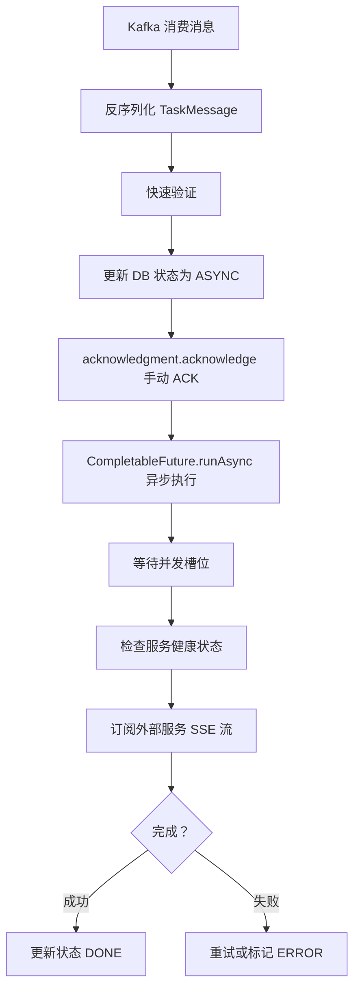

**关键设计**：

- Kafka ACK 在任务移交异步线程后立即确认，不阻塞消费线程
- 12 小时 max poll interval 确保长任务不会被 Kafka 重新分配
- 每条消息通过 `operationId` 实现幂等性

---

## 13. SSE 流式架构

### 13.1 SseEmitter 配置

```java
// 深度研究
SseEmitter emitter = new SseEmitter(7200000L);  // 2 小时

// Spring MVC 全局
spring.mvc.async.request-timeout: 3000000       // 50 分钟
```

### 13.2 Redis Pub/Sub 多 Pod 广播

**问题**：Consumer Pod 处理任务并生成事件，但客户端连接在 API Pod 上。

**解决方案**：

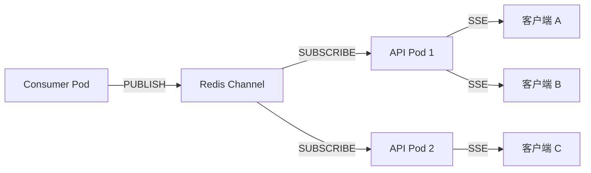

**实现**：

- Consumer Pod 将事件发布到 Redis Channel
- 所有 API Pod 通过 `RedisMessageListenerContainer` 订阅该 Channel
- 收到事件后，查找本 Pod 上关联的 `SseEmitter` 并推送

### 13.3 客户端重连与断点续传

**事件缓存**：每个事件带递增序列号 `seq`，存储在 Redis List 中（TTL = 2 小时）。

**重连流程**：

1. 客户端断开连接
2. 重连时携带 `last_event_id=N`
3. 服务端从 Redis List 读取缓存事件
4. 过滤 `seq > N` 的事件逐一推送
5. 推送完毕后保持连接，等待实时事件

**会话完成后重连**：从数据库 `sseData` 字段读取完整事件记录并重放。

### 13.4 SSE 连接管理

```java
// 连接映射结构
ConcurrentHashMap<String, ConcurrentHashMap<String, SseEmitter>>
//              drid (会话ID)     clientId (浏览器标签)

// 生命周期回调
emitter.onCompletion(() -> removeEmitter(drid, clientId));
emitter.onTimeout(() -> removeEmitter(drid, clientId));
emitter.onError(e -> removeEmitter(drid, clientId));
```

支持同一会话多个客户端同时连接（不同 `clientId`）。

---

## 14. 定时任务

### 14.1 ShedLock 分布式锁

使用 ShedLock 确保多 Pod 部署下定时任务只在一个节点执行。

**配置**：`config/SchedulerLockProperties.java`

每个任务配置：

- `name` — 锁标识
- `lockAtMostFor` — 最大持锁时间（防死锁）
- `lockAtLeastFor` — 最小持锁时间（防重复执行）

### 14.2 任务清单

**文件**：`cron/DailyCronTask.java`、`cron/MembershipPointCronTask.java`

| 任务                           | 调度      | 锁时间              | 说明                       |
| ------------------------------ | --------- | ------------------- | -------------------------- |
| `expireUserAvailablePoints`    | 每小时    | max 120s, min 5s    | 批量过期可用积分           |
| `expireFileTranslationSession` | 每小时    | max 120s, min 5s    | 清理过期翻译会话           |
| `expireDeepResearchSession`    | 每小时    | max 120s, min 5s    | 清理过期研究会话           |
| `pullLatestDocs`               | 每日 0:00 | max 20min, min 1min | 同步最新文档（仅生产环境） |
| `grantMembershipPoints`        | 每日 1:30 | max 10min, min 1min | V2 会员月度积分发放        |

### 14.3 积分过期任务详解

**方法**：`PointServiceImpl.expireUserAvailablePoints(LocalDateTime now)`

```
1. 查询 expire_time <= now 的可用积分
2. 分批处理（每批 100 条）
3. 每条记录：
   a. 创建负数 UserPointRecordTab（type=EXPIRATION）
   b. 创建 UserConsumedPointTab（reason="积分过期"）
   c. 软删除 UserAvailablePointTab（deleted=1, point=0）
```

### 14.4 会员月度积分发放详解

**方法**：`PointServiceImpl.grantMonthlyPoints()`

```
1. 查询所有未过期会员
2. 逐个检查 lastPointGrantTime
3. 若距上次发放 ≥ 30 天：
   a. 创建当月积分包（过期时间 = 今日 + 30 天）
   b. 更新 lastPointGrantTime（截断到当日零点，防漂移）
```

---

> 本文档基于代码库实际实现编写，所有引用的类和方法均可在 `src/main/java/com/wilddata/suppr/` 下找到。
