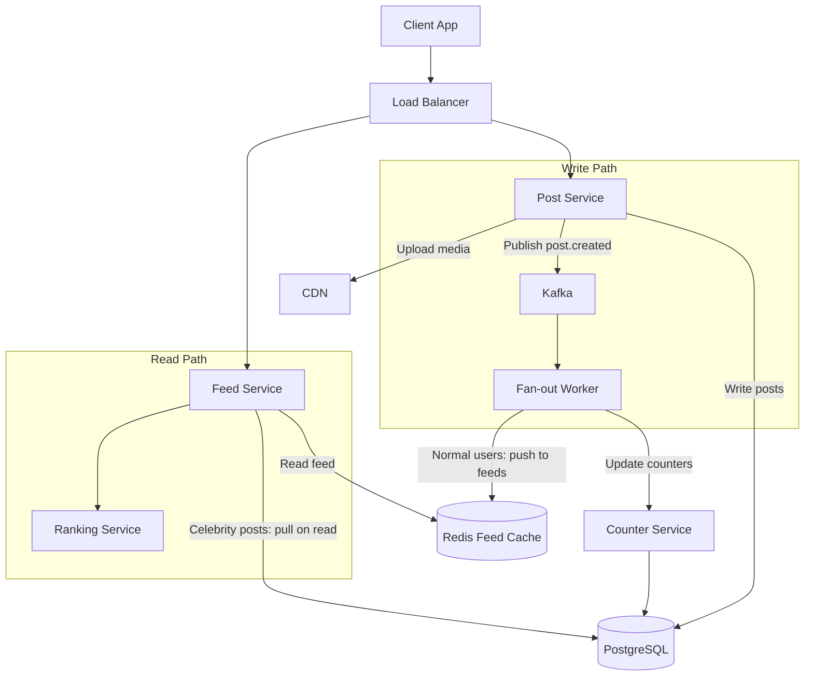
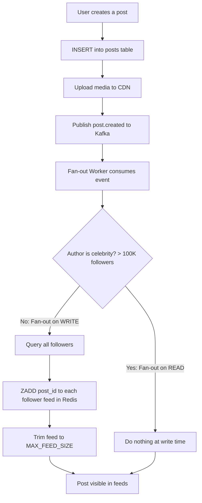
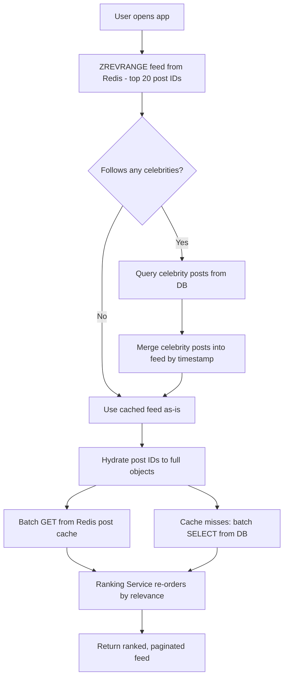

# Data Model: News Feed (Twitter/Facebook)

A news feed system aggregates posts from followed users into a personalized timeline. The core challenge is fan-out: when a user with 10 million followers posts, how do you update 10 million timelines? The data model supports both push (fan-out on write) and pull (fan-out on read) strategies, with a hybrid approach for optimal performance.

## High-Level Architecture



## Table Responsibilities

| Table          | Purpose                                | Storage          | Key Characteristic                      |
| -------------- | -------------------------------------- | ---------------- | --------------------------------------- |
| **users**      | User profiles with denormalized counts | PostgreSQL       | Frequently read, counts updated async   |
| **posts**      | Core content with engagement counters  | PostgreSQL       | Snowflake IDs for time-ordering         |
| **follows**    | Social graph (who follows whom)        | PostgreSQL       | Composite PK prevents duplicate follows |
| **likes**      | Post like records                      | PostgreSQL       | Composite PK prevents double-likes      |
| **comments**   | Threaded comments on posts             | PostgreSQL       | Self-referential for nested replies     |
| **media**      | Media attachments for posts            | PostgreSQL       | One post can have multiple media        |
| **feed_cache** | Pre-computed user timelines            | Redis Sorted Set | The actual feed users see               |

## Detailed Field Descriptions

### users (PostgreSQL)

| Field           | Type                   | Description                                                                                              |
| --------------- | ---------------------- | -------------------------------------------------------------------------------------------------------- |
| user_id         | BIGINT, PK (Snowflake) | Globally unique identifier.                                                                              |
| username        | VARCHAR(50), UNIQUE    | Handle (e.g., @johndoe). Indexed for search.                                                             |
| display_name    | VARCHAR(100)           | Shown in UI above posts.                                                                                 |
| bio             | TEXT                   | Profile description.                                                                                     |
| avatar_url      | VARCHAR(500)           | CDN URL for profile picture.                                                                             |
| follower_count  | INT, DEFAULT 0         | Denormalized count. Updated asynchronously via Kafka consumer to avoid lock contention on viral follows. |
| following_count | INT, DEFAULT 0         | Denormalized count. Same async update pattern.                                                           |

**Why denormalize follower/following counts?** `COUNT(*)` on the follows table for a user with millions of followers would be extremely slow. The denormalized counter is updated asynchronously and is accurate enough for display purposes.

### posts (PostgreSQL)

| Field         | Type                              | Description                                                                                                                    |
| ------------- | --------------------------------- | ------------------------------------------------------------------------------------------------------------------------------ |
| post_id       | BIGINT, PK (Snowflake)            | Time-sortable unique ID. The embedded timestamp eliminates the need for a separate created_at index for chronological sorting. |
| author_id     | BIGINT, FK → users.user_id, INDEX | Who wrote the post. Indexed for "show all posts by user X" queries.                                                            |
| content       | TEXT                              | Post text. Limited to 280 chars for Twitter-style, longer for Facebook-style.                                                  |
| media_ids     | BIGINT[]                          | Array of media IDs attached to this post. Denormalized for fast rendering without joining media table.                         |
| like_count    | INT, DEFAULT 0                    | Denormalized counter. Updated via async counter service to avoid row-level lock contention on viral posts.                     |
| comment_count | INT, DEFAULT 0                    | Denormalized counter. Same pattern as like_count.                                                                              |
| created_at    | TIMESTAMP                         | Redundant with Snowflake timestamp but useful for date-range queries and human readability.                                    |

**Why Snowflake IDs for posts?** Posts are displayed chronologically. Snowflake IDs encode creation time, so sorting by post_id is equivalent to sorting by time — using the primary key index, no secondary index needed.

### follows (PostgreSQL)

| Field       | Type                               | Description                                                                      |
| ----------- | ---------------------------------- | -------------------------------------------------------------------------------- |
| follower_id | BIGINT, PK (composite), FK → users | The user who follows. Part of composite PK.                                      |
| followee_id | BIGINT, PK (composite), FK → users | The user being followed. Together with follower_id, prevents duplicate follows.  |
| created_at  | TIMESTAMP                          | When the follow relationship was created. Used for "recently followed" features. |

**Index strategy:** Two indexes are needed — `(follower_id)` for "who do I follow?" and `(followee_id)` for "who follows me?" The composite PK naturally provides the first; a secondary index is needed for the second.

### likes (PostgreSQL)

| Field      | Type                               | Description                                                             |
| ---------- | ---------------------------------- | ----------------------------------------------------------------------- |
| post_id    | BIGINT, PK (composite), FK → posts | Which post was liked.                                                   |
| user_id    | BIGINT, PK (composite), FK → users | Who liked it. Composite PK prevents double-likes at the database level. |
| created_at | TIMESTAMP                          | When the like was made. Enables "recently liked" feeds.                 |

### comments (PostgreSQL)

| Field             | Type                            | Description                                                               |
| ----------------- | ------------------------------- | ------------------------------------------------------------------------- |
| comment_id        | BIGINT, PK (Snowflake)          | Unique comment identifier.                                                |
| post_id           | BIGINT, FK → posts, INDEX       | Which post this comment belongs to. Indexed for "load comments for post." |
| author_id         | BIGINT, FK → users              | Who wrote the comment.                                                    |
| text              | TEXT                            | Comment content.                                                          |
| parent_comment_id | BIGINT, FK → comments, NULLABLE | Self-referential FK for nested replies. Null means top-level comment.     |
| created_at        | TIMESTAMP                       | Comment creation time.                                                    |

**Why self-referential FK for threading?** This enables nested replies (comment on a comment) with a simple recursive query. The alternative — a separate replies table — would complicate queries without meaningful benefit.

### media (PostgreSQL)

| Field         | Type                        | Description                                                                                                                 |
| ------------- | --------------------------- | --------------------------------------------------------------------------------------------------------------------------- |
| media_id      | BIGINT, PK                  | Unique media identifier.                                                                                                    |
| post_id       | BIGINT, FK → posts, INDEX   | Which post this media belongs to.                                                                                           |
| media_type    | ENUM('image','video','gif') | Determines rendering and processing pipeline.                                                                               |
| url           | VARCHAR(500)                | CDN URL for the full-size media.                                                                                            |
| thumbnail_url | VARCHAR(500)                | CDN URL for thumbnail/preview. Used in feed to avoid loading full media.                                                    |
| dimensions    | VARCHAR(20)                 | Width x height (e.g., "1920x1080"). Enables aspect-ratio placeholder rendering before image loads, preventing layout shift. |

### feed_cache (Redis Sorted Set)

| Field   | Type              | Description                                                                  |
| ------- | ----------------- | ---------------------------------------------------------------------------- |
| key     | STRING            | Pattern: `feed:{user_id}`. Each user has one sorted set.                     |
| members | BIGINT (post_id)  | Post IDs in the user's feed. Capped at ~800 entries via ZREMRANGEBYRANK.     |
| scores  | FLOAT (timestamp) | Post creation timestamp. Sorted by score, so ZREVRANGE returns newest first. |

**Why Redis Sorted Sets?** The feed is a ranked list of post IDs. Sorted sets support O(log N) insertion, O(log N + M) range queries, and built-in deduplication by member. Perfect for a timeline.

**Why cap at ~800?** Users rarely scroll beyond a few hundred posts. Capping saves Redis memory. For older posts, fall back to a database query against the follows + posts tables.

## ER Diagram

```
┌──────────────────┐           ┌──────────────────┐
│     users         │           │     media         │
│──────────────────│           │──────────────────│
│ user_id (PK)      │           │ media_id (PK)     │
│ username          │           │ post_id (FK)      │
│ display_name      │           │ media_type        │
│ bio               │           │ url               │
│ avatar_url        │           │ thumbnail_url     │
│ follower_count    │           │ dimensions        │
│ following_count   │           └──────────────────┘
└──────────────────┘                  *
    │          │                       │
    │          │                       │
    │ 1        │ 1                     │
    │          │                       │
    │     *    │     *                 │
┌───┴──────────┴───┐           ┌──────┴───────────┐
│    follows        │           │     posts         │
│──────────────────│           │─────────���────────│
│ follower_id (PK,FK)│          │ post_id (PK)      │
│ followee_id (PK,FK)│    1     │ author_id (FK)    │
│ created_at        │◄─────────│ content           │
└──────────────────┘           │ media_ids         │
                                │ like_count        │
                 ┌──────────── │ comment_count     │
                 │              │ created_at        │
                 │              └──────────────────┘
                 │ 1                    │ 1
                 │                      │
            *    │                 *    │
┌────────────────┴─┐         ┌─────────┴────────┐
│    comments       │         │     likes         │
│──────────────────│         │──────────────────│
│ comment_id (PK)   │         │ post_id (PK,FK)   │
│ post_id (FK)      │         │ user_id (PK,FK)   │
│ author_id (FK)    │         │ created_at        │
│ text              │         └──────────────────┘
│ parent_comment_id │───┐
│ created_at        │   │ self-ref
└──────────────────┘◄──┘ (nested replies)

Redis:
┌──────────────────────────────────┐
│  feed_cache (Sorted Set)          │
│──────────────────────────────────│
│  feed:{user_id}                   │
│    member: post_id                │
│    score: timestamp               │
└──────────────────────────────────┘

Relationships:
  users  1───* posts       (one user authors many posts)
  users  *───* users       (via follows table, many-to-many)
  posts  1───* likes       (one post has many likes)
  posts  1───* comments    (one post has many comments)
  posts  1───* media       (one post has many media)
  comments 1───* comments  (self-ref for nested replies)
```

## Data Flow

### Publishing a Post (Fan-Out on Write)

```
1. User creates a post
         │
         ▼
2. INSERT into posts table (post_id, author_id, content, media_ids)
         │
         ▼
3. Upload media → CDN, store URLs in media table
         │
         ▼
4. Publish event to Kafka: post.created
         │
         ▼
5. Fan-out Worker consumes event:
         │
         ├─ Check: is author a "celebrity" (>100K followers)?
         │   ├─ NO (normal user): Fan-out on WRITE (push model)
         │   │    │
         │   │    ▼
         │   │   Query follows WHERE followee_id = author_id
         │   │    │
         │   │    ▼
         │   │   For each follower:
         │   │     ZADD feed:{follower_id} timestamp post_id
         │   │     ZREMRANGEBYRANK feed:{follower_id} 0 -(MAX_FEED_SIZE+1)
         │   │
         │   └─ YES (celebrity): Fan-out on READ (pull model)
         │        │
         │        ▼
         │       Do nothing at write time. Followers will
         │       merge celebrity posts at read time.
         │
         ▼
6. Post is now visible in followers' feeds
```



### Reading the Feed

```
1. User opens app, requests feed page 1
         │
         ▼
2. ZREVRANGE feed:{user_id} 0 19 (top 20 post IDs, newest first)
         │
         ▼
3. If user follows any celebrities:
   ├─ Query posts WHERE author_id IN (celebrity_ids)
   │   AND created_at > feed_cache_oldest_timestamp
   └─ Merge celebrity posts into feed by timestamp
         │
         ▼
4. Hydrate post IDs → full post objects:
   ├─ Batch GET from Redis post cache
   └─ Cache misses: batch SELECT from posts table
         │
         ▼
5. Ranking Service re-orders by relevance:
   ├─ Engagement signals (like_count, comment_count)
   ├─ Recency
   ├─ User affinity (how often they interact with author)
   └─ Content type preferences
         │
         ▼
6. Return ranked, paginated feed to client
```



**Why the hybrid push/pull approach?** Pure push: a celebrity post fans out to 10M+ followers, taking minutes and wasting Redis memory for inactive users. Pure pull: every feed read must query all followed users' posts and merge — slow for users following thousands. Hybrid gives the best of both: instant feeds for normal users (push), lazy merging for celebrity posts (pull).

**Why denormalized counters?** A viral post might receive thousands of likes per second. Incrementing the counter in the posts table directly would cause extreme lock contention. Instead, like events go through Kafka, and a counter service batches increments (e.g., every 5 seconds), updating the denormalized count.
