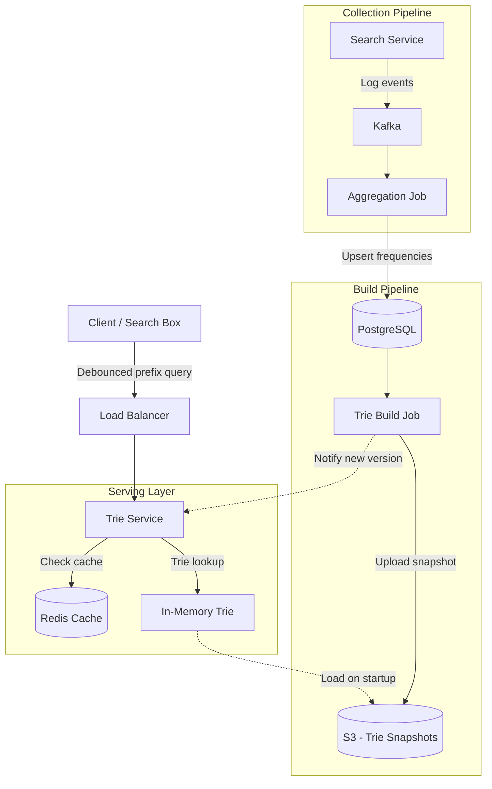
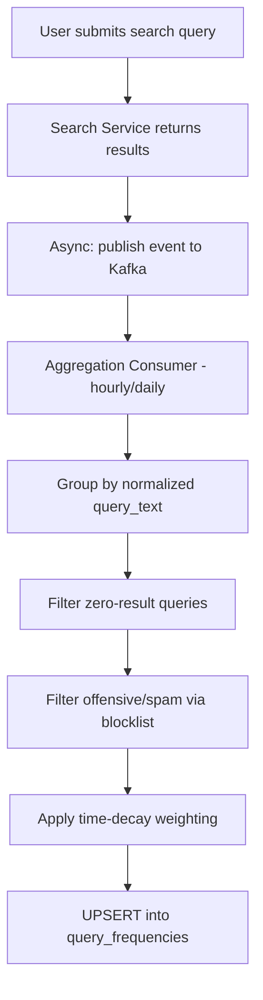
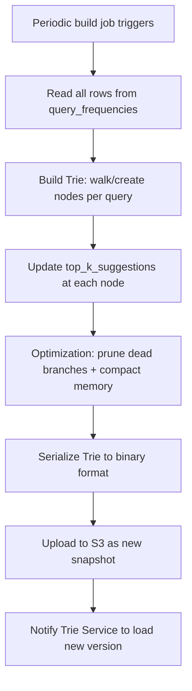
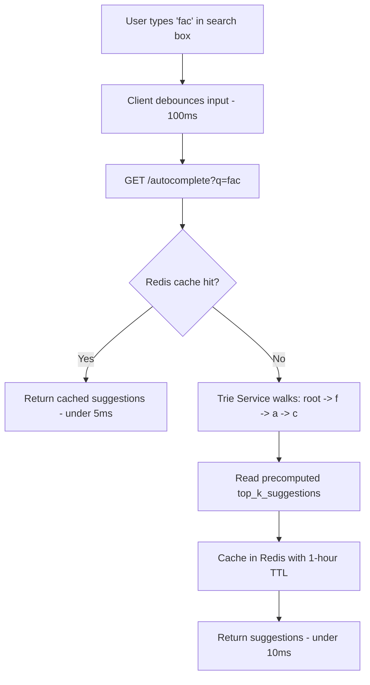

# Data Model: Search Autocomplete

Search autocomplete suggests completions as the user types, requiring sub-50ms latency for a responsive feel. The data model spans three layers: a collection pipeline that aggregates search query frequencies, a build pipeline that constructs an in-memory Trie with precomputed top-K results at each node, and a serving layer that walks the Trie in O(L) time where L is the prefix length.

## High-Level Architecture



## Table Responsibilities

| Table/Structure       | Purpose                        | Storage                | Key Characteristic                          |
| --------------------- | ------------------------------ | ---------------------- | ------------------------------------------- |
| **search_logs**       | Raw search event stream        | Kafka → Data Warehouse | Append-only, high volume                    |
| **query_frequencies** | Aggregated query popularity    | PostgreSQL or DynamoDB | Updated in batches, read by Trie builder    |
| **trie_nodes**        | In-memory prefix tree          | Application memory     | O(L) prefix lookup, precomputed suggestions |
| **trie_snapshots**    | Serialized Trie for deployment | S3                     | Versioned, loaded on service startup        |

## Detailed Field Descriptions

### search_logs (Kafka → Data Warehouse)

| Field        | Type         | Description                                                                                                                |
| ------------ | ------------ | -------------------------------------------------------------------------------------------------------------------------- |
| user_id      | BIGINT       | Who searched. Used for personalization and spam filtering. Anonymous users get a session ID.                               |
| query_text   | VARCHAR(500) | The full query the user submitted. Lowercased and trimmed before logging.                                                  |
| timestamp    | TIMESTAMP    | When the search occurred. Used for time-decay weighting (recent searches count more).                                      |
| result_count | INT          | Number of results returned. Queries with 0 results may be excluded from autocomplete to avoid suggesting dead-end queries. |

**Why log result_count?** A query like "asdfghjkl" might be searched often by accident but returns 0 results. Filtering out zero-result queries prevents suggesting useless completions.

### query_frequencies (PostgreSQL or DynamoDB)

| Field           | Type             | Description                                                                                                                           |
| --------------- | ---------------- | ------------------------------------------------------------------------------------------------------------------------------------- |
| query_text      | VARCHAR(500), PK | The normalized search query. Serves as the primary key for upsert operations.                                                         |
| frequency_count | BIGINT           | How many times this query was searched. Aggregated from search_logs, potentially with time decay (e.g., recent searches weighted 2x). |
| last_updated    | TIMESTAMP        | When this count was last refreshed. Used to identify stale entries that should be re-aggregated.                                      |

**Why a separate table instead of querying search_logs directly?** Raw logs might contain billions of rows. Pre-aggregating into query_frequencies reduces the Trie build job's input from billions of rows to millions of unique queries.

### trie_nodes (In-Memory)

| Field             | Type                 | Description                                                                                                                                 |
| ----------------- | -------------------- | ------------------------------------------------------------------------------------------------------------------------------------------- |
| prefix            | STRING               | The character prefix this node represents (e.g., "fac" for the path f→a→c). Implicit in the tree structure, not stored explicitly.          |
| children          | MAP<CHAR, trie_node> | Pointers to child nodes, one per next character. In practice, an array of 26-36 slots (a-z, 0-9) for O(1) child lookup.                     |
| top_k_suggestions | LIST<{query, score}> | Precomputed top-K (typically K=10) most popular queries that start with this prefix. Stored at every node to avoid traversal at query time. |

**Why precompute top-K at each node?** Without precomputation, finding suggestions for prefix "fac" requires traversing all descendants (potentially millions of nodes). Precomputing bubbles up the best suggestions during build time, making query-time O(L) regardless of how many queries share the prefix.

**Why not just use a database with LIKE 'prefix%'?** A `LIKE 'fac%'` query on millions of rows takes 50-200ms even with an index. The Trie serves suggestions in <1ms from memory. The 100x latency difference is noticeable to users.

### trie_snapshots (S3)

| Field                | Type        | Description                                                                                                                 |
| -------------------- | ----------- | --------------------------------------------------------------------------------------------------------------------------- |
| snapshot_id          | VARCHAR(50) | Unique identifier for this snapshot (e.g., UUID or timestamp-based).                                                        |
| serialized_trie_blob | BYTES       | The entire Trie serialized (e.g., via Protocol Buffers or custom binary format). Typically 1-5 GB for a large-scale system. |
| built_at             | TIMESTAMP   | When this Trie was built. Used to determine freshness and for rollback.                                                     |
| version              | INT         | Monotonically increasing version number. Services load the latest version on startup.                                       |

**Why serialize to S3?** Building a Trie takes minutes to hours. We build it once offline and distribute the artifact. Trie Service instances load the snapshot on startup, avoiding repeated builds. S3 provides durable, versioned storage with easy rollback.

## ER Diagram

```
Data Collection Layer:
┌──────────────────────┐
│    search_logs        │
│    (Kafka)            │
│──────────────────────│
│ user_id               │
│ query_text            │
│ timestamp             │
│ result_count          │
└──────────────────────┘
         │
         │ Aggregation job
         │ (hourly/daily)
         ▼
┌──────────────────────┐
│  query_frequencies    │
│  (PostgreSQL)         │
│──────────────────────│
│ query_text (PK)       │
│ frequency_count       │
│ last_updated          │
└──────────────────────┘
         │
         │ Trie build job
         │ (periodic)
         ▼
┌──────────────────────┐       ┌──────────────────────┐
│   trie_nodes          │       │  trie_snapshots       │
│   (In-Memory)         │       │  (S3)                 │
│──────────────────────│       │──────────────────────│
│ prefix (implicit)     │──────▶│ snapshot_id           │
│ children: map         │ build │ serialized_trie_blob  │
│ top_k_suggestions     │       │ built_at              │
└──────────────────────┘       │ version               │
         ▲                      └──────────────────────┘
         │                               │
         │ load on startup               │
         └───────────────────────────────┘

Note: These are not relational tables with FKs.
The arrows represent data pipeline flow, not
database relationships.
```

## Data Flow

### Collection Pipeline (How search data is gathered)

```
1. User submits a search query (e.g., "facebook login")
         │
         ▼
2. Search Service processes the query and returns results
         │
         ▼
3. Async: publish search event to Kafka topic "search_logs"
   Event: {user_id, query_text: "facebook login", result_count: 25}
         │
         ▼
4. Aggregation Consumer (runs hourly or daily):
   ├─ Read batch of search_logs from Kafka
   ├─ Group by normalized query_text (lowercase, trim)
   ├─ Filter out queries with result_count = 0
   ├─ Filter out offensive/spam queries (blocklist)
   ├─ Apply time-decay weighting (recent = higher weight)
   └─ UPSERT into query_frequencies:
       query_text = "facebook login"
       frequency_count += weighted_count
       last_updated = now
```



### Build Pipeline (How the Trie is constructed)

```
1. Periodic build job triggers (e.g., every 6 hours)
         │
         ▼
2. Read all rows from query_frequencies
   (sorted by frequency_count DESC for efficiency)
         │
         ▼
3. Build Trie:
   For each query (e.g., "facebook login", score: 50000):
     ├─ Walk/create nodes: f → fa → fac → face → faceb → ...
     └─ At EACH node along the path:
         Update top_k_suggestions if this query's score
         is higher than the current K-th suggestion
         │
         ▼
4. Optimization pass:
   ├─ Prune nodes with no top-K suggestions (dead branches)
   └─ Compact memory layout for cache-friendly traversal
         │
         ▼
5. Serialize Trie to binary format
         │
         ▼
6. Upload to S3 as trie_snapshot (version = prev + 1)
         │
         ▼
7. Notify Trie Service instances to load new version
   (via Kafka event, config change, or rolling restart)
```



### Query Pipeline (How suggestions are served)

```
1. User types "fac" in the search box
         │
         ▼
2. Client debounces input (e.g., 100ms delay)
   then sends request: GET /autocomplete?q=fac
         │
         ▼
3. Check Redis cache: GET autocomplete:fac
         │
    ┌────┴────┐
    │ Cache   │
    │ Hit?    │
    ├─ Yes ───┤──► Return cached suggestions (latency: <5ms)
    │ No      │
    └────┬────┘
         ▼
4. Trie Service walks the Trie:
   root → 'f' → 'a' → 'c'  (3 pointer hops, O(L) where L=3)
         │
         ▼
5. Read precomputed top_k_suggestions at node 'c':
   ["facebook", "facebook login", "face swap", ...]
         │
         ▼
6. Cache in Redis: SET autocomplete:fac → suggestions (TTL: 1 hour)
         │
         ▼
7. Return suggestions to client (latency: <10ms)
```



**Why debounce on the client?** Without debouncing, typing "facebook" sends 8 requests (f, fa, fac, face, ...). With a 100ms debounce, fast typers send 2-3 requests instead, reducing server load by 60-70%.

**Why cache in Redis if the Trie is already in memory?** The Trie lookup is fast (~1ms), but popular prefixes (like "f" or "th") are requested millions of times. Redis caching avoids even the Trie traversal for hot prefixes, and enables serving from a shared cache across multiple Trie Service instances.

**Why rebuild periodically instead of real-time updates?** The Trie is a read-optimized, immutable data structure. Concurrent reads and writes would require locks, degrading read performance. Building a new Trie offline and swapping it in atomically (blue-green deployment) keeps reads lock-free.
