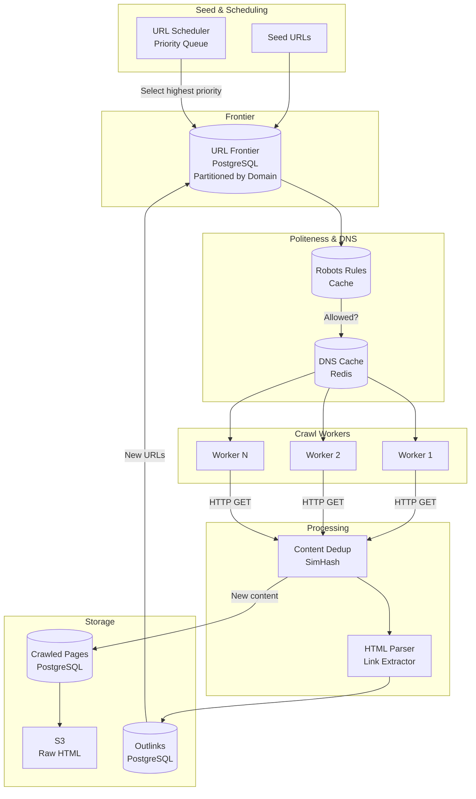
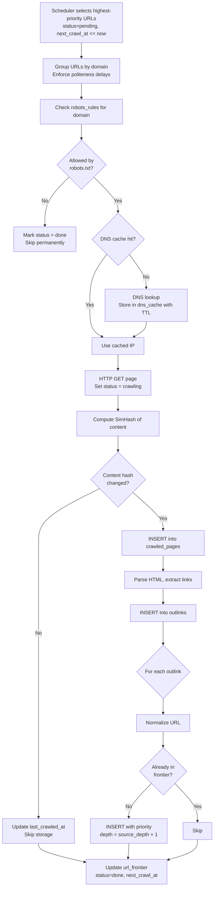

# Data Model: Web Crawler

A web crawler systematically discovers and downloads web pages by following links. The data model must manage a massive URL frontier, respect robots.txt policies, deduplicate content via fingerprinting, and track link structure. The system is write-heavy with billions of URLs and requires politeness controls to avoid overwhelming individual domains.

## High-Level Architecture



## Table Responsibilities

| Table             | Purpose                                           | Storage                            | Key Characteristic                             |
| ----------------- | ------------------------------------------------- | ---------------------------------- | ---------------------------------------------- |
| **url_frontier**  | Queue of URLs to crawl, prioritized by importance | PostgreSQL (partitioned by domain) | Priority queue with per-domain politeness      |
| **crawled_pages** | Downloaded page content and metadata              | PostgreSQL + S3 for raw HTML       | Content-hashed for deduplication               |
| **robots_rules**  | Cached robots.txt rules per domain                | PostgreSQL                         | TTL-based refresh, checked before every fetch  |
| **dns_cache**     | Resolved DNS entries to avoid repeated lookups    | Redis / PostgreSQL                 | Short TTL, reduces DNS resolver load           |
| **outlinks**      | Links discovered on each crawled page             | PostgreSQL (partitioned by source) | Append-only, feeds new URLs back into frontier |

## Detailed Field Descriptions

### url_frontier

| Field            | Type                                          | Description                                                                                                                                             |
| ---------------- | --------------------------------------------- | ------------------------------------------------------------------------------------------------------------------------------------------------------- |
| url_id           | BIGINT, PK                                    | Unique identifier for each URL. Auto-generated. Using a synthetic PK avoids indexing the full URL string as PK (URLs can be 2000+ chars).               |
| url              | TEXT, NOT NULL                                | The full URL to crawl. Normalized (lowercase scheme/host, sorted query params) to prevent duplicates like `HTTP://Example.com` vs `http://example.com`. |
| domain           | VARCHAR(255), INDEX                           | Extracted domain for politeness grouping. Indexed because the crawler must enforce per-domain crawl delays.                                             |
| priority         | FLOAT, INDEX                                  | Crawl priority (higher = more important). Computed from PageRank, freshness needs, and domain authority. Indexed for efficient dequeuing.               |
| depth            | INT                                           | Link depth from seed URLs. Limits how deep the crawler follows links. Prevents infinite crawling into low-value deep pages.                             |
| status           | ENUM('pending', 'crawling', 'done', 'failed') | Current crawl state. `crawling` prevents multiple workers from fetching the same URL simultaneously.                                                    |
| last_crawled_at  | TIMESTAMP, NULLABLE                           | When this URL was last successfully crawled. Null means never crawled. Used to calculate staleness.                                                     |
| next_crawl_at    | TIMESTAMP, INDEX                              | Earliest time this URL should be re-crawled. Derived from `change_frequency`. Indexed for the scheduler to find due URLs efficiently.                   |
| change_frequency | INTERVAL                                      | How often this page typically changes (e.g., daily, weekly). Learned from historical crawls by comparing content hashes across visits.                  |

**Why separate `domain` column?** Politeness requires that a crawler limits requests to a single domain (e.g., max 1 req/sec). Extracting `domain` into its own indexed column lets the scheduler group and throttle per-domain efficiently, rather than parsing it from the URL at query time.

### crawled_pages

| Field        | Type                       | Description                                                                                                                                                 |
| ------------ | -------------------------- | ----------------------------------------------------------------------------------------------------------------------------------------------------------- |
| page_id      | BIGINT, PK                 | Unique identifier per crawl attempt. A URL can have multiple entries if crawled multiple times.                                                             |
| url_id       | BIGINT, FK -> url_frontier | Which URL was crawled. Links back to the frontier for re-crawl scheduling.                                                                                  |
| content_hash | BIGINT                     | SimHash fingerprint of the page content. Used for near-duplicate detection. Two pages with Hamming distance < 3 on their SimHash are considered duplicates. |
| html_size    | INT                        | Size of downloaded HTML in bytes. Useful for monitoring storage growth and detecting anomalies (e.g., soft 404 pages returning tiny HTML).                  |
| title        | VARCHAR(512)               | Extracted `<title>` tag content. Stored for search index metadata without re-parsing the full HTML.                                                         |
| status_code  | SMALLINT                   | HTTP response code (200, 301, 404, 500, etc.). Used to decide whether to keep or discard the page and whether to re-crawl.                                  |
| crawled_at   | TIMESTAMP                  | When this page was fetched. Used for freshness calculations and change frequency learning.                                                                  |

**Why SimHash instead of SHA-256?** SHA-256 detects exact duplicates only. SimHash is a locality-sensitive hash: similar pages produce similar hashes. This lets us detect near-duplicates (e.g., pages differing only in ads or timestamps) by comparing Hamming distance, which is critical at web scale where millions of pages are near-identical.

### robots_rules

| Field            | Type             | Description                                                                                                                      |
| ---------------- | ---------------- | -------------------------------------------------------------------------------------------------------------------------------- |
| domain           | VARCHAR(255), PK | The domain these rules apply to. One entry per domain since robots.txt is domain-scoped.                                         |
| rules_text       | TEXT             | Raw robots.txt content. Stored for debugging and re-parsing if rule interpretation logic changes.                                |
| crawl_delay_sec  | INT              | Requested delay between requests to this domain. Parsed from `Crawl-delay` directive. Overrides the default politeness interval. |
| allowed_paths    | TEXT[]           | Paths explicitly allowed (from `Allow:` directives). Checked before crawling any URL on this domain.                             |
| disallowed_paths | TEXT[]           | Paths disallowed (from `Disallow:` directives). If a URL matches any disallowed path, it is skipped.                             |
| fetched_at       | TIMESTAMP        | When robots.txt was last fetched. Used to determine staleness.                                                                   |
| expires_at       | TIMESTAMP        | When to re-fetch robots.txt. Typically `fetched_at + 24 hours`. Rules can change, so periodic refresh is necessary.              |

**Why cache robots.txt?** Fetching robots.txt before every page request would double the number of HTTP requests. Caching with a 24-hour TTL is the standard practice and reduces load on both the crawler and the target domain.

### dns_cache

| Field        | Type             | Description                                                                                                                                                         |
| ------------ | ---------------- | ------------------------------------------------------------------------------------------------------------------------------------------------------------------- |
| domain       | VARCHAR(255), PK | The domain name to resolve. One entry per domain.                                                                                                                   |
| ip_addresses | TEXT[]           | Resolved IP addresses (may have multiple for load balancing). Stored as an array to support round-robin selection.                                                  |
| resolved_at  | TIMESTAMP        | When the DNS resolution was performed. Used to calculate cache freshness.                                                                                           |
| ttl_seconds  | INT              | DNS TTL from the authoritative response. Cache entry should be refreshed after this period. Respecting TTL ensures we follow DNS-based failover and load balancing. |

**Why a custom DNS cache?** At billions of URLs, the system makes millions of DNS queries per hour. OS-level DNS caching is not sufficient at this scale. A dedicated cache reduces resolver load and avoids hitting per-second query limits on upstream DNS servers.

### outlinks

| Field          | Type                        | Description                                                                                                                    |
| -------------- | --------------------------- | ------------------------------------------------------------------------------------------------------------------------------ |
| source_page_id | BIGINT, FK -> crawled_pages | The page these links were found on. Enables link graph analysis (e.g., PageRank computation).                                  |
| target_url     | TEXT                        | The discovered URL (after resolving relative paths). Will be normalized and inserted into url_frontier if not already present. |
| anchor_text    | VARCHAR(1024)               | The visible text of the hyperlink. Provides context about what the target page is about, useful for search ranking.            |
| discovered_at  | TIMESTAMP                   | When this link was found. Helps track link freshness and detect spam link injection over time.                                 |

**Why store anchor_text?** In search engines, anchor text from inbound links is one of the strongest signals for understanding what a page is about. Storing it at crawl time avoids re-downloading and re-parsing pages later.

## ER Diagram

```
┌──────────────────────┐
│     robots_rules      │
│──────────────────────│
│ domain (PK)           │
│ rules_text            │
│ crawl_delay_sec       │
│ allowed_paths         │
│ disallowed_paths      │
│ fetched_at            │
│ expires_at            │
└──────────────────────┘
          │ checked before crawl
          │
          ▼
┌──────────────────────┐       ┌──────────────────────┐
│    url_frontier       │       │     dns_cache         │
│──────────────────────│       │──────────────────────│
│ url_id (PK)           │       │ domain (PK)           │
│ url                   │       │ ip_addresses          │
│ domain ───────────────│──────►│ resolved_at           │
│ priority              │       │ ttl_seconds           │
│ depth                 │       └──────────────────────┘
│ status                │
│ last_crawled_at       │
│ next_crawl_at         │
│ change_frequency      │
└──────────────────────┘
          │
          │ 1
          │
          │ *
┌──────────────────────┐
│    crawled_pages      │
│──────────────────────│
│ page_id (PK)          │
│ url_id (FK)           │
│ content_hash          │
│ html_size             │
│ title                 │
│ status_code           │
│ crawled_at            │
└──────────────────────┘
          │
          │ 1
          │
          │ *
┌──────────────────────┐
│      outlinks         │
│──────────────────────│
│ source_page_id (FK)   │
│ target_url ───────────│───► (normalized, inserted into url_frontier)
│ anchor_text           │
│ discovered_at         │
└──────────────────────┘

Relationships:
  url_frontier   1───* crawled_pages   (one URL crawled multiple times)
  crawled_pages  1───* outlinks        (one page has many outgoing links)
  url_frontier   *───1 dns_cache       (many URLs share one domain's DNS)
  url_frontier   *───1 robots_rules    (many URLs share one domain's robots.txt)
```

## Data Flow

### Crawling a URL (Main Loop)

```
1. Scheduler selects highest-priority URLs from url_frontier
   where status = 'pending' and next_crawl_at <= now()
         │
         ▼
2. Group selected URLs by domain; enforce politeness
   (check robots_rules.crawl_delay_sec between requests)
         │
         ▼
3. For each URL, check robots_rules for the domain
         │
    ┌────┴────┐
    │Allowed? │
    ├─No──────┤──► Mark url_frontier.status = 'done' (skip permanently)
    │ Yes     │
    └────┬────┘
         ▼
4. Resolve domain via dns_cache
         │
    ┌────┴─────┐
    │Cache hit?│
    ├─Yes──────┤──► Use cached IP
    │ No       │
    └────┬─────┘
         ▼
   DNS lookup → store in dns_cache with TTL
         │
         ▼
5. Download page (HTTP GET), set url_frontier.status = 'crawling'
         │
         ▼
6. Compute SimHash of page content
         │
         ▼
7. Check content_hash against recent crawled_pages for this URL
         │
    ┌────┴──────────┐
    │Hash changed?  │
    ├─No────────────┤──► Update last_crawled_at, skip storage
    │ Yes           │
    └────┬──────────┘
         ▼
8. INSERT into crawled_pages (page content, hash, status code)
         │
         ▼
9. Parse HTML, extract links → INSERT into outlinks
         │
         ▼
10. For each outlink target_url:
    - Normalize URL
    - Check if already in url_frontier
    - If new: INSERT with priority based on source page rank and depth+1
         │
         ▼
11. Update url_frontier: status='done', last_crawled_at=now(),
    next_crawl_at = now() + change_frequency
```



**Why check content_hash before storing?** Many pages do not change between crawls. Comparing SimHash fingerprints avoids storing redundant copies and lets the crawler learn each page's actual change frequency, dynamically adjusting `next_crawl_at` to avoid wasting resources on static pages.

**Why partition url_frontier by domain?** The politeness constraint (max N requests per domain per second) means the scheduler must efficiently find the next eligible URL per domain. Partitioning by domain makes this query fast and avoids full-table scans across billions of URLs.
