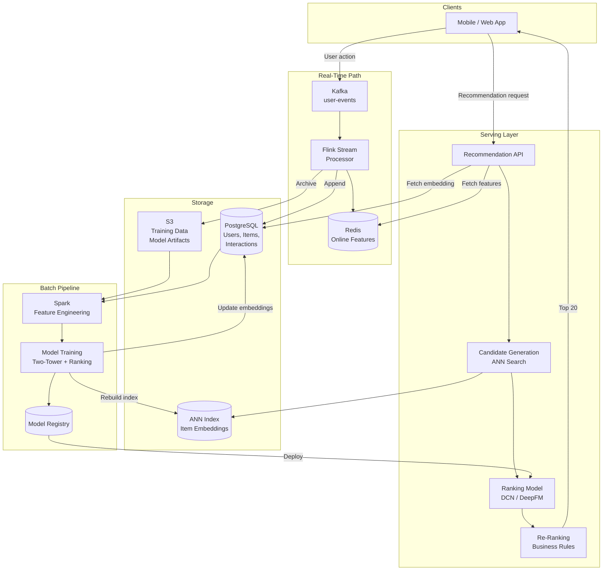
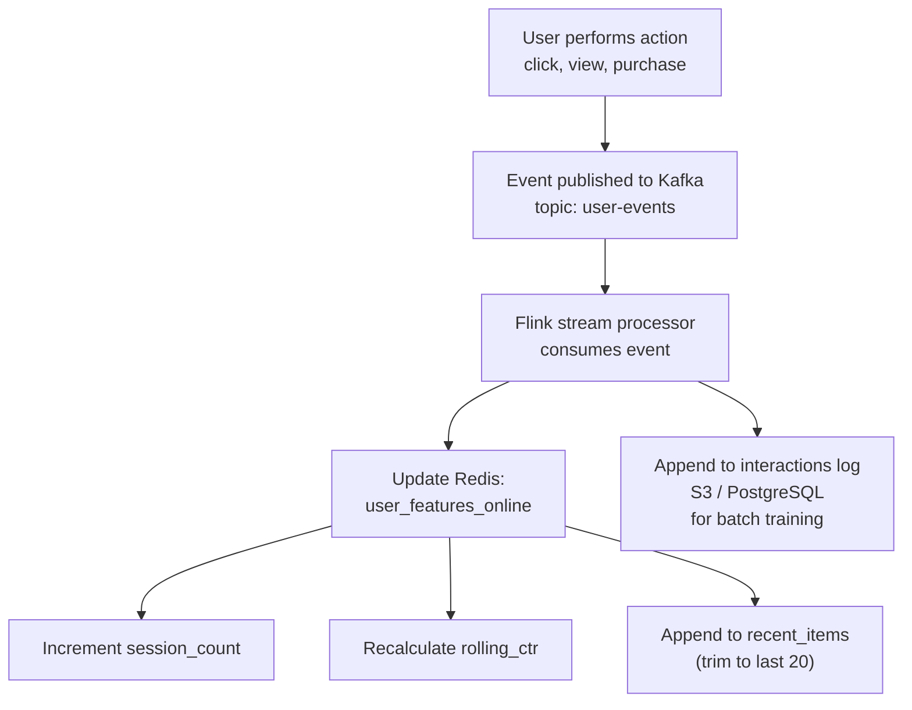
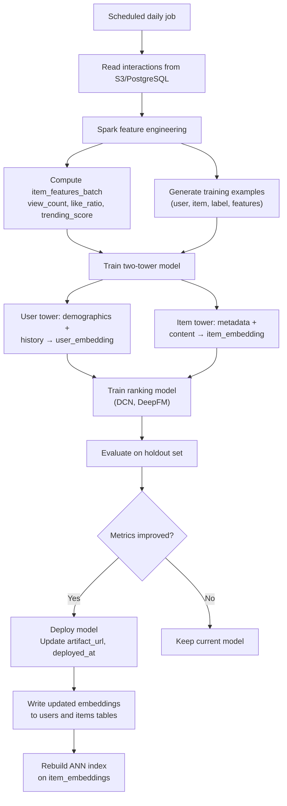
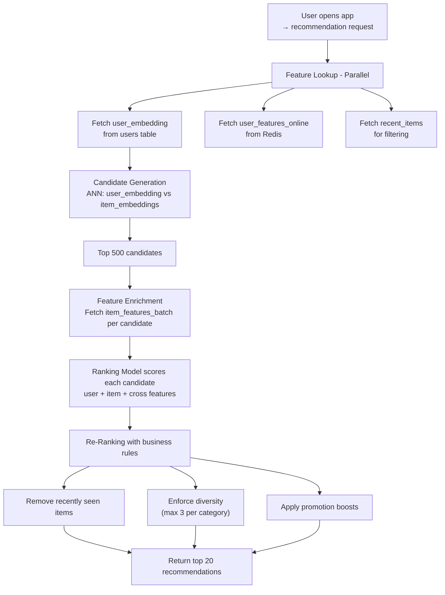

# Data Model: ML Recommendation System

A recommendation system suggests relevant items (products, videos, articles) to users based on their behavior and preferences. The data model must support both real-time feature serving (millisecond latency) and batch feature engineering (hourly/daily). The two-tower architecture (user embedding + item embedding) enables fast candidate generation via ANN search, followed by a ranking model that scores candidates using rich features.

## High-Level Architecture



## Table Responsibilities

| Table                    | Purpose                                    | Storage                | Key Characteristic                                     |
| ------------------------ | ------------------------------------------ | ---------------------- | ------------------------------------------------------ |
| **users**                | User profiles and learned embeddings       | PostgreSQL             | Stores static attributes and trained embedding vectors |
| **items**                | Item catalog with embeddings and freshness | PostgreSQL             | Item metadata plus ML-generated features               |
| **interactions**         | Raw user-item event stream                 | Kafka -> PostgreSQL/S3 | Append-only event log, source of truth for training    |
| **user_features_online** | Real-time user signals                     | Redis                  | Sub-millisecond reads, updated per event               |
| **item_features_batch**  | Aggregated item statistics                 | PostgreSQL / Redis     | Hourly batch-computed, cached for serving              |
| **model_registry**       | Trained model versions and metadata        | PostgreSQL + S3        | Tracks model lineage, A/B test assignments             |

## Detailed Field Descriptions

### users

| Field             | Type        | Description                                                                                                                                                      |
| ----------------- | ----------- | ---------------------------------------------------------------------------------------------------------------------------------------------------------------- |
| user_id           | BIGINT, PK  | Unique user identifier.                                                                                                                                          |
| demographics_json | JSONB       | Age range, gender, location, language. JSONB because available demographics vary by platform and privacy settings. Used as features in the ranking model.        |
| preferences       | TEXT[]      | Explicitly stated interests (e.g., selected categories during onboarding). Helps with cold-start recommendations before behavioral data is available.            |
| account_age       | INT         | Days since account creation. New users get different recommendation strategies (more exploration) than established users (more exploitation).                    |
| user_embedding    | VECTOR(128) | Learned user representation from the two-tower model. Updated periodically (daily) via batch training. Used for ANN candidate retrieval against item embeddings. |

**Why store `user_embedding` directly on the user row?** During candidate generation, we need to look up the user's embedding and perform ANN search against item embeddings. Storing it on the user record avoids a join. The embedding is updated daily by the training pipeline, not in real-time, so staleness is acceptable for the candidate generation stage.

### items

| Field           | Type                | Description                                                                                                                                                         |
| --------------- | ------------------- | ------------------------------------------------------------------------------------------------------------------------------------------------------------------- |
| item_id         | BIGINT, PK          | Unique item identifier.                                                                                                                                             |
| title           | VARCHAR(512)        | Item title. Used for content-based features (TF-IDF, title embedding) and display.                                                                                  |
| category        | VARCHAR(100), INDEX | Primary category. Indexed for category-filtered recommendations ("recommend me sci-fi movies").                                                                     |
| metadata_json   | JSONB               | Flexible item attributes (price, duration, tags, creator, etc.). JSONB accommodates different item types (videos have duration; products have price and color).     |
| item_embedding  | VECTOR(128)         | Learned item representation from the two-tower model. Indexed in an ANN structure (HNSW) for fast retrieval.                                                        |
| freshness_score | FLOAT               | Decaying score based on item age. Newer items get a boost to avoid the cold-start problem where new items never get recommended because they lack interaction data. |

**Why 128-dimensional embeddings?** This is a common sweet spot. Higher dimensions (256, 512) capture more nuance but increase ANN index size and search latency. Lower dimensions (32, 64) are faster but lose discriminative power. 128 dimensions typically provide good recall at acceptable latency for millions of items.

### interactions

| Field        | Type                       | Description                                                                                                                                                                                       |
| ------------ | -------------------------- | ------------------------------------------------------------------------------------------------------------------------------------------------------------------------------------------------- |
| user_id      | BIGINT, FK -> users, INDEX | Who performed the action. Indexed for per-user history queries during feature engineering.                                                                                                        |
| item_id      | BIGINT, FK -> items, INDEX | Which item was interacted with. Indexed for per-item popularity computation.                                                                                                                      |
| event_type   | VARCHAR(20), INDEX         | Type of interaction: view, click, purchase, like, share, add_to_cart. Different events have different weights in the training objective (purchase >> click >> view).                              |
| timestamp    | TIMESTAMP, INDEX           | When the event occurred. Indexed for time-windowed feature computation (e.g., "clicks in the last 7 days").                                                                                       |
| duration_sec | INT, NULLABLE              | How long the user engaged (e.g., video watch time, time on page). Null for instant events like clicks. A strong implicit signal: watching 90% of a video is a stronger positive than watching 5%. |

**Why store all event types in one table?** Training data needs the full interaction sequence. Having separate tables for clicks, views, and purchases would require expensive joins during feature engineering. A single table with `event_type` column enables efficient sequential scans and simple event weighting in the loss function.

### user_features_online (Redis)

| Field         | Type       | Description                                                                                                                                                           |
| ------------- | ---------- | --------------------------------------------------------------------------------------------------------------------------------------------------------------------- |
| user_id       | STRING, PK | Redis key. Maps to the users table.                                                                                                                                   |
| session_count | INT        | Number of sessions in the current day. Indicates engagement level; highly engaged users can receive more niche recommendations.                                       |
| rolling_ctr   | FLOAT      | Click-through rate over the last 100 impressions. Real-time signal for the ranking model. A dropping CTR suggests the current recommendation strategy is not working. |
| recent_items  | LIST       | Last 20 items the user interacted with. Used for diversity filtering (do not recommend items the user already saw) and session-based signals.                         |

**Why Redis for online features?** The ranking model is called for every recommendation request and must return in <50ms. Feature lookups from PostgreSQL would add 5-10ms per query. Redis provides sub-millisecond reads. These features are updated by a Flink stream processor as events arrive, ensuring freshness.

### item_features_batch

| Field          | Type       | Description                                                                                                                                             |
| -------------- | ---------- | ------------------------------------------------------------------------------------------------------------------------------------------------------- |
| item_id        | BIGINT, PK | Maps to the items table.                                                                                                                                |
| view_count     | BIGINT     | Total views (all time or rolling 30 days). A popularity signal for the ranking model.                                                                   |
| like_ratio     | FLOAT      | Likes / (likes + dislikes). Quality signal. Items with high like ratios are boosted.                                                                    |
| trending_score | FLOAT      | Velocity of interactions (e.g., interactions in last 6 hours / interactions in prior 6 hours). Captures viral content that is rapidly gaining traction. |

**Why batch instead of real-time for item features?** Item-level aggregates (view_count, like_ratio) change gradually and do not need sub-second freshness. Hourly batch computation via Spark is more cost-effective and avoids the complexity of maintaining real-time counters for millions of items. The trending_score is the most time-sensitive feature here, but hourly updates are sufficient to capture viral trends.

### model_registry

| Field        | Type                | Description                                                                                                                                                               |
| ------------ | ------------------- | ------------------------------------------------------------------------------------------------------------------------------------------------------------------------- |
| model_id     | VARCHAR(64), PK     | Unique model identifier (e.g., "ranking-v3.2.1"). Versioned for reproducibility.                                                                                          |
| model_type   | VARCHAR(50)         | Architecture type (e.g., "two_tower", "dcn_v2", "deepfm"). Enables querying which architecture performs best.                                                             |
| version      | VARCHAR(20)         | Semantic version. Used for rollback if a new model degrades metrics.                                                                                                      |
| artifact_url | TEXT                | S3 URL to the serialized model artifact. Serving infrastructure downloads from here on deployment.                                                                        |
| metrics_json | JSONB               | Offline evaluation metrics (AUC, NDCG, recall@K). JSONB because different model types produce different metrics. Used to decide whether to promote a model to production. |
| deployed_at  | TIMESTAMP, NULLABLE | When this model was deployed to production. Null means not yet deployed. Used for A/B test analysis (compare metrics before and after deployment).                        |

**Why a model registry?** ML models are retrained frequently (daily or weekly). Without a registry, it is impossible to know which model version is serving, roll back to a previous version, or compare offline metrics across versions. The registry provides model lineage and audit trail.

## ER Diagram

```
┌──────────────────────┐
│       users           │
│──────────────────────│
│ user_id (PK)          │
│ demographics_json     │
│ preferences           │
│ account_age           │
│ user_embedding        │
└──────────────────────┘
     │                │
     │ 1              │ 1
     │                │
     │ *              │ 1
     │         ┌──────────────────────┐
     │         │ user_features_online  │
     │         │ (Redis)              │
     │         │──────────────────────│
     │         │ user_id (PK)          │
     │         │ session_count         │
     │         │ rolling_ctr           │
     │         │ recent_items          │
     │         └──────────────────────┘
     │
     │         ┌──────────────────────┐
     │         │     interactions      │
     │         │──────────────────────│
     └────────►│ user_id (FK)          │
               │ item_id (FK)          │◄────────┐
               │ event_type            │         │
               │ timestamp             │         │
               │ duration_sec          │         │
               └──────────────────────┘         │
                                                 │
┌──────────────────────┐                         │
│       items           │                         │
│──────────────────────│                         │
│ item_id (PK) ─────────│─────────────────────────┘
│ title                 │
│ category              │         ┌──────────────────────┐
│ metadata_json         │         │  item_features_batch  │
│ item_embedding        │         │──────────────────────│
│ freshness_score       │────────►│ item_id (PK)          │
└──────────────────────┘  1───1   │ view_count            │
                                  │ like_ratio            │
                                  │ trending_score        │
┌──────────────────────┐          └──────────────────────┘
│   model_registry      │
│──────────────────────│
│ model_id (PK)         │
│ model_type            │
│ version               │   (independent, referenced by
│ artifact_url          │    serving infrastructure)
│ metrics_json          │
│ deployed_at           │
└──────────────────────┘

Relationships:
  users 1───* interactions   (one user has many events)
  items 1───* interactions   (one item has many events)
  users 1───1 user_features_online  (one user has one online feature set)
  items 1───1 item_features_batch   (one item has one batch feature set)
```

## Data Flow

### Real-Time Feature Update

```
1. User performs an action (click, view, purchase)
         │
         ▼
2. Event published to Kafka topic "user-events"
         │
         ▼
3. Flink stream processor consumes event
         │
         ├──► Update user_features_online in Redis:
         │    - Increment session_count
         │    - Recalculate rolling_ctr
         │    - Append to recent_items (trim to last 20)
         │
         └──► Append to interactions log (S3 / PostgreSQL)
              for batch training
```



### Batch Training Pipeline

```
1. Scheduled job (daily) reads interactions from S3/PostgreSQL
         │
         ▼
2. Spark feature engineering:
   - Compute item_features_batch (view_count, like_ratio, trending_score)
   - Generate training examples: (user, item, label, features)
         │
         ▼
3. Train two-tower model:
   - User tower: demographics + interaction history → user_embedding
   - Item tower: metadata + content features → item_embedding
         │
         ▼
4. Train ranking model (DCN, DeepFM, etc.):
   - Input: user features + item features + context
   - Output: predicted engagement probability
         │
         ▼
5. Evaluate on holdout set → write metrics to model_registry
         │
         ▼
6. If metrics improve: deploy model, update artifact_url, set deployed_at
         │
         ▼
7. Write updated user_embeddings to users table
   Write updated item_embeddings to items table
   Rebuild ANN index on item_embeddings
```



### Serving a Recommendation Request

```
1. User opens app → recommendation request
         │
         ▼
2. Feature Lookup (parallel):
   ├──► Fetch user_embedding from users table
   ├──► Fetch user_features_online from Redis
   └──► Fetch user's recent_items for filtering
         │
         ▼
3. Candidate Generation:
   ANN search: user_embedding vs item_embeddings → top 500 candidates
         │
         ▼
4. Feature Enrichment:
   For each candidate, fetch item_features_batch
         │
         ▼
5. Ranking Model:
   Score each candidate using all features
   (user features + item features + cross features)
         │
         ▼
6. Re-Ranking (business rules):
   - Remove recently seen items (from recent_items)
   - Enforce diversity (no more than 3 items from same category)
   - Apply promotion boosts
         │
         ▼
7. Return top 20 recommendations to user
```



**Why two stages (candidate generation + ranking)?** Scoring all items (millions) with the full ranking model would take seconds. The two-tower ANN search narrows candidates to ~500 in <10ms using cheap dot-product similarity. The expensive ranking model then only scores 500 items instead of millions, keeping total latency under 100ms.
