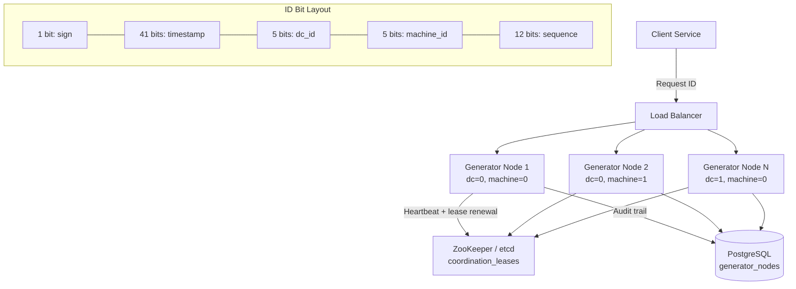
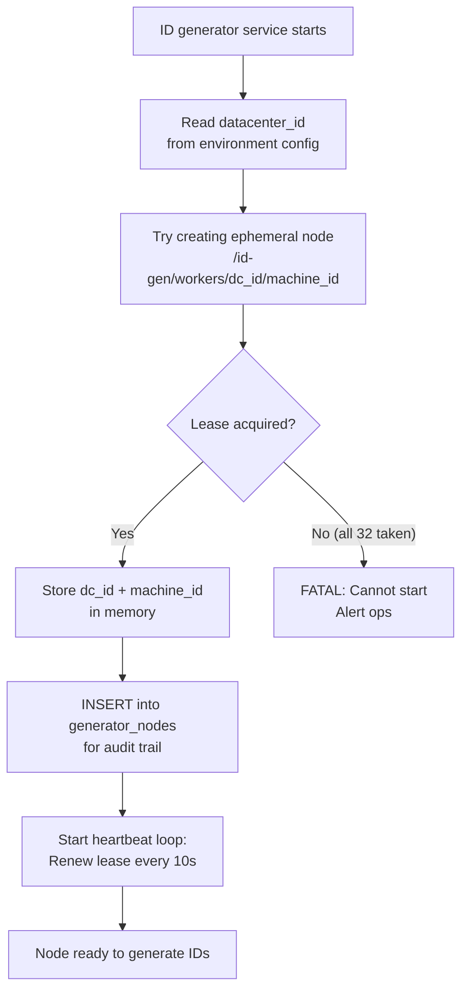
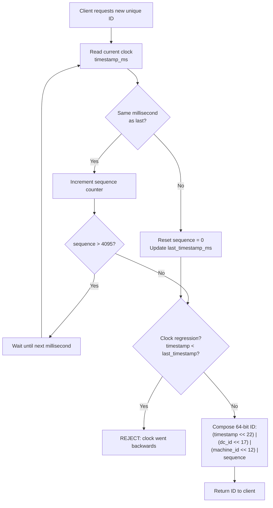
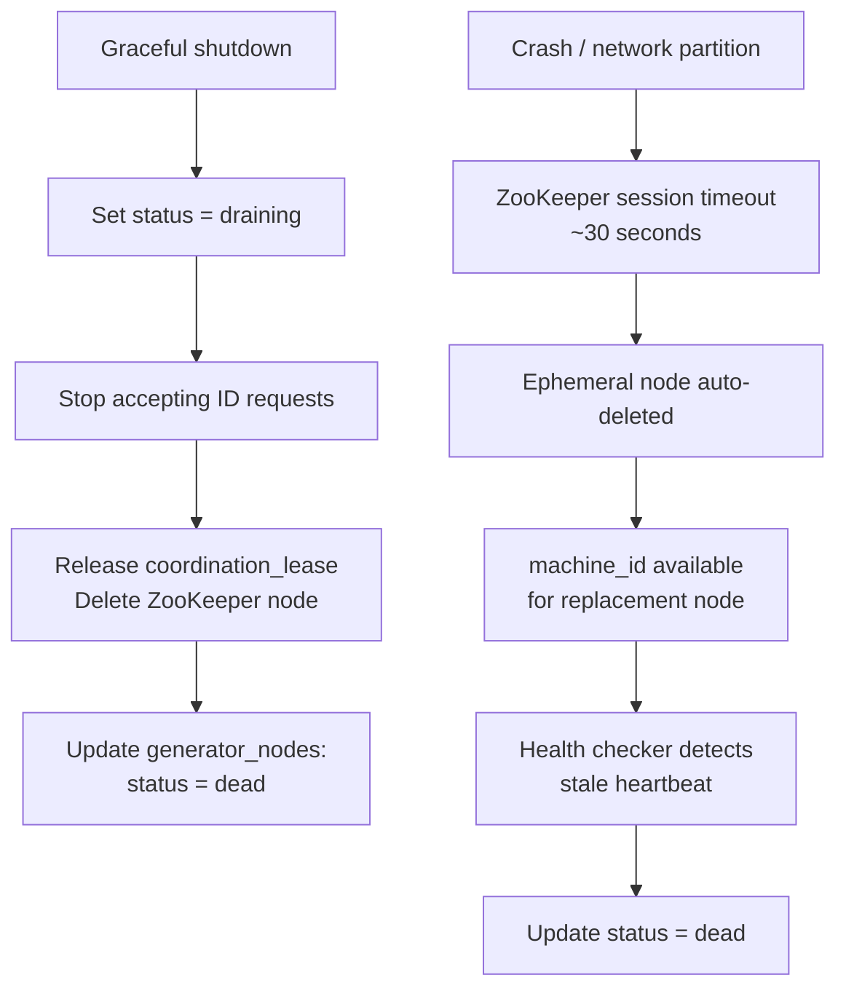

# Data Model: Unique ID Generator (Snowflake)

A distributed unique ID generator produces globally unique, roughly time-ordered 64-bit integers without central coordination. The data model is minimal by design: the "tables" are mostly the ID bit layout itself and the coordination mechanism that assigns machine identifiers. The key insight is encoding enough information into 64 bits to guarantee uniqueness across thousands of machines generating millions of IDs per second, while maintaining temporal ordering for database index friendliness.

## High-Level Architecture



## Table Responsibilities

| Table                   | Purpose                                    | Storage                  | Key Characteristic                                                        |
| ----------------------- | ------------------------------------------ | ------------------------ | ------------------------------------------------------------------------- |
| **generator_nodes**     | Registry of all ID generator instances     | PostgreSQL               | Node lifecycle management and health tracking                             |
| **id_format**           | Bit layout specification for generated IDs | N/A (in-memory constant) | Defines the 64-bit structure: timestamp + datacenter + machine + sequence |
| **coordination_leases** | Distributed lock for machine_id assignment | ZooKeeper / etcd         | Prevents two nodes from claiming the same machine_id                      |

## Detailed Field Descriptions

### generator_nodes

| Field            | Type                               | Description                                                                                                                                                                                                   |
| ---------------- | ---------------------------------- | ------------------------------------------------------------------------------------------------------------------------------------------------------------------------------------------------------------- |
| node_id          | BIGINT, PK                         | Auto-incrementing identifier for audit purposes. Not used in ID generation itself.                                                                                                                            |
| datacenter_id    | SMALLINT, NOT NULL                 | 5-bit datacenter identifier (0-31). Allows up to 32 datacenters. Assigned based on the physical/cloud region where the node runs.                                                                             |
| machine_id       | SMALLINT, NOT NULL                 | 5-bit machine identifier within a datacenter (0-31). Combined with datacenter_id, uniquely identifies this generator. The (datacenter_id, machine_id) pair must be globally unique.                           |
| hostname         | VARCHAR(255)                       | Server hostname for operational identification. Used by ops teams to locate a specific generator node.                                                                                                        |
| ip_address       | VARCHAR(45)                        | Server IP address (supports IPv6). Used for health checks and network debugging.                                                                                                                              |
| registered_at    | TIMESTAMP                          | When this node first registered. Useful for capacity planning ("how many generators have we deployed over time?").                                                                                            |
| last_heartbeat   | TIMESTAMP, INDEX                   | Last time this node reported healthy. Nodes that miss heartbeats for >30 seconds are considered dead, and their machine_id can be reassigned. Indexed for the health checker to efficiently find stale nodes. |
| status           | ENUM('active', 'draining', 'dead') | Node lifecycle state. `draining` means the node is shutting down gracefully and will not accept new ID requests. `dead` means the lease has expired.                                                          |
| lease_expires_at | TIMESTAMP                          | When this node's claim on its (datacenter_id, machine_id) expires. The node must renew before expiry or lose its assignment. Prevents permanently reserved but unused machine_ids.                            |

**Why only 5 bits for datacenter and machine?** The Snowflake format has a fixed 64-bit budget. 5 bits per field gives 32 datacenters x 32 machines = 1024 generators. Each generator can produce 4096 IDs per millisecond (12-bit sequence). That is 4 billion IDs per second across the system. For most organizations, this is more than sufficient. If more machines are needed, the bit allocation can be adjusted (e.g., 10 bits for machine = 1024 machines per datacenter).

### id_format (Snowflake 64-bit Layout)

| Field         | Bits | Range       | Description                                                                                                                                                                                          |
| ------------- | ---- | ----------- | ---------------------------------------------------------------------------------------------------------------------------------------------------------------------------------------------------- |
| sign          | 1    | 0           | Always 0 (positive number). Ensures the ID is positive in signed 64-bit integer languages (Java long, Go int64).                                                                                     |
| timestamp_ms  | 41   | 0 to 2^41-1 | Milliseconds since a custom epoch (e.g., 2024-01-01). 41 bits cover ~69 years from the epoch. Using a custom epoch (not Unix epoch 1970) maximizes the usable range.                                 |
| datacenter_id | 5    | 0-31        | Identifies which datacenter generated this ID. Encoded directly from generator_nodes.datacenter_id.                                                                                                  |
| machine_id    | 5    | 0-31        | Identifies which machine within the datacenter. Together with datacenter_id, ensures no two generators produce the same bit pattern.                                                                 |
| sequence      | 12   | 0-4095      | Per-millisecond counter. Incremented for each ID generated within the same millisecond on the same machine. 12 bits allow 4096 IDs per millisecond per machine. Resets to 0 on the next millisecond. |

```
Bit layout (64 bits total):

 0                   1                   2                   3
 0 1 2 3 4 5 6 7 8 9 0 1 2 3 4 5 6 7 8 9 0 1 2 3 4 5 6 7 8 9 0 1
+-+-+-+-+-+-+-+-+-+-+-+-+-+-+-+-+-+-+-+-+-+-+-+-+-+-+-+-+-+-+-+-+
|0|                    timestamp_ms (41 bits)                    |
+-+                                         +-+-+-+-+-+-+-+-+-+-+
|                                           |dc_id| machine_id  |
+-+-+-+-+-+-+-+-+-+-+-+-+-+-+-+-+-+-+-+-+-+-+-+-+-+-+-+-+-+-+-+-+
|  machine_id   |         sequence (12 bits)                    |
+-+-+-+-+-+-+-+-+-+-+-+-+-+-+-+-+-+-+-+-+-+-+-+-+-+-+-+-+-+-+-+-+
```

**Why timestamp as the most significant bits?** IDs generated later have larger timestamps, making them numerically larger. This means IDs are roughly time-ordered, which is critical for database performance: B-tree indexes perform best with monotonically increasing keys (no random page splits). This is why Snowflake IDs are superior to UUIDs for primary keys in write-heavy databases.

**Why a custom epoch instead of Unix epoch?** Unix epoch (1970-01-01) has already consumed ~54 years of the 69-year range. A custom epoch (e.g., system launch date) pushes the overflow date far into the future. Twitter's Snowflake used a 2010 epoch, giving it until ~2079.

**Why 12 bits for sequence?** 4096 IDs per millisecond per machine = 4M IDs per second per machine. This handles even the most aggressive burst traffic. If a machine exhausts 4096 in a single millisecond (rare), it waits until the next millisecond, introducing at most 1ms of latency.

### coordination_leases (ZooKeeper/etcd)

| Field        | Type       | Description                                                                                                                                   |
| ------------ | ---------- | --------------------------------------------------------------------------------------------------------------------------------------------- |
| path         | STRING, PK | Hierarchical path: `/id-gen/workers/{datacenter_id}/{machine_id}`. The path structure encodes the (dc, machine) assignment.                   |
| hostname     | STRING     | Which server holds this lease. Used for conflict detection if two servers claim the same path.                                                |
| ip           | STRING     | Lease holder's IP address. Used for health checks.                                                                                            |
| lease_expiry | TIMESTAMP  | When the lease must be renewed. If not renewed, ZooKeeper's ephemeral node is automatically deleted, freeing the machine_id for reassignment. |

**Why ZooKeeper/etcd for coordination?** The most critical invariant is that no two nodes simultaneously use the same (datacenter_id, machine_id). This requires distributed consensus. ZooKeeper provides ephemeral nodes that are automatically deleted when a node's session expires (crashes, network partition). This guarantees machine_id recovery without manual intervention.

**Why not use a database sequence or auto-increment?** A database sequence is a single point of failure and a bottleneck. At 100K+ IDs per second, the sequence table becomes a hot row under contention. Snowflake's design eliminates central coordination entirely: each machine generates IDs independently using only its local clock and its pre-assigned (dc, machine) pair.

## ER Diagram

```
┌────────────────────────────┐
│      generator_nodes        │
│       (PostgreSQL)          │
│────────────────────────────│
│ node_id (PK)                │
│ datacenter_id               │
│ machine_id                  │
│ hostname                    │
│ ip_address                  │
│ registered_at               │
│ last_heartbeat              │
│ status                      │
│ lease_expires_at            │
└────────────────────────────┘
          │
          │ 1───1 (each node holds one lease)
          │
          ▼
┌────────────────────────────┐
│   coordination_leases       │
│   (ZooKeeper / etcd)        │
│────────────────────────────│
│ path (PK)                   │   path = /id-gen/workers/{dc}/{machine}
│ hostname                    │
│ ip                          │
│ lease_expiry                │
└────────────────────────────┘
          │
          │ uses (dc_id, machine_id) from lease
          │
          ▼
┌────────────────────────────┐
│        id_format            │
│     (in-memory constant)    │
│────────────────────────────│
│ 1 bit:  sign (always 0)    │
│ 41 bits: timestamp_ms      │──► time-ordered IDs
│ 5 bits:  datacenter_id     │──► from lease
│ 5 bits:  machine_id        │──► from lease
│ 12 bits: sequence          │──► local counter
│────────────────────────────│
│ Total: 64 bits              │
└────────────────────────────┘

Relationships:
  generator_nodes 1───1 coordination_leases  (one node holds one lease)
  coordination_leases ───► id_format         (lease provides dc_id + machine_id bits)
```

## Data Flow

### Node Startup (Registration)

```
1. ID generator service starts on a host
         │
         ▼
2. Read datacenter_id from environment config
   (determined by deployment region)
         │
         ▼
3. Attempt to acquire a coordination_lease:
   Try creating ephemeral node at
   /id-gen/workers/{datacenter_id}/{machine_id}
   for machine_id = 0, 1, 2, ... until one succeeds
         │
    ┌────┴──────────────┐
    │Lease acquired?    │
    ├─Yes───────────────┤──► Store (datacenter_id, machine_id) in memory
    │ No (all 32 taken) │
    └────┬──────────────┘
         ▼
   FATAL: Cannot start. Alert ops to add capacity
   or investigate dead nodes holding leases
         │
         ▼
4. INSERT into generator_nodes for audit trail
         │
         ▼
5. Start heartbeat loop:
   - Every 10 seconds: renew coordination_lease
   - Update generator_nodes.last_heartbeat
         │
         ▼
6. Node is ready to generate IDs
```



### ID Generation (Hot Path)

```
1. Client requests a new unique ID
         │
         ▼
2. Read current system clock → timestamp_ms
   (milliseconds since custom epoch)
         │
         ▼
3. Compare timestamp_ms with last_timestamp_ms
         │
    ┌────┴──────────────────────┐
    │Same millisecond as last?  │
    ├─Yes───────────────────────┤
    │                           ▼
    │              Increment sequence counter
    │                     │
    │                ┌────┴──────────┐
    │                │sequence > 4095?│
    │                ├─Yes───────────┤──► Wait until next millisecond
    │                │ No            │    (busy-wait or sleep 1ms)
    │                └────┬──────────┘
    │                     │
    ├─No (new millisecond)─┤
    │                      ▼
    │         Reset sequence = 0
    │         Update last_timestamp_ms
    └──────────┬───────────┘
               ▼
4. Check for clock regression:
   if timestamp_ms < last_timestamp_ms → REJECT
   (clock went backwards, IDs would not be unique)
         │
         ▼
5. Compose 64-bit ID:
   id = (timestamp_ms << 22)
      | (datacenter_id << 17)
      | (machine_id << 12)
      | sequence
         │
         ▼
6. Return ID to client
```



### Node Shutdown / Failure

```
7. Graceful shutdown:
   - Set status = 'draining'
   - Stop accepting new ID requests
   - Release coordination_lease (delete ZooKeeper node)
   - Update generator_nodes: status = 'dead'

8. Crash / network partition:
   - ZooKeeper session timeout (e.g., 30 seconds)
   - Ephemeral node auto-deleted
   - machine_id becomes available for a replacement node
   - generator_nodes.last_heartbeat goes stale
   - Health checker detects stale heartbeat
     → updates status = 'dead'
```



**Why reject on clock regression instead of compensating?** If the system clock jumps backward (NTP correction, VM migration), generating IDs with the old timestamp would produce IDs that collide with previously generated IDs (same timestamp + same dc + same machine + potentially same sequence). Rejecting is the safe choice. The generator becomes temporarily unavailable (typically <1 second for NTP adjustments), which is far better than producing duplicate IDs.

**Why not just use UUIDs?** UUIDs (128-bit) are universally unique but have major drawbacks: they are 2x larger (wastes memory and storage), not time-ordered (causes random B-tree page splits, degrading write performance), and not sortable by creation time. Snowflake IDs fit in a 64-bit integer, are time-ordered, and are just as unique in practice (given the coordination guarantees).
