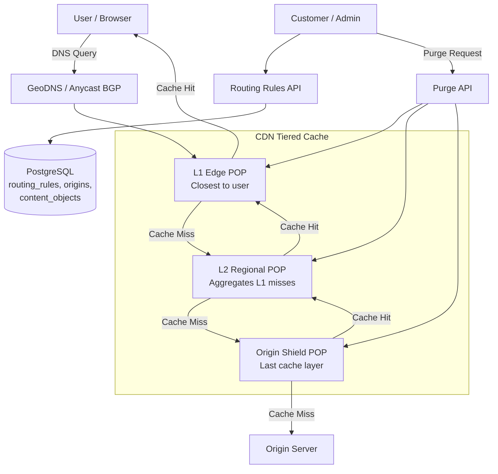
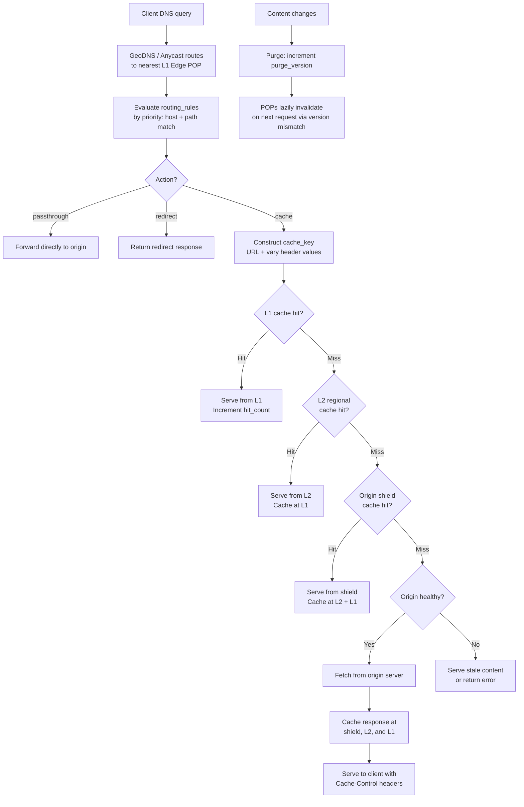

# Data Model: Content Delivery Network (Cloudflare)

A CDN accelerates content delivery by caching content at edge locations close to users. The data model must capture content metadata, cache state across hundreds of edge POPs (Points of Presence), routing rules, and origin server health. The tiered caching architecture (L1 edge, L2 regional, origin shield) is a key design choice that reduces origin load.

## High-Level Architecture



---

## Table Responsibilities

| Table                  | Purpose                                           | Why It Exists                                                                                 |
| ---------------------- | ------------------------------------------------- | --------------------------------------------------------------------------------------------- |
| **content_objects**    | Canonical content metadata and caching directives | Single source of truth for cache behavior; decouples content identity from where it is cached |
| **edge_cache_entries** | Per-POP cache state                               | Tracks what is cached where; enables targeted purging and hit-rate analysis                   |
| **edge_pops**          | Edge location registry                            | Models the physical topology; used for routing and capacity planning                          |
| **routing_rules**      | Customer-defined request handling rules           | Determines how requests are processed: cache, passthrough, redirect, or edge function         |
| **origins**            | Origin server definitions with health tracking    | Manages failover when origin servers go down                                                  |

---

## Detailed Field Descriptions

### content_objects

| Field         | Type      | Description                                                                         |
| ------------- | --------- | ----------------------------------------------------------------------------------- |
| id            | UUID (PK) | Unique content identifier                                                           |
| cdn_url       | VARCHAR   | The CDN-served URL (e.g., cdn.example.com/img/hero.jpg)                             |
| origin_url    | VARCHAR   | The origin URL to fetch from on cache miss                                          |
| content_type  | VARCHAR   | MIME type (image/jpeg, text/html, application/json)                                 |
| ttl_seconds   | INT       | Default time-to-live before content is considered stale                             |
| cache_control | VARCHAR   | Full Cache-Control header value (max-age, s-maxage, stale-while-revalidate)         |
| vary_headers  | VARCHAR[] | Headers that create separate cache entries (e.g., Accept-Encoding, Accept-Language) |
| tags          | VARCHAR[] | Cache tags for grouped purging (e.g., "product-123", "homepage")                    |
| size_bytes    | BIGINT    | Content size; used for capacity planning                                            |
| etag          | VARCHAR   | Entity tag for conditional requests (If-None-Match)                                 |
| last_modified | TIMESTAMP | Last modification time for conditional requests (If-Modified-Since)                 |

**Why vary_headers?** A single URL might serve different content based on Accept-Encoding (gzip vs brotli) or Accept-Language. Each unique combination of vary header values creates a separate cache entry. Without this, users would get wrong content.

**Why tags array?** When a product is updated, you need to purge all related cached content (product page, category listing, search results). Tags enable "purge all content tagged product-123" instead of listing every URL.

### edge_cache_entries

| Field         | Type                 | Description                                                               |
| ------------- | -------------------- | ------------------------------------------------------------------------- |
| cache_key     | VARCHAR (PK per POP) | Composite of URL + vary header values; unique within a POP                |
| cdn_url       | VARCHAR              | The cached content's CDN URL                                              |
| pop_id        | UUID (FK)            | Which edge POP holds this cache entry                                     |
| cached_at     | TIMESTAMP            | When this entry was populated                                             |
| expires_at    | TIMESTAMP            | When the entry becomes stale (cached_at + ttl)                            |
| hit_count     | INT                  | Number of times this entry was served; used for eviction decisions        |
| size_bytes    | BIGINT               | Cached content size                                                       |
| etag          | VARCHAR              | ETag for revalidation with origin                                         |
| is_stale      | BOOLEAN              | Whether the entry is past TTL but still servable (stale-while-revalidate) |
| purge_version | INT                  | Incremented on purge; entries with old purge_version are invalid          |

**Why purge_version instead of DELETE?** Deleting cache entries across hundreds of POPs is slow and creates inconsistency windows. Incrementing purge_version is a single metadata update; POPs lazily invalidate on the next request when they see a version mismatch.

### edge_pops

| Field          | Type      | Description                                                                                        |
| -------------- | --------- | -------------------------------------------------------------------------------------------------- |
| pop_id         | UUID (PK) | Unique POP identifier                                                                              |
| region         | VARCHAR   | Geographic region (us-east, eu-west, ap-southeast)                                                 |
| city           | VARCHAR   | City name                                                                                          |
| country        | VARCHAR   | ISO country code                                                                                   |
| lat            | DECIMAL   | Latitude for geo-routing calculations                                                              |
| lng            | DECIMAL   | Longitude for geo-routing calculations                                                             |
| anycast_prefix | VARCHAR   | The anycast IP prefix this POP announces via BGP                                                   |
| capacity_gbps  | INT       | Total bandwidth capacity                                                                           |
| tier           | ENUM      | L1_edge (closest to users), L2_regional (mid-tier cache), origin_shield (last cache before origin) |

**Why three tiers?** L1 edge POPs handle most requests but have limited storage. L2 regional POPs aggregate cache misses from multiple L1s, reducing origin load. Origin shield is a single cache layer that absorbs the "thundering herd" -- without it, a cache miss at 100 L1 POPs would generate 100 origin requests simultaneously.

### routing_rules

| Field        | Type      | Description                                              |
| ------------ | --------- | -------------------------------------------------------- |
| rule_id      | UUID (PK) | Unique rule identifier                                   |
| customer_id  | UUID      | Which customer owns this rule                            |
| priority     | INT       | Lower number = higher priority; rules evaluated in order |
| match_host   | VARCHAR   | Hostname pattern to match (e.g., \*.example.com)         |
| match_path   | VARCHAR   | Path pattern to match (e.g., /api/_, /static/_)          |
| action       | ENUM      | cache, passthrough, redirect, edge_function              |
| ttl_override | INT       | Overrides content_objects.ttl_seconds if set             |
| origin_id    | UUID (FK) | Which origin to fetch from on cache miss                 |

**Why priority-based rules?** Customers need fine-grained control: "cache everything under /static/ for 1 year, but /api/\* should always passthrough." Priority ordering resolves conflicts when multiple rules match.

### origins

| Field             | Type      | Description                                      |
| ----------------- | --------- | ------------------------------------------------ |
| origin_id         | UUID (PK) | Unique origin identifier                         |
| customer_id       | UUID      | Which customer owns this origin                  |
| name              | VARCHAR   | Human-readable name                              |
| url               | VARCHAR   | Origin server URL                                |
| health_check_path | VARCHAR   | Path to probe for health (e.g., /healthz)        |
| timeout_ms        | INT       | Request timeout before marking unhealthy         |
| retry_attempts    | INT       | Number of retries before failover                |
| is_healthy        | BOOLEAN   | Current health status; updated by health checker |

**Why explicit health tracking?** If an origin is down, the CDN should serve stale content (stale-while-revalidate) or fail fast rather than making users wait for timeouts. The is_healthy flag short-circuits routing decisions.

---

## ER Diagram

```
+--------------------+        +---------------------+
|      origins       |        |   routing_rules     |
+--------------------+        +---------------------+
| origin_id (PK)     |<-------| rule_id (PK)        |
| customer_id        |   *  1 | customer_id         |
| name               |        | priority            |
| url                |        | match_host          |
| health_check_path  |        | match_path          |
| timeout_ms         |        | action              |
| retry_attempts     |        | ttl_override        |
| is_healthy         |        | origin_id (FK)      |
+--------------------+        +---------------------+
                                        |
                                        | Determines caching
                                        | behavior for
                                        v
+--------------------+        +---------------------+
| content_objects    |        |    edge_pops        |
+--------------------+        +---------------------+
| id (PK)            |        | pop_id (PK)         |
| cdn_url            |        | region              |
| origin_url         |        | city, country       |
| content_type       |        | lat, lng            |
| ttl_seconds        |        | anycast_prefix      |
| cache_control      |        | capacity_gbps       |
| vary_headers[]     |        | tier                |
| tags[]             |        +----------+----------+
| size_bytes         |                   |
| etag               |                   | 1
| last_modified      |                   |
+---------+----------+                   |
          |                              *
          | 1                  +---------+----------+
          |                    | edge_cache_entries  |
          +----*-----------+   +--------------------+
                           |   | cache_key (PK/POP) |
                           +-->| cdn_url             |
                               | pop_id (FK)         |
                               | cached_at           |
                               | expires_at          |
                               | hit_count           |
                               | size_bytes          |
                               | etag                |
                               | is_stale            |
                               | purge_version       |
                               +--------------------+
```

### Relationship Summary

```
origins        1───* routing_rules       (one origin serves many routing rules)
content_objects 1───* edge_cache_entries  (one content object cached at many POPs)
edge_pops      1───* edge_cache_entries  (one POP holds many cache entries)
```

---

## Data Flow

1. **DNS resolution** -- Client makes a DNS query. GeoDNS (or anycast BGP) routes the query to the nearest L1 edge POP based on the client's geographic location and the POP's anycast_prefix.

2. **Request arrives at edge** -- The L1 edge POP receives the HTTP request. It evaluates `routing_rules` in priority order, matching on host and path to determine the action (cache, passthrough, redirect, edge_function).

3. **Cache lookup (L1)** -- If action=cache, the POP constructs the cache_key from the URL + vary header values and looks up `edge_cache_entries` for this POP. If found and not expired (or is_stale=true with stale-while-revalidate), serve it. Increment hit_count.

4. **L2 regional fallback** -- On L1 miss, the request is forwarded to the L2 regional POP (determined by edge_pops.tier). The L2 POP performs the same cache lookup. This aggregation layer prevents many L1 misses from all hitting the origin.

5. **Origin shield** -- On L2 miss, the request reaches the origin_shield POP. This is the last cache layer. A miss here means the content truly is not cached anywhere in the CDN.

6. **Origin fetch** -- On origin shield miss, the CDN fetches from the `origins` server. If `is_healthy=false`, it either serves stale content or returns an error. On success, it populates the content_objects metadata (etag, size, content_type).

7. **Cache population** -- The response is cached at each tier it passed through (origin shield, L2, L1), creating `edge_cache_entries` at each POP with appropriate TTLs derived from content_objects.ttl_seconds or routing_rules.ttl_override.

8. **Cache invalidation** -- When content changes, a purge request increments `purge_version` on the content_object. POPs lazily invalidate: on the next request, they compare their cached purge_version against the current one and treat mismatches as cache misses. Tag-based purging invalidates all content_objects matching a given tag.

9. **Response to client** -- The content is served with appropriate Cache-Control headers. The client and any intermediate proxies can cache based on these headers.



---

## Interview Discussion Points

**Q: Why tiered caching instead of every POP going directly to origin?**
If you have 300 edge POPs and a popular asset expires, 300 simultaneous origin requests create a thundering herd. Tiered caching funnels these through ~20 L2 POPs and then a single origin shield, so the origin sees 1 request instead of 300. This is the most critical scalability feature of a CDN.

**Q: How does cache invalidation work at scale?**
Two strategies: (1) TTL-based expiration -- set short TTLs for dynamic content, long TTLs for static assets. (2) Active purge -- increment purge_version for immediate invalidation. Tag-based purging enables invalidating groups of related content with a single operation.

**Q: Why is the cache_key per-POP rather than global?**
Each POP manages its own cache independently. A global cache would require distributed consensus (slow) and would not reflect geographic locality. The cache_key includes vary header values so the same URL can have multiple cache entries (e.g., gzip vs brotli).

**Q: How do you handle cache stampede (thundering herd at a single POP)?**
Request coalescing: when multiple concurrent requests arrive at a POP for the same uncached URL, only one request goes to the next tier. The others wait and are served from the cache entry that the first request populates. This is implemented at the POP level, not in the data model, but is critical to mention.
