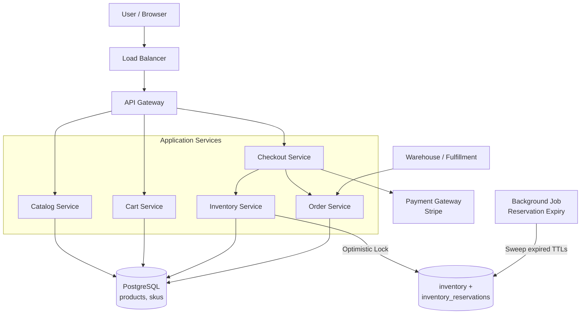
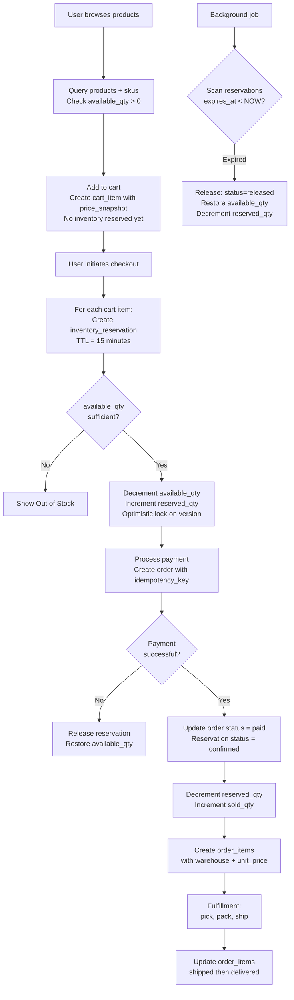

# Data Model: E-commerce Inventory & Orders (Amazon)

An e-commerce inventory system must handle the critical challenge of selling physical goods without overselling. The core tension is between showing accurate availability to millions of concurrent browsers while ensuring that checkout does not sell more units than exist. This model uses a reservation-based pattern with TTLs to hold inventory during checkout without permanently locking it.

## High-Level Architecture



---

## Table Responsibilities

| Table                      | Purpose                              | Why It Exists                                                           |
| -------------------------- | ------------------------------------ | ----------------------------------------------------------------------- |
| **products**               | Product catalog metadata             | Separates product identity from purchasable variants (SKUs)             |
| **skus**                   | Purchasable product variants         | A "Blue T-Shirt Size M" is a different SKU from "Red T-Shirt Size L"    |
| **inventory**              | Per-warehouse stock levels           | Tracks available, reserved, and sold quantities with optimistic locking |
| **inventory_reservations** | Time-limited inventory holds         | Prevents overselling during checkout without permanently locking stock  |
| **carts**                  | Shopping cart lifecycle              | Session-scoped container for items a user intends to purchase           |
| **cart_items**             | Items in a cart with price snapshots | Captures the price at add-time so price changes do not surprise users   |
| **orders**                 | Finalized purchase records           | Immutable record of a completed transaction with payment linkage        |
| **order_items**            | Per-SKU order line items             | Tracks which warehouse fulfills each item and per-item status           |

---

## Detailed Field Descriptions

### products

| Field       | Type      | Description                                 |
| ----------- | --------- | ------------------------------------------- |
| product_id  | UUID (PK) | Unique product identifier                   |
| seller_id   | UUID (FK) | The seller who listed this product          |
| title       | VARCHAR   | Product title for display and search        |
| description | TEXT      | Full product description                    |
| category_id | UUID (FK) | Product category for browsing and filtering |
| status      | ENUM      | active, inactive, suspended                 |

### skus

| Field           | Type      | Description                                    |
| --------------- | --------- | ---------------------------------------------- |
| sku_id          | UUID (PK) | Unique SKU identifier                          |
| product_id      | UUID (FK) | Parent product                                 |
| sku_code        | VARCHAR   | Human-readable SKU code (e.g., "TSHIRT-BLU-M") |
| attributes_json | JSONB     | Variant attributes: size, color, material      |
| price_cents     | INT       | Current price in cents (avoids floating point) |
| weight_g        | INT       | Weight in grams for shipping calculation       |
| image_url       | VARCHAR   | Variant-specific image                         |

**Why separate products and skus?** A product is a concept ("Nike Air Max 90"). A SKU is a specific purchasable variant ("Nike Air Max 90, Black, Size 10"). Inventory is tracked per SKU, not per product. Combining them would force denormalization or prevent variant-level stock tracking.

### inventory

| Field         | Type      | Description                                                                     |
| ------------- | --------- | ------------------------------------------------------------------------------- |
| inventory_id  | UUID (PK) | Unique inventory record identifier                                              |
| sku_id        | UUID (FK) | Which SKU this stock is for                                                     |
| warehouse_id  | UUID (FK) | Which warehouse holds this stock                                                |
| available_qty | INT       | Units available for sale right now                                              |
| reserved_qty  | INT       | Units currently held by active reservations                                     |
| sold_qty      | INT       | Units that have been sold (for analytics)                                       |
| reorder_point | INT       | When available_qty drops below this, trigger reorder                            |
| version       | INT       | Optimistic lock version; prevents concurrent updates from corrupting quantities |

**Why per-warehouse inventory?** A SKU might have 50 units in warehouse A and 200 in warehouse B. Fulfillment needs to know WHERE the stock is, not just the total. This also enables nearest-warehouse routing for faster delivery.

**Why optimistic locking?** Pessimistic locks (SELECT FOR UPDATE) create contention under high concurrency. Optimistic locking lets concurrent reads proceed freely; only the final UPDATE checks the version. If it changed, the operation retries. This is critical for flash sales.

### inventory_reservations

| Field          | Type      | Description                                                                |
| -------------- | --------- | -------------------------------------------------------------------------- |
| reservation_id | UUID (PK) | Unique reservation identifier                                              |
| sku_id         | UUID (FK) | Which SKU is reserved                                                      |
| warehouse_id   | UUID (FK) | Which warehouse the reservation is against                                 |
| quantity       | INT       | Number of units reserved                                                   |
| status         | ENUM      | active, confirmed, released                                                |
| expires_at     | TIMESTAMP | TTL -- reservation auto-releases after this time (typically 10-15 minutes) |
| order_id       | UUID      | Nullable; set when reservation is confirmed for an order                   |

**Why TTL-based reservations?** Without TTLs, abandoned checkouts would permanently lock inventory. A 15-minute TTL ensures that if a user does not complete payment, the stock becomes available again automatically. A background job sweeps expired reservations.

### carts

| Field      | Type      | Description                                            |
| ---------- | --------- | ------------------------------------------------------ |
| cart_id    | UUID (PK) | Unique cart identifier                                 |
| user_id    | UUID      | The user who owns this cart (nullable for guest carts) |
| status     | ENUM      | active, checked_out, abandoned                         |
| expires_at | TIMESTAMP | Cart expiration for cleanup (e.g., 30 days)            |

### cart_items

| Field                | Type      | Description                                          |
| -------------------- | --------- | ---------------------------------------------------- |
| cart_id              | UUID (FK) | Parent cart (composite PK with sku_id)               |
| sku_id               | UUID (FK) | Which SKU is in the cart (composite PK with cart_id) |
| quantity             | INT       | How many units                                       |
| price_snapshot_cents | INT       | Price at the time of adding to cart                  |

**Why price_snapshot?** If a price changes between adding to cart and checkout, the user should see the price they expect. The snapshot captures "the price you saw." At checkout, you can either honor the snapshot or show a price-change notification.

### orders

| Field             | Type          | Description                                                 |
| ----------------- | ------------- | ----------------------------------------------------------- |
| order_id          | UUID (PK)     | Unique order identifier                                     |
| user_id           | UUID (FK)     | The buyer                                                   |
| status            | ENUM          | pending_payment, paid, shipped, delivered, cancelled        |
| subtotal          | INT           | Sum of item prices in cents                                 |
| tax               | INT           | Tax amount in cents                                         |
| shipping          | INT           | Shipping cost in cents                                      |
| total             | INT           | Final total in cents (subtotal + tax + shipping)            |
| payment_intent_id | VARCHAR       | Reference to payment processor (e.g., Stripe PaymentIntent) |
| idempotency_key   | UUID (UNIQUE) | Prevents duplicate order creation from retried requests     |

**Why idempotency_key?** If the client retries a checkout request (network timeout, user double-clicks), the unique constraint on idempotency_key ensures only one order is created. Without this, users get charged twice.

### order_items

| Field            | Type      | Description                                        |
| ---------------- | --------- | -------------------------------------------------- |
| order_id         | UUID (FK) | Parent order (composite PK with sku_id)            |
| sku_id           | UUID (FK) | Which SKU was ordered (composite PK with order_id) |
| warehouse_id     | UUID      | Which warehouse fulfills this item                 |
| quantity         | INT       | Number of units ordered                            |
| unit_price_cents | INT       | Price per unit at time of purchase (immutable)     |
| status           | ENUM      | pending, shipped, delivered, returned              |

**Why per-item status?** In a multi-item order, items may ship from different warehouses at different times. One item might be delivered while another is still being packed. Per-item status enables accurate tracking.

---

## ER Diagram

```
+------------------+       +------------------+
|    products      |       |     carts        |
+------------------+       +------------------+
| product_id (PK)  |       | cart_id (PK)     |
| seller_id (FK)   |       | user_id          |
| title            |       | status           |
| description      |       | expires_at       |
| category_id (FK) |       +--------+---------+
| status           |                |
+--------+---------+                | 1
         |                          |
         | 1                        *
         |               +-------------------+
         *               |   cart_items      |
+--------+---------+     +-------------------+
|      skus        |     | cart_id (FK)(CPK) |
+------------------+     | sku_id (FK)(CPK)  +-----+
| sku_id (PK)      |<----| quantity          |     |
| product_id (FK)  |  *  | price_snapshot    |     |
| sku_code         |     +-------------------+     |
| attributes_json  |                               |
| price_cents      |                               |
| weight_g         |                               |
+--------+---------+                               |
         |                                         |
         | 1                                       |
         |                                         |
         *                                         |
+------------------+     +--------------------+    |
|   inventory      |     |    orders          |    |
+------------------+     +--------------------+    |
| inventory_id(PK) |     | order_id (PK)      |    |
| sku_id (FK)      |     | user_id (FK)       |    |
| warehouse_id(FK) |     | status             |    |
| available_qty    |     | subtotal, tax      |    |
| reserved_qty     |     | shipping, total    |    |
| sold_qty         |     | payment_intent_id  |    |
| reorder_point    |     | idempotency_key    |    |
| version          |     +--------+-----------+    |
+--------+---------+              |                |
         |                        | 1              |
         | 1                      |                |
         |                        *                |
         *               +--------------------+   |
+--------------------+   |   order_items      |   |
| inventory_         |   +--------------------+   |
|   reservations     |   | order_id (FK)(CPK) |   |
+--------------------+   | sku_id (FK)(CPK)   +---+
| reservation_id(PK) |   | warehouse_id       |
| sku_id (FK)        |   | quantity            |
| warehouse_id (FK)  |   | unit_price_cents    |
| quantity           |   | status              |
| status             |   +--------------------+
| expires_at (TTL)   |
| order_id           |
+--------------------+
```

### Relationship Summary

```
products          1───* skus                 (one product has many variants)
skus              1───* inventory            (one SKU stocked in many warehouses)
skus              1───* cart_items           (one SKU in many carts)
skus              1───* order_items          (one SKU in many orders)
inventory         1───* inventory_reservations (one inventory record has many holds)
carts             1───* cart_items           (one cart has many items)
orders            1───* order_items          (one order has many line items)
```

---

## Data Flow

1. **Browse products** -- Users query products and skus. Inventory availability (available_qty > 0) is checked to show "In Stock" or "Out of Stock."

2. **Add to cart** -- A cart_items row is created with the current price_snapshot_cents. No inventory is reserved yet (carts are long-lived; reserving here would lock stock for days).

3. **Checkout initiated** -- The system attempts to reserve inventory for each cart item by creating `inventory_reservations` with a 15-minute TTL. The inventory record's `reserved_qty` is incremented and `available_qty` is decremented, using the optimistic lock version. If available_qty is insufficient, the item is shown as "Out of Stock."

4. **Payment processing** -- The payment processor authorizes the charge. The order is created with status=pending_payment and the idempotency_key prevents duplicate orders.

5. **Payment confirmed** -- On successful payment:

   - Order status updated to paid
   - Reservation status updated to confirmed
   - Inventory: reserved_qty decremented, sold_qty incremented
   - Order_items created with the confirmed warehouse and unit_price

6. **Reservation expiry** -- A background job periodically scans for reservations where `expires_at < NOW()` and status=active. Expired reservations are released: reservation status set to released, inventory available_qty incremented, reserved_qty decremented.

7. **Fulfillment** -- Warehouse picks, packs, and ships items. Order_items status updated to shipped, then delivered. Order status follows the latest item status.

8. **Cancellation** -- If an order is cancelled before shipping, inventory is restored: available_qty incremented, sold_qty decremented. Refund is issued via the payment processor.



---

## Interview Discussion Points

**Q: Why not reserve inventory when adding to cart?**
Carts are long-lived (days to weeks). Reserving at cart-add time would lock inventory for extended periods, causing phantom stock-outs. Reservation should only happen during the short checkout window (10-15 minutes).

**Q: How do you handle flash sales with 10,000 concurrent buyers for 100 items?**
Optimistic locking on the inventory version field. All 10,000 users can read concurrently. When they attempt to reserve, only updates where the version matches succeed. Failed attempts retry with fresh data. For extreme cases, use Redis atomic decrements as a fast pre-check before hitting the database.

**Q: Why store price in cents as INT instead of DECIMAL?**
Floating-point arithmetic causes rounding errors (0.1 + 0.2 = 0.30000000000000004). Cents as integers eliminate this entirely. All monetary calculations are exact. Display formatting (inserting the decimal point) is a presentation concern.

**Q: What if the price changes between cart add and checkout?**
The cart stores price_snapshot_cents at add time. At checkout, compare snapshot against current SKU price. If different, notify the user and let them confirm. Some businesses honor the lower price; others always use current price. The snapshot enables both policies.
