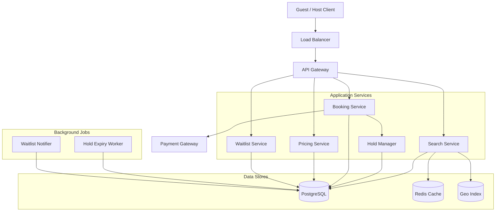
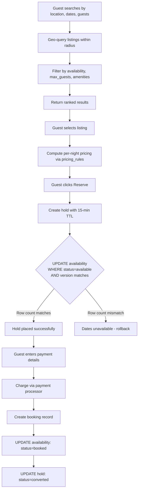
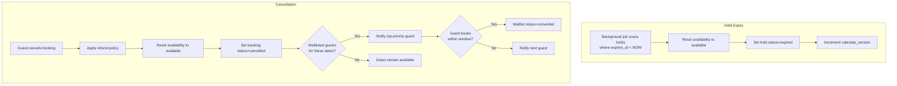

# Data Model: Booking & Reservation (Airbnb)

A booking and reservation system must solve the double-booking problem: two guests should never be able to book the same listing for overlapping dates. The core design uses a per-date availability model with optimistic locking, a short-lived hold mechanism to protect inventory during checkout, and pricing rules that allow dynamic pricing based on season, day of week, and demand. The waitlist feature captures demand for fully booked dates.

---

## High-Level Architecture



---

## Table Responsibilities

| Table                | Purpose                                      | Why It Exists                                                                     |
| -------------------- | -------------------------------------------- | --------------------------------------------------------------------------------- |
| **listings**         | Property catalog with attributes and pricing | Central entity describing what is bookable                                        |
| **availability**     | Per-date availability status                 | One row per listing per date; enables precise control and prevents double-booking |
| **bookings**         | Confirmed reservations                       | Immutable record of a guest's stay with full pricing breakdown                    |
| **holds**            | Short-lived inventory locks during checkout  | Prevents two users from booking the same dates simultaneously                     |
| **pricing_rules**    | Dynamic pricing configuration                | Allows hosts to set seasonal, weekend, and demand-based pricing                   |
| **waitlist_entries** | Demand capture for unavailable dates         | Notifies guests when dates become available; measures unmet demand                |

---

## Detailed Field Descriptions

### listings

| Field         | Type      | Description                                          |
| ------------- | --------- | ---------------------------------------------------- |
| listing_id    | UUID (PK) | Unique listing identifier                            |
| host_id       | UUID (FK) | The property owner                                   |
| title         | VARCHAR   | Listing title                                        |
| description   | TEXT      | Full property description                            |
| property_type | ENUM      | apartment, house, room, villa, cabin                 |
| lat           | DECIMAL   | Latitude for geo-search                              |
| lng           | DECIMAL   | Longitude for geo-search                             |
| max_guests    | INT       | Maximum number of guests allowed                     |
| bedrooms      | INT       | Number of bedrooms                                   |
| bathrooms     | INT       | Number of bathrooms                                  |
| amenities     | VARCHAR[] | Array of amenity tags (wifi, pool, parking, etc.)    |
| base_price    | DECIMAL   | Default nightly price before any pricing rules apply |
| cleaning_fee  | DECIMAL   | One-time cleaning fee per booking                    |
| rating        | DECIMAL   | Average review rating (1.0 to 5.0)                   |
| status        | ENUM      | active, unlisted, suspended                          |

**Why amenities as an array?** Amenities are used for filtering ("show listings with pool AND wifi") but do not have their own lifecycle or relationships. An array with a GIN index is simpler than a many-to-many join table and performs well for containment queries.

### availability

| Field            | Type       | Description                                                            |
| ---------------- | ---------- | ---------------------------------------------------------------------- |
| listing_id       | UUID (CPK) | Part of composite primary key                                          |
| date             | DATE (CPK) | Part of composite primary key; one row per listing per date            |
| status           | ENUM       | available, blocked (host blocked), booked, held                        |
| booking_id       | UUID       | Set when status=booked; references the confirmed booking               |
| hold_id          | UUID       | Set when status=held; references the active hold                       |
| price_override   | DECIMAL    | Host-set price for this specific date (overrides base_price and rules) |
| calendar_version | INT        | Optimistic lock; incremented on every status change                    |

**Why one row per date instead of date ranges?** Date ranges (checkin-checkout) create overlap-detection complexity. With one row per date, "is Oct 15 available?" is a simple primary key lookup. Double-booking prevention becomes: UPDATE availability SET status='booked' WHERE listing_id=X AND date IN (...) AND status='available' -- if the affected row count does not match the expected date count, the booking fails atomically.

**Why calendar_version?** Optimistic locking prevents two concurrent holds on the same date. If two users try to hold Oct 15 simultaneously, only the first UPDATE (where calendar_version matches) succeeds. The second sees a version mismatch and retries, finding the date is now held.

### bookings

| Field               | Type          | Description                                       |
| ------------------- | ------------- | ------------------------------------------------- |
| booking_id          | UUID (PK)     | Unique booking identifier                         |
| listing_id          | UUID (FK)     | Which property is booked                          |
| guest_id            | UUID (FK)     | The guest                                         |
| host_id             | UUID (FK)     | The host (denormalized for query efficiency)      |
| checkin             | DATE          | Check-in date                                     |
| checkout            | DATE          | Check-out date                                    |
| guest_count         | INT           | Number of guests                                  |
| nights              | INT           | Number of nights (checkout - checkin)             |
| status              | ENUM          | confirmed, checked_in, completed, cancelled       |
| price_per_night     | DECIMAL       | Computed average price per night                  |
| subtotal            | DECIMAL       | Sum of per-night prices                           |
| cleaning_fee        | DECIMAL       | Cleaning fee at time of booking                   |
| service_fee         | DECIMAL       | Platform service fee                              |
| taxes               | DECIMAL       | Applicable taxes                                  |
| total               | DECIMAL       | Grand total charged to guest                      |
| payment_id          | VARCHAR       | Reference to payment processor                    |
| cancellation_policy | ENUM          | flexible, moderate, strict                        |
| idempotency_key     | UUID (UNIQUE) | Prevents duplicate bookings from retried requests |

**Why store all price components separately?** Hosts, guests, and the platform each need to see different breakdowns. The host sees subtotal minus platform commission. The guest sees subtotal + cleaning_fee + service_fee + taxes. Storing components separately enables these views without recomputation.

### holds

| Field               | Type          | Description                                               |
| ------------------- | ------------- | --------------------------------------------------------- |
| hold_id             | UUID (PK)     | Unique hold identifier                                    |
| listing_id          | UUID (FK)     | Which listing is held                                     |
| guest_id            | UUID          | Which guest placed the hold                               |
| checkin             | DATE          | Hold start date                                           |
| checkout            | DATE          | Hold end date                                             |
| price_snapshot_json | JSONB         | Full pricing at hold time (per-night prices, fees, taxes) |
| status              | ENUM          | active, converted (became a booking), expired             |
| expires_at          | TIMESTAMP     | 15-minute TTL from creation                               |
| idempotency_key     | UUID (UNIQUE) | Prevents duplicate holds from retried requests            |

**Why 15-minute TTL?** Long enough for a user to enter payment details. Short enough to not block inventory from other buyers. If the hold expires, availability rows are reset to 'available' and other users can book.

**Why price_snapshot_json?** Prices can change between hold creation and booking confirmation. The snapshot ensures the guest pays what they saw, and the host cannot change prices mid-checkout.

### pricing_rules

| Field          | Type      | Description                                                       |
| -------------- | --------- | ----------------------------------------------------------------- |
| rule_id        | UUID (PK) | Unique rule identifier                                            |
| listing_id     | UUID (FK) | Which listing this rule applies to                                |
| rule_type      | ENUM      | seasonal, weekend, early_bird, last_minute                        |
| start_date     | DATE      | Rule effective start date                                         |
| end_date       | DATE      | Rule effective end date                                           |
| price_modifier | DECIMAL   | Multiplier (1.5 = 50% increase) or fixed amount depending on type |
| priority       | INT       | Higher priority rules override lower ones                         |

**Why priority-based rules?** A date might match both "summer season (+30%)" and "weekend (+20%)." Priority determines which applies, or whether they stack. This gives hosts fine-grained control without conflicting rules.

### waitlist_entries

| Field          | Type            | Description                                                |
| -------------- | --------------- | ---------------------------------------------------------- |
| listing_id     | UUID (CPK)      | Part of composite primary key                              |
| guest_id       | UUID (CPK)      | Part of composite primary key                              |
| dates          | DATERANGE (CPK) | Desired date range                                         |
| max_price      | DECIMAL         | Maximum price the guest is willing to pay                  |
| priority_score | DECIMAL         | Computed from max_price, signup time, and guest reputation |
| status         | ENUM            | waiting, notified, converted, expired                      |
| notified_at    | TIMESTAMP       | When the guest was notified of availability                |

**Why waitlist?** When a booking is cancelled, the platform can immediately notify waitlisted guests, increasing rebooking speed and reducing revenue loss. The priority_score ensures the most engaged guests are notified first.

---

## ER Diagram

```
+-------------------+
|    listings       |
+-------------------+
| listing_id (PK)   |
| host_id (FK)      |
| title, description|
| property_type     |
| lat, lng          |
| max_guests        |
| bedrooms          |
| bathrooms         |
| amenities[]       |
| base_price        |
| cleaning_fee      |
| rating            |
| status            |
+---+---+---+---+--+
    |   |   |   |
    |   |   |   +-----------------------------+
    |   |   |                                 |
    |   |   +-----------------+               |
    |   |                     |               |
    | 1 | 1                   | 1             | 1
    |   |                     |               |
    *   *                     *               *
+---+--------+  +-------------+--+  +---------+---------+
| availability|  |    holds       |  | pricing_rules     |
+------------+  +-----------------+  +-------------------+
| listing_id |  | hold_id (PK)    |  | rule_id (PK)      |
| date  (CPK)|  | listing_id (FK) |  | listing_id (FK)   |
| status     |  | guest_id        |  | rule_type         |
| booking_id |  | checkin         |  | start/end_date    |
| hold_id    |  | checkout        |  | price_modifier    |
| price_     |  | price_snapshot  |  | priority          |
|  override  |  | status          |  +-------------------+
| calendar_  |  | expires_at      |
|  version   |  | idempotency_key |
+---+--------+  +-----------------+
    |
    | * (booking_id FK)
    |
+---+-------------------+       +-------------------+
|      bookings         |       | waitlist_entries   |
+-----------------------+       +-------------------+
| booking_id (PK)       |       | listing_id (CPK)  |
| listing_id (FK)       |       | guest_id (CPK)    |
| guest_id (FK)         |       | dates (CPK)       |
| host_id (FK)          |       | max_price         |
| checkin, checkout     |       | priority_score    |
| guest_count, nights   |       | status            |
| status                |       | notified_at       |
| price_per_night       |       +-------------------+
| subtotal              |               *
| cleaning_fee          |               |
| service_fee           |               |
| taxes, total          |          1    |
| payment_id            |   listings ---+
| cancellation_policy   |
| idempotency_key       |
+-----------------------+
```

### Relationship Summary

```
listings       1───* availability       (one listing has one row per date)
listings       1───* bookings           (one listing has many bookings over time)
listings       1───* holds              (one listing can have multiple active holds for different dates)
listings       1───* pricing_rules      (one listing has multiple pricing rules)
listings       1───* waitlist_entries   (one listing has many waitlisted guests)
bookings       1───* availability       (one booking marks multiple dates as booked)
holds          1───* availability       (one hold marks multiple dates as held)
```

---

## Data Flow

1. **Search listings** -- Guest searches by location (geo-query on lat/lng within radius), dates (check availability rows for status=available across the date range), guest count (max_guests >= requested), and filters (amenities, property_type).

2. **View listing details** -- Load the listing record with pricing. For each date in the requested range, apply pricing_rules in priority order: check for price_override on the specific availability row first, then matching pricing_rules (seasonal > weekend > early_bird), finally fall back to base_price.

3. **Place hold** -- When the guest clicks "Reserve":

   - Create a `holds` row with a 15-minute expires_at
   - UPDATE all `availability` rows for the date range: SET status='held', hold_id=X WHERE status='available' AND calendar_version matches
   - If affected row count does not equal the number of dates, another user grabbed a date -- rollback and show "dates unavailable"
   - Store the full price breakdown in price_snapshot_json

4. **Complete payment** -- Guest enters payment details and confirms:

   - Charge the guest via the payment processor
   - Create a `bookings` row with all pricing details and idempotency_key
   - UPDATE `availability` rows: SET status='booked', booking_id=X, hold_id=NULL
   - UPDATE `holds` row: SET status=converted

5. **Hold expiry** -- A background job runs every minute, scanning for holds where `expires_at < NOW()` and status=active:

   - UPDATE `availability` rows: SET status='available', hold_id=NULL, increment calendar_version
   - UPDATE `holds` row: SET status=expired

6. **Cancellation** -- If a confirmed booking is cancelled:

   - Apply refund policy based on cancellation_policy and time until checkin
   - UPDATE `availability` rows: SET status='available', booking_id=NULL
   - UPDATE `bookings` row: SET status=cancelled
   - Query `waitlist_entries` for matching listing_id and overlapping dates
   - Notify top-priority waitlisted guests; set notified_at and status=notified

7. **Waitlist conversion** -- Notified guest has a time window (e.g., 4 hours) to book. If they do, waitlist status=converted. If they do not, notify the next guest.

### Search and Booking Flow



### Hold Expiry and Cancellation Flow



---

## Interview Discussion Points

**Q: Why per-date rows instead of a single booking range with overlap checks?**
Per-date rows make availability checks O(1) per date (primary key lookup). Overlap detection with ranges requires checking `NOT EXISTS (SELECT 1 FROM bookings WHERE listing_id=X AND checkin < :checkout AND checkout > :checkin)` which is harder to index correctly and more prone to race conditions under concurrency.

**Q: How do you handle time zones?**
Checkin and checkout are DATE (not TIMESTAMP) because hospitality operates on dates, not times. The listing's timezone determines when "check-in on Oct 15" actually starts. Storing dates avoids time zone conversion bugs.

**Q: What if the hold expires while the user is entering their credit card?**
The payment flow should extend the hold if the user is actively progressing (e.g., extend by 5 minutes when payment form is submitted). If it truly expires, the booking attempt fails gracefully with a "dates no longer available" message.

**Q: Why not use database-level locks (SELECT FOR UPDATE) on availability?**
Database locks create contention. If 100 users are viewing the same popular listing, SELECT FOR UPDATE would serialize them. Optimistic locking with calendar_version allows all 100 to read concurrently; only the two who try to hold overlapping dates will conflict, and only one will succeed.
