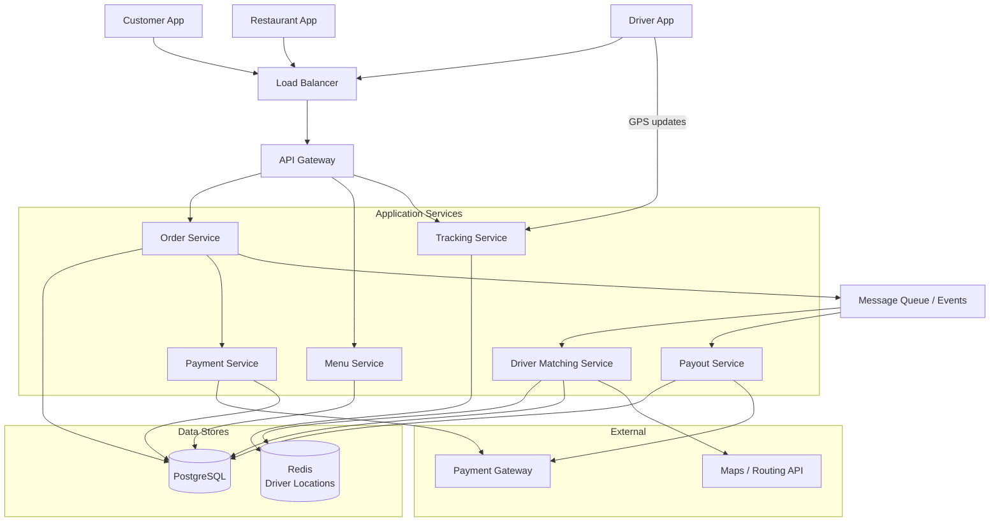
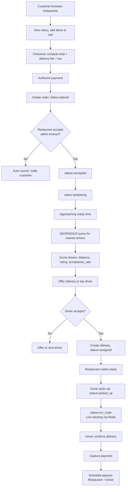
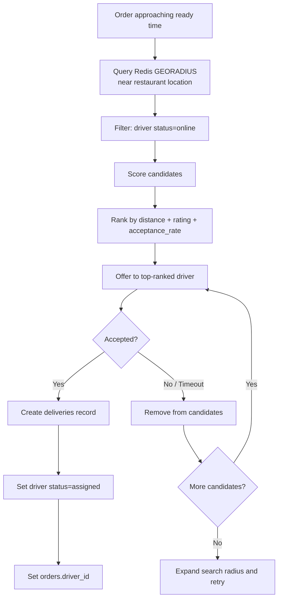

# Data Model: Food Delivery (DoorDash/Uber Eats)

A food delivery platform coordinates three parties in real time: customers ordering food, restaurants preparing it, and drivers delivering it. The data model must handle menu management with real-time availability, order lifecycle across multiple status transitions, driver matching using geospatial queries, live location tracking, and split payments to restaurants and drivers. The core challenge is coordinating these three independent actors with different incentives and constraints.

---

## High-Level Architecture



---

## Table Responsibilities

| Table                | Purpose                                  | Storage  | Why It Exists                                                                       |
| -------------------- | ---------------------------------------- | -------- | ----------------------------------------------------------------------------------- |
| **restaurants**      | Restaurant catalog and operational state | Postgres | Central entity with operating hours, capacity limits, and commission rates          |
| **menu_items**       | Menu catalog with customization options  | Postgres | What customers can order; includes real-time availability toggling                  |
| **orders**           | Order lifecycle and pricing              | Postgres | Single record tracking the full journey from placed to delivered                    |
| **order_items**      | Per-item details with snapshots          | Postgres | Captures exactly what was ordered, including customizations and price at order time |
| **drivers**          | Driver profiles and status               | Postgres | Driver identity, vehicle info, and performance metrics                              |
| **driver_locations** | Real-time driver GPS positions           | Redis    | Sub-millisecond geo-queries for driver matching and live tracking                   |
| **deliveries**       | Delivery assignment and routing          | Postgres | Links order to driver with distance and payout calculations                         |
| **payments**         | Payment processing records               | Postgres | Tracks payment authorization, capture, and refunds                                  |
| **payouts**          | Settlement to restaurants and drivers    | Postgres | Schedules payments to two-sided marketplace participants                            |

---

## Detailed Field Descriptions

### restaurants

| Field                 | Type      | Description                                                              |
| --------------------- | --------- | ------------------------------------------------------------------------ |
| restaurant_id         | UUID (PK) | Unique restaurant identifier                                             |
| name                  | VARCHAR   | Restaurant display name                                                  |
| address_json          | JSONB     | Structured address: street, city, state, zip, country                    |
| location              | POINT     | Geographic coordinates for distance calculations and geo-search          |
| cuisine_types         | VARCHAR[] | Tags for filtering: pizza, sushi, thai, etc.                             |
| rating                | DECIMAL   | Average customer rating (1.0 to 5.0)                                     |
| is_open               | BOOLEAN   | Whether the restaurant is currently open (based on operating_hours_json) |
| accepting_orders      | BOOLEAN   | Open does not mean accepting orders -- kitchen may be overwhelmed        |
| max_concurrent_orders | INT       | Maximum orders the kitchen can handle simultaneously                     |
| avg_prep_minutes      | INT       | Average preparation time; used for delivery ETA calculation              |
| commission_rate       | DECIMAL   | Platform's commission percentage (typically 15-30%)                      |
| operating_hours_json  | JSONB     | Per-day-of-week open/close times, including holiday overrides            |

**Why both is_open and accepting_orders?** A restaurant can be open (within operating hours) but not accepting orders (kitchen at capacity, short-staffed). These are independent states. Conflating them would either turn away customers unnecessarily or accept orders the kitchen cannot fulfill.

**Why max_concurrent_orders?** Without this, a viral restaurant could receive 500 orders in 10 minutes and deliver none on time. This cap ensures quality and helps set realistic ETAs.

### menu_items

| Field                     | Type      | Description                                                                    |
| ------------------------- | --------- | ------------------------------------------------------------------------------ |
| menu_item_id              | UUID (PK) | Unique menu item identifier                                                    |
| restaurant_id             | UUID (FK) | Parent restaurant                                                              |
| category                  | VARCHAR   | Menu section: appetizers, mains, desserts, drinks                              |
| name                      | VARCHAR   | Item name                                                                      |
| description               | TEXT      | Item description                                                               |
| price_cents               | INT       | Price in cents                                                                 |
| image_url                 | VARCHAR   | Food photo URL                                                                 |
| is_available              | BOOLEAN   | Real-time availability toggle (restaurant can mark items as 86'd/sold out)     |
| dietary_tags              | VARCHAR[] | vegetarian, vegan, gluten_free, halal, etc.                                    |
| customization_groups_json | JSONB     | Nested structure of customization options (size, toppings, extras) with prices |

**Why customization_groups_json as JSONB?** Customization options vary wildly between menu items (pizza toppings vs burger add-ons vs drink sizes). A relational model would require multiple join tables. JSONB captures the hierarchical structure naturally and is read-heavy (rarely updated).

### orders

| Field                 | Type      | Description                                                                   |
| --------------------- | --------- | ----------------------------------------------------------------------------- |
| order_id              | UUID (PK) | Unique order identifier                                                       |
| customer_id           | UUID (FK) | The ordering customer                                                         |
| restaurant_id         | UUID (FK) | Which restaurant is preparing the food                                        |
| driver_id             | UUID (FK) | Assigned delivery driver (set after matching)                                 |
| status                | ENUM      | placed, accepted, preparing, ready, picked_up, en_route, delivered, cancelled |
| delivery_address_json | JSONB     | Structured delivery address with lat/lng                                      |
| subtotal              | INT       | Sum of order_items in cents                                                   |
| delivery_fee          | INT       | Delivery fee in cents (distance-based)                                        |
| tax                   | INT       | Tax amount in cents                                                           |
| tip                   | INT       | Driver tip in cents                                                           |
| total                 | INT       | Grand total in cents                                                          |
| promo_code            | VARCHAR   | Applied promotional code, if any                                              |
| placed_at             | TIMESTAMP | When the order was placed                                                     |
| estimated_delivery_at | TIMESTAMP | ETA computed from avg_prep_minutes + driving time                             |

**Why so many status values?** Each status transition triggers different actions: accepted notifies the customer, preparing starts the prep timer, ready triggers driver dispatch, picked_up starts delivery tracking, delivered triggers payment capture. Missing a status means missing a user-facing notification or a business process.

### order_items

| Field               | Type      | Description                                              |
| ------------------- | --------- | -------------------------------------------------------- |
| order_item_id       | UUID (PK) | Unique line item identifier                              |
| order_id            | UUID (FK) | Parent order                                             |
| menu_item_id        | UUID (FK) | Which menu item was ordered                              |
| name_snapshot       | VARCHAR   | Menu item name at order time (menu items can be renamed) |
| price_snapshot      | INT       | Price at order time in cents (prices can change)         |
| quantity            | INT       | Number of this item ordered                              |
| customizations_json | JSONB     | Selected customization options with their prices         |
| subtotal            | INT       | (price_snapshot + customization prices) x quantity       |

**Why name_snapshot and price_snapshot?** The menu is a living document. If a restaurant renames "Classic Burger" to "Signature Burger" or changes the price from $12 to $14, historical orders should still show what the customer actually ordered and paid. Snapshots make the order record self-contained.

### drivers

| Field           | Type      | Description                                       |
| --------------- | --------- | ------------------------------------------------- |
| driver_id       | UUID (PK) | Unique driver identifier                          |
| user_id         | UUID      | Link to the user account                          |
| vehicle_type    | ENUM      | car, motorcycle, bicycle, scooter                 |
| status          | ENUM      | offline, online (available), assigned, delivering |
| rating          | DECIMAL   | Average customer rating                           |
| acceptance_rate | DECIMAL   | Percentage of offered deliveries accepted         |
| completion_rate | DECIMAL   | Percentage of accepted deliveries completed       |

**Why track acceptance_rate and completion_rate?** These metrics determine driver priority in the matching algorithm and eligibility for bonuses. A driver who accepts 95% of offers gets first pick of high-value deliveries. A driver with low completion_rate may be deactivated.

### driver_locations (Redis)

| Field     | Type  | Description                    |
| --------- | ----- | ------------------------------ |
| driver_id | KEY   | Redis key                      |
| lat       | FLOAT | Current latitude               |
| lng       | FLOAT | Current longitude              |
| heading   | FLOAT | Direction of travel in degrees |
| speed     | FLOAT | Current speed in km/h          |
| timestamp | INT   | Unix timestamp of last update  |

**Why Redis with GEOADD?** Driver matching requires "find the 5 nearest available drivers to restaurant X." Redis GEORADIUS performs this in sub-milliseconds with O(N+log(M)) complexity. A relational database geo-query would be orders of magnitude slower for the real-time requirements. Drivers update their location every 3-5 seconds.

### deliveries

| Field                    | Type      | Description                                              |
| ------------------------ | --------- | -------------------------------------------------------- |
| delivery_id              | UUID (PK) | Unique delivery identifier                               |
| order_id                 | UUID (FK) | Which order this delivery fulfills                       |
| driver_id                | UUID (FK) | Assigned driver                                          |
| status                   | ENUM      | assigned, picked_up, en_route, delivered, failed         |
| restaurant_location_json | JSONB     | Restaurant lat/lng at assignment time                    |
| dropoff_location_json    | JSONB     | Customer delivery location                               |
| distance_km              | DECIMAL   | Computed driving distance                                |
| driver_payout_cents      | INT       | Driver payment for this delivery (base + distance + tip) |

**Why a separate deliveries table from orders?** An order might be reassigned to a different driver (original driver cancelled). The delivery record captures the actual fulfillment, not the order intent. In future, multi-order batching (driver picks up from two restaurants) maps cleanly to multiple deliveries per driver trip.

### payments

| Field        | Type      | Description                                               |
| ------------ | --------- | --------------------------------------------------------- |
| payment_id   | UUID (PK) | Unique payment identifier                                 |
| order_id     | UUID (FK) | Which order this payment is for                           |
| amount       | INT       | Payment amount in cents                                   |
| status       | ENUM      | authorized, captured, failed, refunded                    |
| processor_id | VARCHAR   | Payment processor transaction ID (e.g., Stripe charge ID) |

**Why authorize then capture?** Authorization holds funds when the order is placed. Capture happens only when the order is delivered. If the order is cancelled, the authorization is released without ever charging the customer. This two-step process protects both the customer and the platform.

### payouts

| Field          | Type      | Description                       |
| -------------- | --------- | --------------------------------- |
| payout_id      | UUID (PK) | Unique payout identifier          |
| recipient_type | ENUM      | restaurant, driver                |
| recipient_id   | UUID      | Restaurant or driver ID           |
| order_id       | UUID      | Which order this payout is for    |
| amount         | INT       | Payout amount in cents            |
| status         | ENUM      | pending, scheduled, paid, failed  |
| scheduled_for  | DATE      | When the payout will be processed |

**Why separate payouts per recipient per order?** Restaurant payout = subtotal - (subtotal x commission_rate). Driver payout = base_pay + distance_bonus + tip. These are independent amounts going to independent bank accounts on independent schedules (restaurants might get weekly payouts, drivers daily).

---

## ER Diagram

```
+--------------------+
|   restaurants      |
+--------------------+
| restaurant_id (PK) |
| name               |
| address_json       |
| location (POINT)   |
| cuisine_types[]    |
| rating             |
| is_open            |
| accepting_orders   |
| max_concurrent     |
| avg_prep_minutes   |
| commission_rate    |
| operating_hours    |
+--------+-----------+
         |
         | 1
         |
    +----+----+
    |         |
    *         *
+---+------+ +--+-----------+
|menu_items| |   orders      |
+----------+ +---------------+
|menu_item_| | order_id (PK) |
| id (PK)  | | customer_id   |
|restaurant| | restaurant_id |
| _id (FK) | | driver_id(FK) |
|category  | | status        |
|name      | | delivery_addr |
|price_cents| | subtotal     |
|image_url | | delivery_fee  |
|is_avail  | | tax, tip      |
|dietary[] | | total         |
|custom_   | | promo_code    |
| groups   | | placed_at     |
+---+------+ | est_delivery  |
    |         +--+--+--+-----+
    |            |  |  |
    | 1          |  |  |
    |     +------+  |  +----------+
    *     |         |             |
+---+----+---+     | 1           | 1
| order_items |     |             |
+-------------+     *             *
|order_item_id| +---+--------+ +-+---------+
|order_id(FK) | | deliveries | | payments  |
|menu_item_id | +------------+ +-----------+
|name_snapshot| |delivery_id | |payment_id |
|price_snap   | |order_id(FK)| |order_id   |
|quantity     | |driver_id   | |amount     |
|custom_json  | |status      | |status     |
|subtotal     | |restaurant_ | |processor_ |
+-------------+ | location   | | id        |
                |dropoff_loc | +-----------+
                |distance_km |
                |driver_payout|
                +---+--------+
                    |
                    | *
                    |
               +----+------+     (Redis)
               |  drivers  |     +------------------+
               +-----------+     | driver_locations  |
               |driver_id  |     +------------------+
               |user_id    |     | driver_id (KEY)  |
               |vehicle    |     | lat, lng         |
               |status     |     | heading, speed   |
               |rating     |     | timestamp        |
               |accept_rate|     +------------------+
               |complete_  |
               | rate      |
               +-----------+

+---------------+
|   payouts     |
+---------------+
| payout_id(PK) |
| recipient_type|
| recipient_id  |
| order_id      |
| amount        |
| status        |
| scheduled_for |
+---------------+
```

### Relationship Summary

```
restaurants    1───* menu_items       (one restaurant has many menu items)
restaurants    1───* orders           (one restaurant receives many orders)
orders         1───* order_items      (one order has many line items)
menu_items     1───* order_items      (one menu item appears in many orders)
orders         1───1 deliveries       (one order has one delivery assignment)
orders         1───1 payments         (one order has one payment record)
orders         1───* payouts          (one order generates payouts to restaurant + driver)
drivers        1───* deliveries       (one driver handles many deliveries)
```

---

## Data Flow

1. **Customer browses** -- Customer opens the app. The system queries `restaurants` near the customer's location using a geo-query on the `location` field, filtered by is_open=true AND accepting_orders=true. Results are ranked by distance, rating, and cuisine match.

2. **Menu selection** -- Customer views a restaurant's `menu_items` where is_available=true. They add items with customizations to the cart.

3. **Checkout** -- The system computes the total: sum of order_items (price_cents x quantity + customization prices) + delivery_fee (distance-based) + tax. Payment is authorized (payments.status=authorized).

4. **Order placed** -- An `orders` row is created with status=placed. `order_items` rows capture name_snapshot, price_snapshot, and customizations_json.

5. **Restaurant accepts** -- The restaurant app shows the new order. Restaurant sets status=accepted. If the restaurant does not respond within a timeout (e.g., 5 minutes), the order is auto-cancelled and the customer is notified.

6. **Preparation** -- Restaurant sets status=preparing. The ETA is computed: avg_prep_minutes + estimated driving time from restaurant to customer (based on delivery_address distance).

7. **Driver matching** -- When the order is approaching ready (e.g., 5 minutes before expected ready time), the system queries `driver_locations` in Redis using GEORADIUS to find the nearest available drivers (status=online). The matching algorithm considers distance, driver rating, and acceptance_rate. The selected driver is offered the delivery.

8. **Driver assigned** -- When a driver accepts, a `deliveries` row is created. Driver status changes to assigned. `orders.driver_id` is set.

9. **Pickup** -- Restaurant sets status=ready. Driver navigates to the restaurant. Upon arrival and pickup, status changes to picked_up. Driver location updates continue streaming to Redis every 3-5 seconds.

10. **En route** -- Status changes to en_route. The customer sees live driver location on a map, powered by polling `driver_locations` from Redis.

11. **Delivered** -- Driver confirms delivery. Status changes to delivered. Payment is captured (payments.status=captured). Driver status returns to online.

12. **Payouts scheduled** -- Two `payouts` rows are created:
    - Restaurant: subtotal - (subtotal x commission_rate)
    - Driver: base_pay + distance_bonus + tip
    - Payouts are scheduled per the settlement frequency (daily for drivers, weekly for restaurants).

### Order Lifecycle Flow



### Driver Matching Flow



---

## Interview Discussion Points

**Q: Why snapshot item names and prices instead of just referencing the menu_item?**
Restaurants frequently update menus (rename items, change prices, mark items unavailable). An order record must be self-contained -- if you look at an order from 6 months ago, you need to see exactly what was ordered and at what price. A foreign key to a potentially changed menu_item would show incorrect data.

**Q: How do you handle the driver matching problem?**
The matching algorithm balances multiple objectives: minimize customer wait time (nearest driver), maximize driver utilization (batching nearby pickups), and maintain fairness (rotate among available drivers). Redis GEORADIUS finds candidates; the ranking algorithm scores them. This is one of the most valuable IP in food delivery platforms.

**Q: Why authorize payment at order time but capture at delivery?**
If the restaurant cancels or is out of items, the customer should not be charged. Authorization holds the funds without transferring them. Capture only happens on successful delivery. This is standard for two-sided marketplaces where fulfillment is not guaranteed at order time.

**Q: How do you compute accurate delivery ETAs?**
ETA = restaurant prep time (avg_prep_minutes, adjusted for current order volume) + driver travel time to restaurant + driver travel time to customer. Travel times use real-time traffic data. The ETA is updated continuously as driver_locations stream in. Accurate ETAs are critical for customer satisfaction and are a major competitive differentiator.
