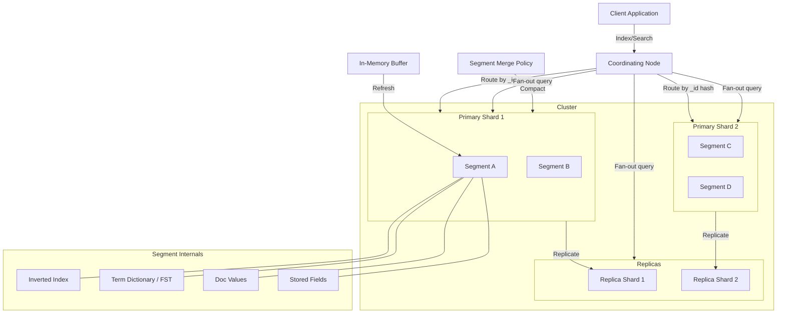
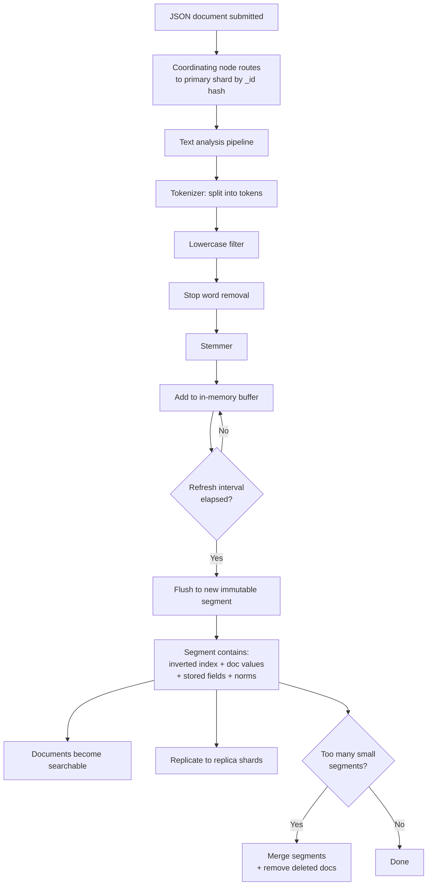
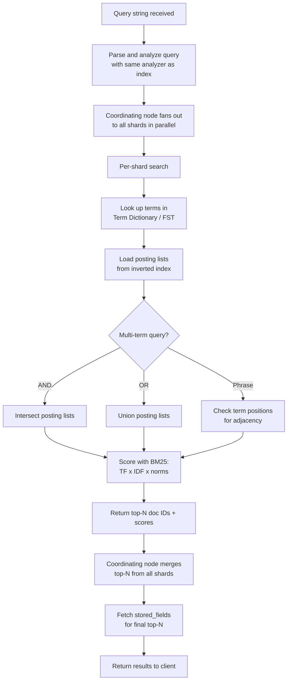

# Data Model: Search Engine (Elasticsearch)

A search engine's data model is fundamentally different from relational databases. Instead of tables with rows, it uses inverted indexes that map terms to documents, enabling full-text search in milliseconds across billions of documents. This model covers the core Lucene-based structures that power Elasticsearch: inverted indexes, term dictionaries, doc values, stored fields, and the segment-based architecture that makes writes and reads concurrent without locking.

---

## High-Level Architecture



---

## Table Responsibilities

| Structure           | Purpose                              | Why It Exists                                                                                                                 |
| ------------------- | ------------------------------------ | ----------------------------------------------------------------------------------------------------------------------------- |
| **index_mappings**  | Schema definition for an index       | Defines field types, analyzers, and shard topology -- the search engine's equivalent of a table schema                        |
| **inverted_index**  | Term-to-document mapping             | The core data structure that makes full-text search fast: O(1) term lookup + linear scan of matching docs                     |
| **term_dictionary** | Sorted term index with block offsets | FST (Finite State Transducer) that maps terms to their posting list locations on disk; enables prefix queries and fast lookup |
| **doc_values**      | Columnar field storage               | Pre-sorted, columnar representation for sorting and aggregation; avoids loading full documents just to sort by a field        |
| **stored_fields**   | Original document storage            | The raw JSON source document; returned in search results when requested                                                       |
| **segments**        | Immutable Lucene data units          | Each segment is a complete mini-index; immutability enables lock-free reads and crash recovery                                |

---

## Detailed Field Descriptions

### index_mappings

| Field                     | Type     | Description                                                                                            |
| ------------------------- | -------- | ------------------------------------------------------------------------------------------------------ |
| index_name                | STRING   | Logical index name (e.g., "products", "logs-2024-01")                                                  |
| field_definitions         | OBJECT[] | Array of field definitions, each containing name, type, analyzer, and sub-fields                       |
| -- field.name             | STRING   | Field name (e.g., "title", "description", "price")                                                     |
| -- field.type             | ENUM     | text (analyzed for full-text), keyword (exact match), integer, float, date, boolean, geo_point, nested |
| -- field.analyzer         | STRING   | Which text analyzer to use: standard, english, custom_synonym, etc.                                    |
| -- field.sub_fields       | OBJECT[] | Multi-fields: index the same content differently (e.g., title as text + title.raw as keyword)          |
| settings.shard_count      | INT      | Number of primary shards (determines parallelism and max index size)                                   |
| settings.replica_count    | INT      | Number of replica shards per primary (determines read throughput and fault tolerance)                  |
| settings.refresh_interval | DURATION | How often new documents become searchable (default: 1 second)                                          |

**Why separate text and keyword types?** Text fields are analyzed (tokenized, lowercased, stemmed) for full-text search -- "running shoes" matches "ran" and "shoe." Keyword fields are stored verbatim for exact matching, sorting, and aggregation -- "Nike Air Max" must match exactly. The same field often needs both: title (text) for search and title.raw (keyword) for sorting.

**Why configurable shard_count?** Shards determine the degree of parallelism. A query fans out to all shards. Too few shards = cannot scale horizontally. Too many shards = excessive overhead per query. The right number depends on index size (aim for 10-50 GB per shard).

### inverted_index (per shard)

| Field             | Type     | Description                                                           |
| ----------------- | -------- | --------------------------------------------------------------------- |
| term              | STRING   | A single indexed term (e.g., "running", "shoe", "nike")               |
| posting_list      | OBJECT[] | Array of postings, each containing:                                   |
| -- doc_id         | INT      | Internal document identifier within this shard                        |
| -- term_frequency | INT      | How many times this term appears in this document's field             |
| -- positions      | INT[]    | Exact positions of the term within the field (enables phrase queries) |

**Why store term_frequency?** TF is a key component of the BM25 scoring algorithm. A document mentioning "elasticsearch" 5 times is likely more relevant than one mentioning it once. Without TF, all matches would be scored equally.

**Why store positions?** Positions enable phrase queries ("quick brown fox" must have these three terms in exactly this order) and proximity queries ("quick" within 3 words of "fox"). Without positions, you could find documents containing all three terms but could not verify their ordering.

### term_dictionary (FST)

| Field        | Type   | Description                                                        |
| ------------ | ------ | ------------------------------------------------------------------ |
| term         | STRING | The indexed term                                                   |
| block_offset | LONG   | Byte offset in the posting list file where this term's data begins |

**Why an FST (Finite State Transducer)?** An FST is a compressed data structure that maps terms to values while sharing common prefixes and suffixes. For a dictionary of millions of terms, an FST uses ~5x less memory than a hash map while supporting prefix queries ("auto\*") and fuzzy matching ("elasticsearch" with edit distance 1). This is critical because the term dictionary must fit in memory for fast lookups.

### doc_values (columnar)

| Field      | Type   | Description                                                      |
| ---------- | ------ | ---------------------------------------------------------------- |
| field_name | STRING | The field being stored in columnar format                        |
| doc_id     | INT    | Internal document identifier                                     |
| value      | VARIES | The field's value for this document, sorted for efficient access |

**Why columnar storage separate from the inverted index?** The inverted index maps terms to documents (which documents contain "nike"?). Doc values map documents to values (what is the price of document 42?). Sorting search results by price requires reading the price of every matching document. Columnar storage reads only the price column, not the entire document. This is the same principle behind columnar databases like ClickHouse.

### stored_fields

| Field    | Type | Description                             |
| -------- | ---- | --------------------------------------- |
| doc_id   | INT  | Internal document identifier            |
| \_source | JSON | The original JSON document as submitted |

**Why store the original source?** When returning search results, users expect to see the original document fields (title, description, price). Without stored fields, you would need to reconstruct the document from the inverted index and doc values, which is lossy (analyzed text cannot be reversed). The \_source also enables reindexing.

### segments (immutable Lucene segments)

| Field          | Type   | Description                                                      |
| -------------- | ------ | ---------------------------------------------------------------- |
| segment_id     | STRING | Unique segment identifier within a shard                         |
| inverted_index | BINARY | This segment's inverted index data                               |
| doc_values     | BINARY | This segment's columnar field data                               |
| stored_fields  | BINARY | This segment's stored source documents                           |
| norms          | BINARY | Field-length normalization factors (shorter fields score higher) |
| live_docs      | BITSET | Bit vector marking which documents are not deleted               |
| doc_count      | INT    | Total documents in this segment (including deleted)              |
| max_doc_id     | INT    | Highest doc_id in this segment                                   |

**Why immutable segments?** Immutability is the key architectural insight. New documents are written to a new segment (never modifying existing ones). This means reads never block on writes, no locking is needed, and crash recovery is simple (incomplete segments are discarded). Deletes are marked in live_docs (a bit vector) rather than physically removed.

**Why live_docs bitset instead of physical deletion?** Modifying a segment to remove a document would require rewriting the entire segment (since they are immutable). Instead, deleted documents are marked in live_docs and excluded from query results. Physical removal happens during segment merging.

---

## ER Diagram

```
+------------------------------+
|       index_mappings         |
+------------------------------+
| index_name                   |
| field_definitions[]          |
|   name, type, analyzer       |
|   sub_fields[]               |
| settings                     |
|   shard_count                |
|   replica_count              |
|   refresh_interval           |
+-------------+----------------+
              |
              | 1 index has N shards
              |
              *
+-------------+----------------+
|          shard               |
| (logical grouping)          |
+------------------------------+
              |
              | 1 shard has N segments
              |
              *
+-------------+----------------+
|         segments             |
| (immutable Lucene units)     |
+------------------------------+
| segment_id                   |
| doc_count                    |
| max_doc_id                   |
| live_docs (bitset)           |
+--+-------+-------+-------+--+
   |       |       |       |
   | contains      |       |
   |       |       |       |
   v       v       v       v
+------+ +-----+ +------+ +------+
|invert| |term | |doc   | |stored|
|ed    | |dict | |values| |fields|
|index | |(FST)| |      | |      |
+------+ +-----+ +------+ +------+
|term  | |term | |field | |doc_id|
|post- | |block| |doc_id| |_src  |
| ings | | off | |value | |      |
| list | | set | |      | |      |
+------+ +-----+ +------+ +------+

Segment Merge Process:

  Segment A     Segment B     Segment C
  (100 docs)    (50 docs)     (200 docs)
      \             |             /
       \            |            /
        +---- MERGE POLICY ----+
                    |
                    v
             New Segment D
             (340 docs, 10 deleted docs removed)
```

### Relationship Summary

```
index_mappings  1───* shards        (one index split across N shards)
shards          1───* segments      (one shard contains many immutable segments)
segments contain: inverted_index + term_dictionary + doc_values + stored_fields + norms + live_docs
```

---

## Data Flow

### Indexing (Write Path)

1. **Document ingested** -- A JSON document is submitted to the index API. The coordinating node routes it to the correct primary shard based on a hash of the document's \_id.

2. **Text analysis** -- For each text field, the configured analyzer processes the content:

   - **Tokenizer**: splits "The quick brown fox" into ["The", "quick", "brown", "fox"]
   - **Lowercase filter**: ["the", "quick", "brown", "fox"]
   - **Stop word filter**: ["quick", "brown", "fox"] (removes "the")
   - **Stemmer**: ["quick", "brown", "fox"] (or ["run", "shoe"] from "running shoes")

3. **In-memory buffer** -- Analyzed terms and their positions are added to an in-memory buffer (the "indexing buffer"). The document's \_source is also buffered.

4. **Refresh (new segment)** -- Every refresh_interval (default 1 second), the in-memory buffer is flushed to a new, small, immutable segment on disk. The segment contains the inverted index, doc values, stored fields, and norms for the buffered documents. After refresh, new documents become searchable.

5. **Segment merging** -- Over time, many small segments accumulate. A background merge policy combines small segments into larger ones, physically removes deleted documents (those marked in live_docs), and optimizes the data layout. This is similar to LSM-tree compaction. Merging is the only time data is physically rewritten.

6. **Replication** -- After the primary shard writes the segment, the operation is replicated to all replica shards for fault tolerance and read throughput.

### Querying (Read Path)

7. **Query parsing** -- The query string (e.g., "running shoes size 10") is parsed and analyzed using the same analyzer as the indexed field. This ensures "running" is stemmed to "run" to match indexed "run."

8. **Shard fan-out** -- The coordinating node sends the query to all shards (primary or replica) in parallel. Each shard searches independently.

9. **Per-shard search** -- On each shard:

   - Look up each query term in the **term_dictionary** (FST) to get the block_offset
   - Load the **posting list** from the **inverted_index** at that offset
   - For multi-term queries, intersect or union posting lists (AND/OR)
   - For phrase queries, check term **positions** for adjacency

10. **Scoring with BM25** -- Each matching document is scored:

    - **TF (term frequency)**: how often the term appears in the document
    - **IDF (inverse document frequency)**: how rare the term is across all documents
    - **Field length normalization (norms)**: shorter fields score higher (a match in a 5-word title is more relevant than in a 5000-word body)

11. **Top-N per shard** -- Each shard returns its top-N scored documents (only doc_ids and scores, not full documents).

12. **Coordinating node merge** -- The coordinating node merges top-N results from all shards, re-sorts globally, and takes the final top-N. If sorting by a field (e.g., price), **doc_values** are used instead of BM25 scores.

13. **Fetch phase** -- For the final top-N documents, **stored_fields** (\_source) are fetched from the relevant shards and returned to the client.

### Indexing (Write Path) Flow



### Querying (Read Path) Flow



---

## Interview Discussion Points

**Q: Why inverted index instead of a B-tree?**
B-trees are optimized for exact match and range queries on structured data. Full-text search requires finding documents containing ANY of the query terms, ranked by relevance. An inverted index directly maps terms to documents, making this O(1) per term lookup + O(K) for K matching documents. A B-tree would require scanning all documents.

**Q: What is the trade-off with refresh_interval?**
Lower refresh_interval (e.g., 100ms) means near-real-time search but creates many small segments, increasing merge overhead. Higher refresh_interval (e.g., 30s) means better write throughput and fewer segments but documents are not searchable for up to 30 seconds. For logging use cases, 30s is fine. For e-commerce product search, 1s is typical.

**Q: How does Elasticsearch handle updates?**
Documents are immutable within segments. An "update" is actually a delete (mark in live_docs) + re-index (write to a new segment). This is why updates are more expensive than inserts, and why partial updates still reindex the entire document.

**Q: Why does Elasticsearch use BM25 instead of TF-IDF?**
BM25 improves on TF-IDF by adding term frequency saturation (diminishing returns beyond a certain TF) and configurable document length normalization. In practice, BM25 produces better ranking for most use cases and is the default since Elasticsearch 5.0.

**Q: How does sharding affect search accuracy?**
IDF (inverse document frequency) is computed per-shard, not globally. If term distribution is uneven across shards, scores may be slightly inaccurate. This is usually negligible for large indices but can matter for small ones. A `dfs_query_then_fetch` search type computes global IDF at the cost of an extra round trip.
