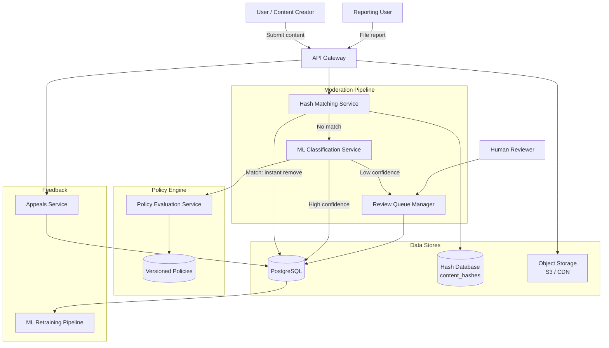
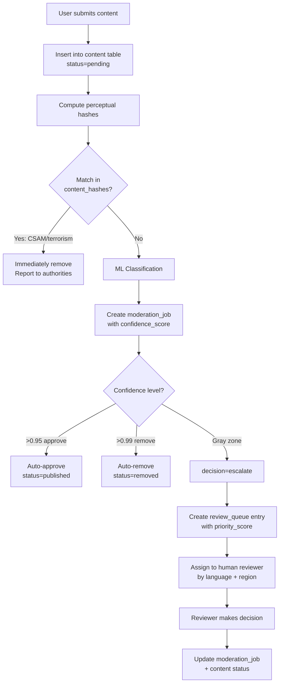
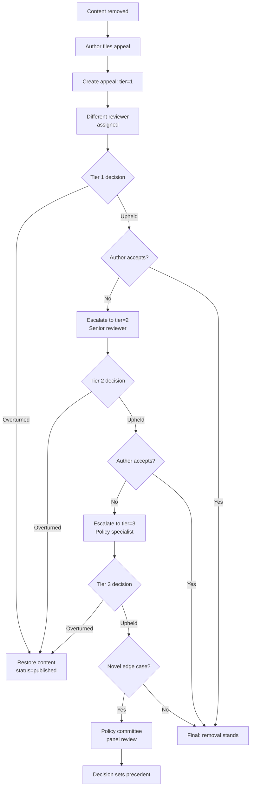

# Data Model: Content Moderation System

A content moderation system must handle billions of posts daily across multiple media types (text, image, video, audio, live streams) while balancing safety, speed, and fairness. The data model supports a hybrid pipeline: automated ML classification handles the majority of content, while borderline cases are routed to human reviewers. Appeals provide due process, and known-bad content is caught instantly via perceptual hashing.

---

## High-Level Architecture



---

## Table Responsibilities

| Table               | Purpose                                         | Why It Exists                                                                                               |
| ------------------- | ----------------------------------------------- | ----------------------------------------------------------------------------------------------------------- |
| **content**         | Stores all user-generated content with metadata | Central entity; every moderation action references back to a specific piece of content                      |
| **moderation_jobs** | Records each moderation decision (ML or human)  | Separates the decision record from the content itself; supports auditability and model performance tracking |
| **review_queue**    | Manages human reviewer work assignments         | Enables SLA-driven prioritization and fair workload distribution across reviewers                           |
| **content_hashes**  | Known-bad content fingerprint database          | Enables O(1) lookup to instantly block known CSAM, terrorism, or spam content without re-analysis           |
| **reports**         | User-submitted content reports                  | Crowdsources safety signals; report quality scoring prevents abuse of the reporting system                  |
| **appeals**         | Multi-tier appeal process for removed content   | Provides due process; tiered review prevents one reviewer's bias from being final                           |
| **policies**        | Versioned moderation policy rules               | Decouples policy from code; enables A/B testing of policies and auditable policy history                    |

---

## Detailed Field Descriptions

### content

| Field              | Type       | Description                                                                                     |
| ------------------ | ---------- | ----------------------------------------------------------------------------------------------- |
| content_id         | PK, UUID   | Unique identifier for every piece of content                                                    |
| author_id          | FK → users | The user who created this content; used for repeat-offender analysis                            |
| content_type       | ENUM       | One of text, image, video, audio, live_stream; determines which ML pipeline processes it        |
| body_text          | TEXT       | Text content or transcript; nullable for pure media posts                                       |
| media_url          | VARCHAR    | S3/CDN reference for media content; nullable for text-only posts                                |
| status             | ENUM       | pending, published, removed, appealed; drives visibility to end users                           |
| geo_country        | VARCHAR(2) | ISO country code from IP geolocation; critical because moderation policies vary by jurisdiction |
| device_fingerprint | VARCHAR    | Device hash for detecting ban-evasion accounts creating content from the same device            |
| created_at         | TIMESTAMP  | Submission time; used for SLA calculations and time-based policy application                    |

### moderation_jobs

| Field              | Type         | Description                                                                                              |
| ------------------ | ------------ | -------------------------------------------------------------------------------------------------------- |
| job_id             | PK, UUID     | Unique identifier for each moderation decision                                                           |
| content_id         | FK → content | Links decision back to the content being moderated                                                       |
| priority           | INT          | Numeric priority; higher = reviewed sooner. Calculated from content type, author risk, and report volume |
| decision           | ENUM         | approve, remove, escalate; escalate means confidence was too low for auto-decision                       |
| confidence_score   | FLOAT        | ML model confidence (0.0-1.0); drives auto-approve threshold (e.g., >0.95 = auto-approve)                |
| model_version      | VARCHAR      | Which ML model version made the decision; essential for debugging model regressions                      |
| processing_time_ms | INT          | Latency of the ML inference; used for performance monitoring and SLA compliance                          |
| reviewer_id        | FK → agents  | Null for automated decisions; populated when a human makes the call                                      |
| reviewed_at        | TIMESTAMP    | When the decision was made; null for pending jobs                                                        |

### review_queue

| Field                | Type                 | Description                                                                        |
| -------------------- | -------------------- | ---------------------------------------------------------------------------------- |
| queue_id             | PK, UUID             | Unique queue entry identifier                                                      |
| content_id           | FK → content         | The content awaiting human review                                                  |
| job_id               | FK → moderation_jobs | Links to the moderation job that created this queue entry                          |
| priority_score       | FLOAT                | Composite score combining severity, report count, author history, and virality     |
| assigned_reviewer_id | FK → agents          | Null until assigned; prevents two reviewers working the same item                  |
| sla_deadline         | TIMESTAMP            | When this item must be reviewed by; calculated from priority and content type      |
| language             | VARCHAR              | Content language; used to route to reviewers who speak that language               |
| region               | VARCHAR              | Geographic region; used to route to reviewers familiar with local cultural context |
| status               | ENUM                 | pending, in_review, completed; prevents double-assignment                          |

### content_hashes

| Field            | Type      | Description                                                                                                                        |
| ---------------- | --------- | ---------------------------------------------------------------------------------------------------------------------------------- |
| hash_id          | PK, UUID  | Unique identifier for each known-bad hash                                                                                          |
| hash_type        | ENUM      | photodna (image fingerprint), phash (perceptual hash), sha256 (exact match); different algorithms for different evasion resistance |
| hash_value       | VARCHAR   | The actual hash value; indexed for O(1) lookup                                                                                     |
| content_category | ENUM      | csam, terrorism, spam; categorization determines action severity (CSAM = instant remove + report to NCMEC)                         |
| source           | VARCHAR   | Where this hash came from (e.g., NCMEC, internal discovery, partner exchange)                                                      |
| created_at       | TIMESTAMP | When the hash was added to the database                                                                                            |

### reports

| Field         | Type         | Description                                                                           |
| ------------- | ------------ | ------------------------------------------------------------------------------------- |
| report_id     | PK, UUID     | Unique report identifier                                                              |
| content_id    | FK → content | The content being reported                                                            |
| reporter_id   | FK → users   | Who filed the report; tracked for quality scoring and anti-abuse                      |
| reason        | VARCHAR      | Category of the report (hate speech, harassment, spam, etc.)                          |
| evidence_text | TEXT         | Optional description from the reporter explaining the violation                       |
| quality_score | FLOAT        | Reporter credibility score (0.0-1.0); built from historical accuracy of their reports |
| status        | ENUM         | new, triaged, actioned, dismissed; tracks report lifecycle                            |

### appeals

| Field             | Type         | Description                                                                                                 |
| ----------------- | ------------ | ----------------------------------------------------------------------------------------------------------- |
| appeal_id         | PK, UUID     | Unique appeal identifier                                                                                    |
| content_id        | FK → content | The content whose removal is being appealed                                                                 |
| appellant_id      | FK → users   | The user filing the appeal (usually the content author)                                                     |
| tier              | ENUM         | 1, 2, 3, policy_committee; each tier is a more senior review. Tier 3 and policy committee handle edge cases |
| status            | ENUM         | pending, under_review, upheld, overturned; tracks appeal outcome                                            |
| original_decision | VARCHAR      | What the original moderation decision was (for context)                                                     |
| appeal_decision   | VARCHAR      | The outcome of this appeal tier                                                                             |
| reviewer_id       | FK → agents  | The reviewer handling this appeal; must be different from the original reviewer                             |
| resolved_at       | TIMESTAMP    | When the appeal was decided                                                                                 |

### policies

| Field           | Type      | Description                                                               |
| --------------- | --------- | ------------------------------------------------------------------------- |
| policy_id       | PK, UUID  | Unique policy identifier                                                  |
| name            | VARCHAR   | Human-readable policy name (e.g., "Hate Speech Policy")                   |
| version         | INT       | Monotonically increasing version; enables rollback and A/B testing        |
| conditions_json | JSONB     | Machine-readable conditions (content type, geo, severity thresholds)      |
| action          | VARCHAR   | What happens when policy matches (remove, age_gate, reduce_distribution)  |
| severity        | ENUM      | low, medium, high, critical; drives SLA and escalation behavior           |
| effective_from  | TIMESTAMP | When this policy version takes effect; supports scheduled policy rollouts |

---

## ER Diagram

```
+----------------+       +-------------------+       +----------------+
|    content     |       | moderation_jobs   |       | review_queue   |
|----------------|       |-------------------|       |----------------|
| content_id (PK)|<──┐   | job_id (PK)       |<──┐   | queue_id (PK)  |
| author_id (FK) |   |   | content_id (FK)───|───┘   | content_id(FK)─|───┐
| content_type   |   |   | priority          |   ┌───| job_id (FK)    |   |
| body_text      |   |   | decision          |   |   | priority_score |   |
| media_url      |   |   | confidence_score  |   |   | assigned_      |   |
| status         |   |   | model_version     |   |   |  reviewer_id   |   |
| geo_country    |   |   | processing_time_ms|   |   | sla_deadline   |   |
| device_        |   |   | reviewer_id       |   |   | language       |   |
|  fingerprint   |   |   | reviewed_at       |   |   | region         |   |
| created_at     |   |   +-------------------+   |   | status         |   |
+----------------+   |          1                 |   +----------------+   |
        |            |          |                 |          1             |
        |            |          |                 |          |             |
        | 1          └──────────|─────────────────|──────────┘             |
        |                       |                 |                        |
        |───* moderation_jobs   |                 |                        |
        |                       └─────────────────┘                        |
        |───* review_queue  <──────────────────────────────────────────────┘
        |
        |───* reports              +----------------+
        |                          | content_hashes |
        |───* appeals              |----------------|
        |                          | hash_id (PK)   |
        |                          | hash_type      |
+-------+--------+                | hash_value     |
|    reports      |                | content_       |
|-----------------|                |  category      |
| report_id (PK)  |                | source         |
| content_id (FK) |                | created_at     |
| reporter_id     |                +----------------+
| reason          |                (standalone lookup table)
| evidence_text   |
| quality_score   |    +----------------+
| status          |    |   policies     |
+-----------------+    |----------------|
                       | policy_id (PK) |
+----------------+     | name           |
|    appeals     |     | version        |
|----------------|     | conditions_json|
| appeal_id (PK) |     | action         |
| content_id(FK) |     | severity       |
| appellant_id   |     | effective_from |
| tier           |     +----------------+
| status         |     (standalone rule engine)
| original_      |
|  decision      |
| appeal_decision|
| reviewer_id    |
| resolved_at    |
+----------------+

Relationships:
  content 1───* moderation_jobs   (one content, many moderation attempts)
  content 1───* reports           (one content, many user reports)
  content 1───* appeals           (one content, many appeal tiers)
  moderation_jobs 1───1 review_queue (one job creates at most one queue entry)
  content_hashes: standalone       (lookup table, joined by hash_value not FK)
  policies: standalone             (evaluated at decision time, not FK-linked)
```

---

## Data Flow

1. **Content Submission**: User submits content, a row is inserted into `content` with status = `pending`.

2. **Pre-Publish Hash Check**: The system computes perceptual hashes of the content and checks them against `content_hashes`. If a match is found (especially for CSAM or terrorism), the content is immediately removed without further review. This is O(1) and catches known-bad content in milliseconds.

3. **ML Classification**: An ML pipeline creates a `moderation_jobs` entry with the model's decision and confidence_score. If confidence is high (e.g., >0.95 for approve, >0.99 for remove), the decision is auto-applied and `content.status` is updated.

4. **Borderline Routing**: If confidence is in the "gray zone," the job decision is set to `escalate` and a `review_queue` entry is created. The priority_score is calculated from content virality, author history, report count, and policy severity.

5. **Human Review**: Reviewers pull from `review_queue` sorted by priority_score, filtered by their language and region capabilities. The queue entry is locked (status = `in_review`) to prevent double-assignment. The reviewer updates the `moderation_jobs` record with their decision.

6. **User Reports**: Other users can file `reports` against published content. Reports with high quality_score (from historically accurate reporters) boost the content's priority in the review queue.

7. **Appeals**: If content is removed, the author can file an `appeals` record. Appeals go through tiered review (tier 1 = different reviewer, tier 2 = senior reviewer, tier 3 = policy specialist, policy_committee = panel review). Each tier creates a new appeal record. The reviewer must be different from the original decision-maker.

8. **Policy Enforcement**: `policies` are evaluated as rules at decision time. Versioning ensures that content is judged by the policy in effect when it was posted, and policy changes can be rolled out gradually.

9. **Feedback Loop**: Patterns from reports, appeals, and reviewer decisions feed back into ML model retraining. Model version tracking in `moderation_jobs` enables A/B comparison of model performance.

### Content Moderation Pipeline



### Appeals Flow



---

## Key Design Decisions for Interviews

- **Why separate moderation_jobs from content?** A single piece of content may be moderated multiple times (initial review, re-review after report, appeal review). Separating decisions from content preserves the full audit trail.

- **Why perceptual hashing (content_hashes)?** Exact hash matching is trivially defeated by changing one pixel. Perceptual hashes (PhotoDNA, pHash) are resistant to cropping, resizing, and color changes. This is critical for CSAM detection where legal obligations require matching.

- **Why reporter quality_score?** Without it, bad actors can weaponize the reporting system to suppress legitimate content. Quality scoring ensures that consistently accurate reporters have more influence on prioritization.

- **Why multi-tier appeals?** Single-tier appeals create a bottleneck and bias risk. Multi-tier review with different reviewers at each tier provides fairness and catches errors. The policy_committee tier handles genuinely novel cases that set precedent.

- **Why geo_country and device_fingerprint on content?** Moderation policies vary by jurisdiction (e.g., Germany's NetzDG requires 24-hour removal of certain content). Device fingerprint catches ban-evading users who create new accounts on the same device.

- **Why versioned policies?** Content moderation policies change frequently. Versioning ensures auditability, enables rollback if a new policy has unintended consequences, and supports A/B testing of policy changes.
