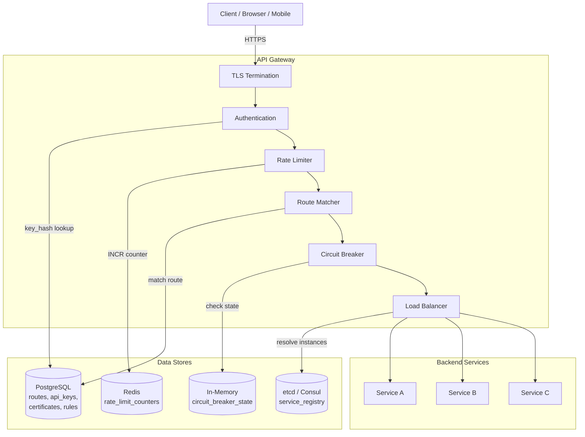
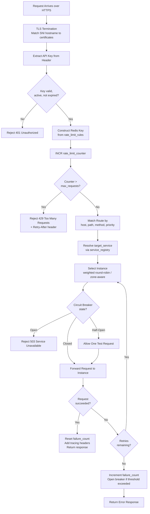

# Data Model: API Gateway & Service Mesh

An API gateway sits at the edge of a microservices architecture, handling cross-cutting concerns like authentication, rate limiting, routing, TLS termination, and circuit breaking. Unlike traditional application data models, this system blends persistent storage (routes, API keys, certificates) with ephemeral state (rate limit counters in Redis, circuit breaker state in memory, service registry in etcd). The data model reflects this hybrid reality.

---

## High-Level Architecture



---

## Table Responsibilities

| Table                     | Purpose                                       | Why It Exists                                                                                             |
| ------------------------- | --------------------------------------------- | --------------------------------------------------------------------------------------------------------- |
| **routes**                | Maps incoming requests to backend services    | Decouples external API paths from internal service topology; enables versioning and migration             |
| **api_keys**              | Authentication credentials for API clients    | Enables per-client identification, scoping, and rate limiting without coupling to user accounts           |
| **rate_limit_rules**      | Configures rate limiting policies             | Separates rate limit configuration from enforcement; supports per-client, per-endpoint, and global limits |
| **rate_limit_counters**   | Real-time request counts (Redis)              | In-memory counters for sub-millisecond rate limit checks; ephemeral by design with TTL                    |
| **circuit_breaker_state** | Tracks upstream service health (in-memory)    | Prevents cascading failures by stopping requests to unhealthy services; must be fast so kept in memory    |
| **certificates**          | TLS certificates for HTTPS termination        | Centralizes certificate management with auto-renewal support                                              |
| **service_registry**      | Live service instance directory (etcd/Consul) | Enables dynamic service discovery and load balancing without hardcoded addresses                          |

---

## Detailed Field Descriptions

### routes

| Field              | Type     | Description                                                                                                 |
| ------------------ | -------- | ----------------------------------------------------------------------------------------------------------- |
| route_id           | PK, UUID | Unique route identifier                                                                                     |
| match_host         | VARCHAR  | Hostname to match (e.g., api.example.com); enables multi-tenant routing on a single gateway                 |
| match_path_pattern | VARCHAR  | URL path pattern with parameter support (e.g., /v1/users/{id}); matched in priority order                   |
| match_methods      | ARRAY    | HTTP methods this route handles (GET, POST, etc.); enables method-level routing to different services       |
| target_service     | VARCHAR  | Backend service name (resolved via service_registry)                                                        |
| target_port        | INT      | Port on the target service                                                                                  |
| strip_prefix       | BOOLEAN  | Whether to strip the matched prefix before forwarding (e.g., /api/v1/users becomes /users)                  |
| timeout_ms         | INT      | Request timeout; set per-route because some endpoints (file uploads) need longer timeouts                   |
| retry_count        | INT      | Number of retries on failure; set per-route because idempotent GETs can retry safely but POSTs often cannot |
| priority           | INT      | Route evaluation order; higher priority routes are checked first to handle overlapping patterns             |

### api_keys

| Field           | Type      | Description                                                                          |
| --------------- | --------- | ------------------------------------------------------------------------------------ |
| key_id          | PK, UUID  | Unique key identifier (not the key itself)                                           |
| key_hash        | VARCHAR   | SHA-256 hash of the API key; raw keys are never stored for security                  |
| client_name     | VARCHAR   | Human-readable name for the client using this key                                    |
| scopes          | ARRAY     | Permissions granted (e.g., read:users, write:orders); enables least-privilege access |
| rate_limit_tier | VARCHAR   | Which rate limit tier this client falls under (free, pro, enterprise)                |
| is_active       | BOOLEAN   | Kill switch to immediately revoke access without deleting the key record             |
| created_at      | TIMESTAMP | When the key was issued                                                              |
| expires_at      | TIMESTAMP | Key expiration; forces regular rotation for security hygiene                         |

### rate_limit_rules

| Field          | Type     | Description                                                                                                  |
| -------------- | -------- | ------------------------------------------------------------------------------------------------------------ |
| rule_id        | PK, UUID | Unique rule identifier                                                                                       |
| scope          | ENUM     | global, per_client, per_endpoint; determines the granularity of the limit                                    |
| key_pattern    | VARCHAR  | Pattern for constructing the Redis key (e.g., {client_id}:{endpoint}); templated to support flexible scoping |
| max_requests   | INT      | Maximum number of requests allowed in the window                                                             |
| window_seconds | INT      | Duration of the rate limit window; common values are 1 (burst), 60 (per-minute), 3600 (per-hour)             |

### rate_limit_counters (Redis)

| Field   | Type   | Description                                                                                   |
| ------- | ------ | --------------------------------------------------------------------------------------------- |
| key     | STRING | Constructed key: rl:{client_id}:{endpoint}:{window}; encodes all dimensions of the rate limit |
| counter | INT    | Current request count in this window; incremented atomically with INCR                        |
| TTL     | INT    | Set to window_seconds on first request; counter auto-expires when window closes               |

### circuit_breaker_state (in-memory)

| Field            | Type      | Description                                                                                  |
| ---------------- | --------- | -------------------------------------------------------------------------------------------- |
| service_name     | KEY       | The upstream service this breaker protects                                                   |
| state            | ENUM      | closed (normal), open (blocking requests), half_open (testing recovery)                      |
| failure_count    | INT       | Consecutive failures; when threshold is exceeded, state transitions to open                  |
| last_failure_at  | TIMESTAMP | Used to calculate whether the recovery_timeout has elapsed                                   |
| recovery_timeout | DURATION  | How long to wait in open state before transitioning to half_open and allowing a test request |

### certificates

| Field             | Type      | Description                                                                               |
| ----------------- | --------- | ----------------------------------------------------------------------------------------- |
| cert_id           | PK, UUID  | Unique certificate identifier                                                             |
| domain            | VARCHAR   | Domain name this certificate covers (may include wildcards)                               |
| cert_pem          | TEXT      | PEM-encoded certificate chain                                                             |
| key_pem_encrypted | TEXT      | PEM-encoded private key, encrypted at rest; decrypted only in memory during TLS handshake |
| expires_at        | TIMESTAMP | Certificate expiration; monitored for renewal alerts                                      |
| auto_renew        | BOOLEAN   | Whether to automatically renew via ACME/Let's Encrypt before expiration                   |

### service_registry (etcd/Consul)

| Field        | Type    | Description                                                                              |
| ------------ | ------- | ---------------------------------------------------------------------------------------- |
| service_name | KEY     | Logical service name (e.g., user-service)                                                |
| instances    | ARRAY   | List of available instances, each containing host, port, health status, weight, and zone |
| host         | VARCHAR | IP or hostname of the instance                                                           |
| port         | INT     | Port the instance is listening on                                                        |
| health       | ENUM    | healthy, unhealthy, draining; unhealthy instances are removed from load balancing        |
| weight       | INT     | Relative weight for weighted load balancing; higher weight = more traffic                |
| zone         | VARCHAR | Availability zone; enables zone-aware routing to minimize latency                        |

---

## ER Diagram

```
                    +-------------------+
                    |      routes       |
                    |-------------------|
                    | route_id (PK)     |
                    | match_host        |
                    | match_path_pattern|
                    | match_methods     |
                    | target_service ───|──────────────────────┐
                    | target_port       |                      |
                    | strip_prefix      |                      |
                    | timeout_ms        |                      |
                    | retry_count       |                      |
                    | priority          |                      |
                    +-------------------+                      |
                                                               |
+-------------------+     +--------------------+    +----------+----------+
|    api_keys       |     | rate_limit_rules   |    | service_registry    |
|-------------------|     |--------------------|    |   (etcd/Consul)     |
| key_id (PK)       |     | rule_id (PK)       |    |---------------------|
| key_hash          |     | scope              |    | service_name (KEY)  |
| client_name       |     | key_pattern ───────|──┐ | instances[]         |
| scopes            |     | max_requests       |  | |   host, port,       |
| rate_limit_tier──|──┐  | window_seconds     |  | |   health, weight,   |
| is_active         |  |  +--------------------+  | |   zone              |
| created_at        |  |                          | +---------------------+
| expires_at        |  |                          |
+-------------------+  |  +--------------------+  |
                       |  | rate_limit_counters |  |
                       └──|     (Redis)         |──┘
                          |--------------------|
                          | key: rl:{client}:  |
                          |  {endpoint}:{win}  |
                          | counter            |
                          | TTL                |
                          +--------------------+

+---------------------+     +-------------------+
| circuit_breaker_    |     |   certificates    |
|  state (in-memory)  |     |-------------------|
|---------------------|     | cert_id (PK)      |
| service_name (KEY)  |     | domain            |
| state               |     | cert_pem          |
| failure_count       |     | key_pem_encrypted |
| last_failure_at     |     | expires_at        |
| recovery_timeout    |     | auto_renew        |
+---------------------+     +-------------------+

Relationships:
  routes *───1 service_registry   (many routes target one service)
  api_keys ──── rate_limit_rules  (linked by rate_limit_tier)
  rate_limit_rules ── rate_limit_counters (rules define pattern, counters track usage)
  circuit_breaker_state ──── service_registry (one breaker per service)
  certificates: standalone (matched by domain during TLS handshake)
```

---

## Data Flow

1. **TLS Termination**: Request arrives over HTTPS. The gateway matches the SNI hostname against `certificates` to select the right certificate for the TLS handshake. Decrypted request proceeds to the next stage.

2. **Authentication**: The gateway extracts the API key from the request header and hashes it. The hash is looked up in `api_keys`. If not found or expired or inactive, the request is rejected with 401. The matched key's `scopes` are attached to the request context.

3. **Rate Limit Check**: Using the client's `rate_limit_tier` and the matched endpoint, the gateway constructs a Redis key from the `rate_limit_rules` key_pattern. It atomically increments the `rate_limit_counters` counter. If the counter exceeds `max_requests`, the request is rejected with 429 and a Retry-After header.

4. **Route Matching**: The gateway evaluates `routes` in priority order, matching the request's host, path, and method. The first matching route determines the `target_service` and configuration (timeout, retries, prefix stripping).

5. **Service Discovery**: The `target_service` name is resolved via `service_registry` (etcd/Consul) to get the list of healthy instances with their weights and zones.

6. **Load Balancing**: The gateway selects an instance using weighted round-robin or least-connections, preferring instances in the same availability zone to minimize latency.

7. **Circuit Breaker Check**: Before forwarding, the gateway checks the `circuit_breaker_state` for the target service. If the breaker is **open**, the request is immediately rejected with 503 without contacting the upstream. If **half_open**, one test request is allowed through.

8. **Forward Request**: The request is forwarded to the selected instance. If it fails and `retry_count > 0` and the request is idempotent, retries are attempted against different instances.

9. **Circuit Breaker Update**: If the request succeeds, the failure_count is reset. If it fails, failure_count is incremented. When failure_count exceeds the threshold, the breaker transitions to **open** with a recovery_timeout.

10. **Response**: The gateway adds tracing headers (X-Request-ID, X-Trace-ID) and returns the response to the client.



---

## Key Design Decisions for Interviews

- **Why hash API keys instead of storing them in plain text?** API keys are credentials. If the database is breached, plain-text keys would allow immediate impersonation. Hashing means compromised data cannot be used directly. The raw key is only seen at creation time and given to the client once.

- **Why Redis for rate limit counters?** Rate limit checks happen on every single request and must complete in sub-milliseconds. Relational databases cannot handle this volume with acceptable latency. Redis INCR is atomic and O(1), and TTL-based expiration handles window cleanup automatically.

- **Why in-memory circuit breaker state?** Circuit breaker decisions must be instantaneous (no network calls). The state is local to each gateway instance, which means different instances may have slightly different views -- this is acceptable because circuit breakers are probabilistic protection, not exact accounting.

- **Why a separate service registry (etcd/Consul)?** Hardcoding service addresses breaks in dynamic environments (Kubernetes, auto-scaling). A service registry provides live, health-checked service discovery. etcd/Consul also provide watch APIs so the gateway is notified of changes immediately rather than polling.

- **Why per-route timeout and retry configuration?** A file upload endpoint might need a 60-second timeout, while a health check needs 2 seconds. Similarly, idempotent GET requests can safely retry on failure, but retrying a POST might create duplicates. Per-route configuration handles these differences.

- **Why priority on routes?** Path patterns can overlap (e.g., /users/{id} vs /users/me). Without priority, the match order would be ambiguous. Explicit priority ensures /users/me (higher priority) is matched before /users/{id}.
