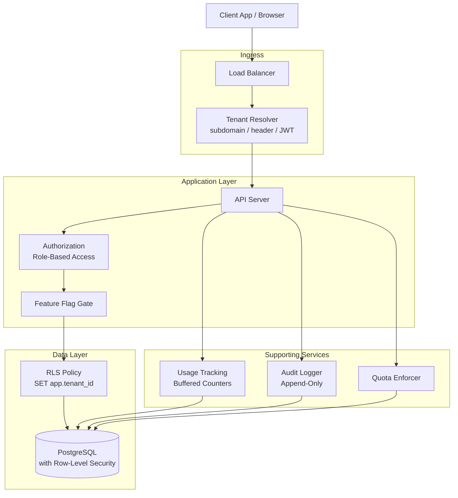
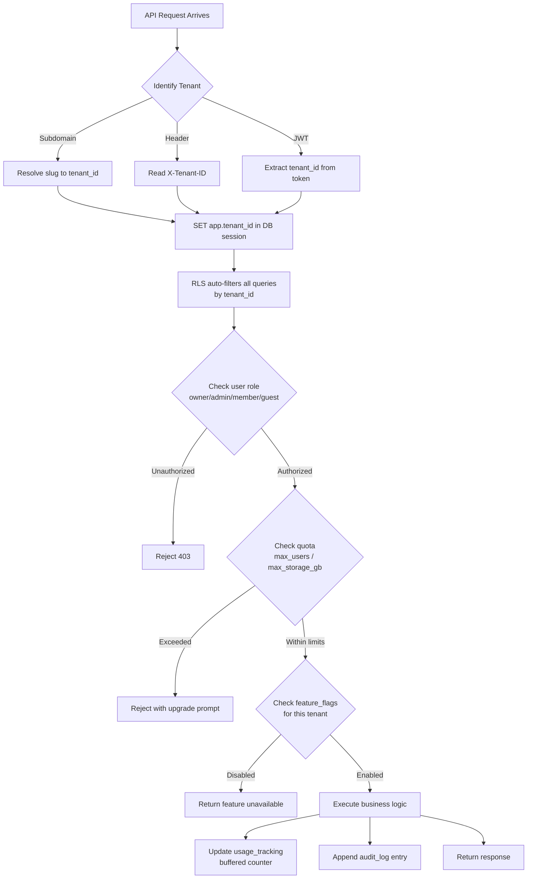

# Data Model: Multi-Tenant SaaS Platform

A multi-tenant SaaS platform serves hundreds to millions of organizations from a shared infrastructure while maintaining strict data isolation between tenants. The central design challenge is choosing the right isolation strategy: shared schema with row-level security (RLS) for scale, separate schemas for moderate isolation, or dedicated databases for compliance-heavy enterprises. This data model demonstrates the shared-schema approach with RLS, which is the most common pattern at scale.

---

## High-Level Architecture



---

## Table Responsibilities

| Table              | Purpose                                        | Why It Exists                                                                                                    |
| ------------------ | ---------------------------------------------- | ---------------------------------------------------------------------------------------------------------------- |
| **tenants**        | Organization-level configuration and limits    | Central entity defining each tenant's plan, quotas, and settings; every other table references back to tenant_id |
| **users**          | Individual users within a tenant               | Users belong to exactly one tenant; role-based access within the tenant                                          |
| **resources**      | Tenant-owned business objects (e.g., projects) | Example of a tenant-scoped entity; every resource table follows the same tenant_id pattern                       |
| **usage_tracking** | Metered resource consumption per tenant        | Enables quota enforcement and usage-based billing; tracked per metric to support flexible billing models         |
| **audit_logs**     | Tenant-scoped activity records                 | Regulatory and debugging requirement; must be tenant-isolated so one tenant cannot see another's activity        |
| **feature_flags**  | Per-tenant feature toggles                     | Enables gradual rollout, plan-based feature gating, and custom enterprise configurations                         |

---

## Detailed Field Descriptions

### tenants

| Field          | Type            | Description                                                                   |
| -------------- | --------------- | ----------------------------------------------------------------------------- |
| tenant_id      | PK, UUID        | Unique tenant identifier; appears as FK in every other table (the RLS column) |
| name           | VARCHAR         | Organization display name                                                     |
| slug           | VARCHAR, UNIQUE | URL-safe identifier used in subdomain routing (e.g., acme.app.com)            |
| plan_tier      | ENUM            | free, pro, enterprise; determines feature access, quotas, and SLA level       |
| status         | ENUM            | active, suspended, deactivated; suspended tenants can read but not write      |
| custom_domain  | VARCHAR         | Enterprise tenants can configure a custom domain (e.g., app.acme.com)         |
| config_json    | JSONB           | Tenant-specific configuration (branding, SSO settings, default timezone)      |
| max_users      | INT             | User seat limit based on plan_tier; enforced at user creation                 |
| max_storage_gb | INT             | Storage quota based on plan_tier; enforced at upload time                     |
| created_at     | TIMESTAMP       | Tenant creation time; used for trial period calculations                      |

### users

| Field         | Type         | Description                                                                            |
| ------------- | ------------ | -------------------------------------------------------------------------------------- |
| user_id       | PK, UUID     | Unique user identifier                                                                 |
| tenant_id     | FK → tenants | RLS column; every query is filtered by this automatically                              |
| email         | VARCHAR      | User email; unique within a tenant but may exist in multiple tenants                   |
| display_name  | VARCHAR      | User's chosen display name                                                             |
| role          | ENUM         | owner (one per tenant), admin, member, guest; determines permissions within the tenant |
| status        | ENUM         | active, invited, suspended, deactivated                                                |
| last_login_at | TIMESTAMP    | Last successful login; used for inactive user cleanup and security auditing            |

### resources (example: projects)

| Field       | Type         | Description                                                |
| ----------- | ------------ | ---------------------------------------------------------- |
| resource_id | PK, UUID     | Unique resource identifier                                 |
| tenant_id   | FK → tenants | RLS column; ensures tenant isolation at the database level |
| name        | VARCHAR      | Resource name                                              |
| description | TEXT         | Resource description                                       |
| owner_id    | FK → users   | Which user created/owns this resource                      |
| status      | ENUM         | active, archived, deleted; soft-delete to support recovery |
| created_at  | TIMESTAMP    | Creation timestamp                                         |

### usage_tracking

| Field        | Type         | Description                                                          |
| ------------ | ------------ | -------------------------------------------------------------------- |
| tenant_id    | FK → tenants | Which tenant's usage this tracks                                     |
| metric_name  | VARCHAR      | What is being measured: api_calls, storage_bytes, active_users, etc. |
| metric_value | BIGINT       | Current value for this metric                                        |
| recorded_at  | TIMESTAMP    | When this measurement was taken; enables time-series analysis        |

### audit_logs

| Field         | Type         | Description                                                  |
| ------------- | ------------ | ------------------------------------------------------------ |
| id            | PK, UUID     | Unique audit entry identifier                                |
| tenant_id     | FK → tenants | RLS column; tenants can only see their own audit trail       |
| user_id       | FK → users   | Who performed the action                                     |
| action        | VARCHAR      | What happened (create, update, delete, login, export)        |
| resource_type | VARCHAR      | What type of entity was affected                             |
| resource_id   | UUID         | Which specific entity was affected                           |
| metadata_json | JSONB        | Action-specific details (old values, new values, IP address) |
| created_at    | TIMESTAMP    | When the action occurred; immutable, append-only             |

### feature_flags

| Field        | Type                  | Description                                                            |
| ------------ | --------------------- | ---------------------------------------------------------------------- |
| tenant_id    | FK, composite PK      | Which tenant this flag applies to                                      |
| feature_name | VARCHAR, composite PK | The feature being toggled (e.g., "advanced_analytics", "sso_login")    |
| enabled      | BOOLEAN               | Whether this feature is active for this tenant                         |
| config_json  | JSONB                 | Feature-specific configuration (e.g., usage limits, variant selection) |

---

## ER Diagram

```
+--------------------+
|      tenants       |
|--------------------|
| tenant_id (PK)     |
| name               |
| slug               |
| plan_tier          |
| status             |
| custom_domain      |
| config_json        |
| max_users          |
| max_storage_gb     |
| created_at         |
+--------------------+
   |    |    |    |    |
   |    |    |    |    |
   |    |    |    |    +────────* feature_flags
   |    |    |    |
   |    |    |    +─────────────* audit_logs
   |    |    |
   |    |    +──────────────────* usage_tracking
   |    |
   |    +───────────────────────* resources
   |
   +────────────────────────────* users

+-----------------+     +------------------+     +------------------+
|     users       |     |    resources     |     | usage_tracking   |
|-----------------|     |   (projects)     |     |------------------|
| user_id (PK)    |     |------------------|     | tenant_id (FK)   |
| tenant_id (FK)  |     | resource_id (PK) |     | metric_name      |
| email           |     | tenant_id (FK)   |     | metric_value     |
| display_name    |     | name             |     | recorded_at      |
| role            |     | description      |     +------------------+
| status          |     | owner_id (FK)────|──┐
| last_login_at   |     | status           |  |  +------------------+
+-----------------+     | created_at       |  |  |   audit_logs     |
        |               +------------------+  |  |------------------|
        |                                     |  | id (PK)          |
        +─────────────────────────────────────┘  | tenant_id (FK)   |
        resources.owner_id references users      | user_id (FK)     |
                                                 | action           |
+------------------+                             | resource_type    |
|  feature_flags   |                             | resource_id      |
|------------------|                             | metadata_json    |
| tenant_id (FK,PK)|                             | created_at       |
| feature_name (PK)|                             +------------------+
| enabled          |
| config_json      |
+------------------+

Relationships:
  tenants 1───* users           (one tenant, many users)
  tenants 1───* resources       (one tenant, many resources)
  tenants 1───* usage_tracking  (one tenant, many usage records)
  tenants 1───* audit_logs      (one tenant, many audit entries)
  tenants 1───* feature_flags   (one tenant, many feature toggles)
  users 1───* resources         (one user owns many resources)

ALL tables include tenant_id for RLS enforcement
```

---

## Isolation Strategies

### Strategy A: Shared Schema (This Model)

```
+------------------------------------------+
|            Shared Database                |
|  +------+  +------+  +------+  +------+  |
|  |Tenant|  |Tenant|  |Tenant|  |Tenant|  |
|  |  A   |  |  B   |  |  C   |  |  D   |  |
|  |rows  |  |rows  |  |rows  |  |rows  |  |
|  +------+  +------+  +------+  +------+  |
|     Same tables, filtered by tenant_id    |
+------------------------------------------+
```

- **Tenant count**: 1M+ tenants
- **Onboarding**: Instant (just INSERT a tenant row)
- **Isolation**: Row-Level Security (RLS) policies auto-filter all queries
- **Trade-off**: Noisy neighbor risk; one tenant's heavy query can affect others
- **Mitigation**: Connection pooling per tier, query timeouts, resource quotas

### Strategy B: Separate Schema

```
+------------------------------------------+
|            Shared Database                |
|  +-----------+  +-----------+            |
|  | Schema:   |  | Schema:   |            |
|  | tenant_a  |  | tenant_b  |  ...       |
|  |  users    |  |  users    |            |
|  |  resources|  |  resources|            |
|  +-----------+  +-----------+            |
+------------------------------------------+
```

- **Tenant count**: ~10K tenants
- **Onboarding**: Schema migration per tenant (seconds)
- **Isolation**: Schema-level; cross-schema access requires explicit grants
- **Trade-off**: Schema migrations must run per-tenant; more operational complexity

### Strategy C: Dedicated Database

```
+-------------+  +-------------+  +-------------+
| Database:   |  | Database:   |  | Database:   |
| tenant_a    |  | tenant_b    |  | tenant_c    |
|  users      |  |  users      |  |  users      |
|  resources  |  |  resources  |  |  resources  |
+-------------+  +-------------+  +-------------+
```

- **Tenant count**: ~100 enterprise tenants
- **Onboarding**: Minutes (provision database, run migrations)
- **Isolation**: Complete; separate connection strings, backup schedules, and SLAs
- **Trade-off**: Highest cost; each tenant needs its own database infrastructure
- **Use case**: HIPAA, SOC2, or contractual isolation requirements

---

## Data Flow

1. **Request Arrives**: Every API request includes tenant identification. This is extracted from one of three sources:

   - Subdomain: `acme.app.com` → resolve `slug = "acme"` to `tenant_id`
   - Header: `X-Tenant-ID` header (for API clients)
   - JWT claim: `tenant_id` embedded in the authentication token

2. **RLS Context Set**: Before any query executes, the database session variable is set (e.g., `SET app.tenant_id = 'abc123'`). The RLS policy on every table automatically adds `WHERE tenant_id = current_setting('app.tenant_id')` to all queries.

3. **Authorization Check**: The user's `role` within the tenant is checked against the requested operation. Owners and admins can manage users; members can CRUD resources; guests have read-only access.

4. **Business Logic Executes**: All queries are automatically tenant-scoped by RLS. Application code does not need to include `WHERE tenant_id = ...` in queries -- the database enforces it. This eliminates an entire class of data-leak bugs.

5. **Usage Tracking**: After the operation completes, `usage_tracking` is updated. For high-frequency metrics (API calls), this uses a buffered counter that flushes periodically rather than writing on every request.

6. **Quota Enforcement**: Before resource-creating operations, current usage is checked against `tenants.max_users` or `tenants.max_storage_gb`. If the quota would be exceeded, the request is rejected with a clear upgrade prompt.

7. **Audit Logging**: The action is recorded in `audit_logs` with the tenant_id, user_id, and affected resource. This is append-only and tenant-scoped.

8. **Feature Gating**: Before executing feature-specific logic, `feature_flags` is checked. This enables plan-based gating (enterprise features), gradual rollout (beta features), and tenant-specific customization.



---

## Key Design Decisions for Interviews

- **Why tenant_id on EVERY table?** This is the foundation of shared-schema multi-tenancy. RLS policies use tenant_id to enforce data isolation at the database level, not the application level. This means even SQL injection attacks cannot access other tenants' data because the database itself enforces the filter.

- **Why RLS instead of application-level filtering?** Application-level `WHERE tenant_id = ?` is error-prone -- one missed filter in one query leaks data. RLS enforces isolation in the database engine itself, making it impossible to query across tenants regardless of what the application does.

- **Why store plan limits (max_users, max_storage_gb) on the tenant?** Quota enforcement must be fast and simple. Querying a plans table on every request adds latency. Denormalizing limits onto the tenant enables O(1) quota checks. When a plan changes, limits are updated on the tenant.

- **Why feature_flags per-tenant instead of per-plan?** Plan-based features can be derived from `tenants.plan_tier`, but per-tenant flags enable: early access for design partners, custom enterprise configurations, A/B testing, and gradual rollout (enable for 10% of free tenants).

- **Why composite PK (tenant_id + feature_name) on feature_flags?** This enforces uniqueness -- a tenant cannot have two conflicting values for the same flag. It also makes lookups O(1) by primary key.

- **Why usage_tracking as a separate table instead of columns on tenants?** Usage is time-series data with multiple metrics. Embedding it in tenants would require columns for every metric and lose historical data. A separate table supports arbitrary metrics, historical trends, and time-based aggregation for billing.

- **Why three isolation strategies?** Different tenants have different needs. A startup on the free tier does not need database-level isolation, but a hospital with HIPAA requirements does. Offering tiered isolation lets you serve both segments from the same platform, with enterprise tenants paying for their dedicated infrastructure.
