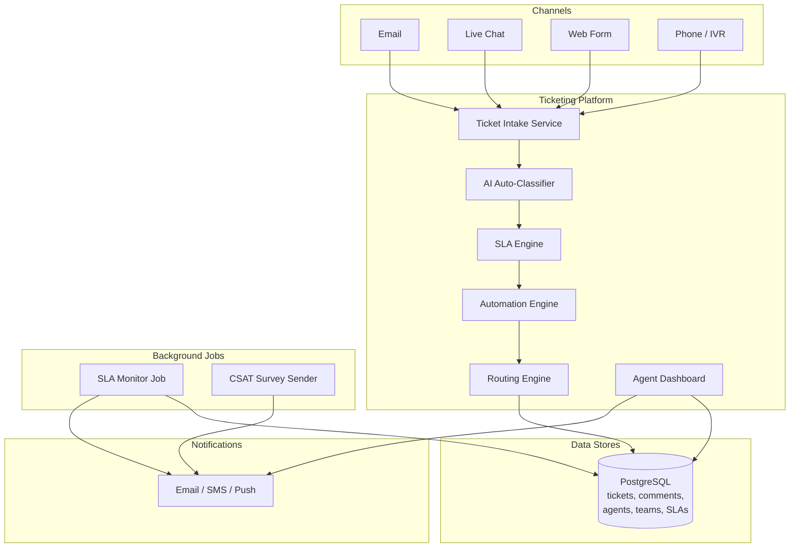
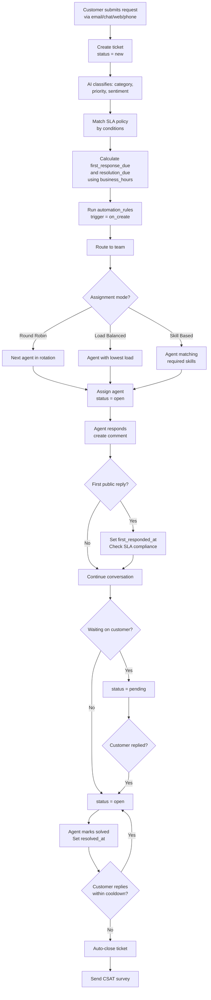

# Data Model: Ticketing System (Zendesk)

A customer support ticketing system must route incoming requests from multiple channels (email, chat, web, phone) to the right agents, enforce SLA deadlines, and provide automation to handle common scenarios at scale. The data model supports omnichannel intake, skill-based routing, SLA tracking with business-hours-aware deadlines, and a flexible automation engine. The key design challenge is balancing real-time agent workload management with configurable business rules that vary by organization.

---

## High-Level Architecture



---

## Table Responsibilities

| Table                | Purpose                                     | Why It Exists                                                                                                   |
| -------------------- | ------------------------------------------- | --------------------------------------------------------------------------------------------------------------- |
| **organizations**    | Customer support organization configuration | Top-level entity defining timezone, business hours, and plan; each organization is a separate support operation |
| **agents**           | Support agents with skills and capacity     | Enables skill-based routing and load balancing; tracks real-time availability                                   |
| **teams**            | Groups of agents with assignment strategies | Organizes agents by specialty (billing, technical, etc.) and configures how work is distributed                 |
| **tickets**          | Core support request records                | The central entity tracking each customer issue from creation to resolution                                     |
| **comments**         | Threaded conversation on tickets            | Supports both public customer-facing replies and private internal notes on the same ticket                      |
| **sla_policies**     | Service level agreement rules               | Defines response and resolution time targets by priority; enables SLA breach alerting                           |
| **automation_rules** | Event-driven business logic                 | Replaces manual work with automated routing, tagging, and escalation; executes on ticket events                 |
| **custom_fields**    | Organization-specific ticket fields         | Enables each organization to capture domain-specific data without schema changes                                |

---

## Detailed Field Descriptions

### organizations

| Field               | Type     | Description                                                                                   |
| ------------------- | -------- | --------------------------------------------------------------------------------------------- |
| org_id              | PK, UUID | Unique organization identifier                                                                |
| name                | VARCHAR  | Organization display name                                                                     |
| timezone            | VARCHAR  | IANA timezone (e.g., "America/New_York"); critical for SLA calculations during business hours |
| business_hours_json | JSONB    | Per-day start/end times and holidays; SLA timers pause outside business hours                 |
| plan_tier           | ENUM     | free, pro, enterprise; determines feature access (automations, SLA, custom fields)            |

### agents

| Field        | Type               | Description                                                                                |
| ------------ | ------------------ | ------------------------------------------------------------------------------------------ |
| agent_id     | PK, UUID           | Unique agent identifier                                                                    |
| org_id       | FK → organizations | Which organization this agent belongs to                                                   |
| name         | VARCHAR            | Agent display name                                                                         |
| email        | VARCHAR            | Agent email for notifications                                                              |
| skills       | ARRAY              | Agent competencies (e.g., "billing", "technical", "spanish"); used for skill-based routing |
| max_capacity | INT                | Maximum number of concurrent tickets this agent can handle                                 |
| current_load | INT                | Current number of assigned open tickets; updated in real-time                              |
| status       | ENUM               | online, away, offline; only online agents receive new assignments                          |

### teams

| Field           | Type               | Description                                                                                               |
| --------------- | ------------------ | --------------------------------------------------------------------------------------------------------- |
| team_id         | PK, UUID           | Unique team identifier                                                                                    |
| org_id          | FK → organizations | Which organization this team belongs to                                                                   |
| name            | VARCHAR            | Team name (e.g., "Billing Support", "Technical Tier 2")                                                   |
| assignment_mode | ENUM               | round_robin (equal distribution), load_balanced (least loaded agent), skill_based (match required skills) |

### tickets

| Field              | Type               | Description                                                                                                                     |
| ------------------ | ------------------ | ------------------------------------------------------------------------------------------------------------------------------- |
| ticket_id          | PK, UUID           | Unique ticket identifier; often displayed as a sequential number to customers                                                   |
| org_id             | FK → organizations | Which organization handles this ticket                                                                                          |
| subject            | VARCHAR            | Brief description of the issue                                                                                                  |
| description        | TEXT               | Full initial message from the customer                                                                                          |
| status             | ENUM               | new (unassigned), open (assigned, working), pending (waiting on customer), solved (agent resolved), closed (confirmed resolved) |
| priority           | ENUM               | low, medium, high, urgent; drives SLA deadlines and queue ordering                                                              |
| category           | VARCHAR            | Issue category (billing, bug, feature_request, account); used for routing and reporting                                         |
| assigned_agent_id  | FK → agents        | Currently assigned agent; null when unassigned                                                                                  |
| assigned_team_id   | FK → teams         | Currently assigned team; tickets are assigned to teams, then to agents within the team                                          |
| requester_id       | FK → users         | The customer who submitted the ticket                                                                                           |
| requester_email    | VARCHAR            | Customer email (denormalized for quick display without joining users table)                                                     |
| channel            | ENUM               | email, chat, web, api, phone; which channel the ticket came from                                                                |
| sla_policy_id      | FK → sla_policies  | Which SLA policy applies to this ticket                                                                                         |
| first_response_due | TIMESTAMP          | Deadline for first agent response; calculated from SLA policy and business hours                                                |
| resolution_due     | TIMESTAMP          | Deadline for ticket resolution; calculated from SLA policy and business hours                                                   |
| first_responded_at | TIMESTAMP          | When the first agent response was sent; null until responded                                                                    |
| resolved_at        | TIMESTAMP          | When the ticket was marked solved; null while open                                                                              |
| tags               | ARRAY              | Flexible labels for categorization and automation matching (e.g., "vip", "escalated", "bug-confirmed")                          |

### comments

| Field            | Type              | Description                                                                                         |
| ---------------- | ----------------- | --------------------------------------------------------------------------------------------------- |
| comment_id       | PK, UUID          | Unique comment identifier                                                                           |
| ticket_id        | FK → tickets      | Which ticket this comment belongs to                                                                |
| author_id        | FK → users/agents | Who wrote this comment                                                                              |
| author_type      | ENUM              | agent, customer, system; system comments track automated actions (assignment changes, SLA breaches) |
| body             | TEXT              | Comment content; supports rich text                                                                 |
| is_internal      | BOOLEAN           | If true, only visible to agents (internal notes); if false, visible to the customer                 |
| attachments_json | JSONB             | Array of attachment references (file name, size, storage URL)                                       |
| created_at       | TIMESTAMP         | When the comment was posted                                                                         |

### sla_policies

| Field           | Type               | Description                                                                                                                  |
| --------------- | ------------------ | ---------------------------------------------------------------------------------------------------------------------------- |
| sla_id          | PK, UUID           | Unique SLA policy identifier                                                                                                 |
| org_id          | FK → organizations | Which organization this SLA belongs to                                                                                       |
| name            | VARCHAR            | Policy name (e.g., "Enterprise SLA", "Standard SLA")                                                                         |
| conditions_json | JSONB              | When this SLA applies (e.g., priority = urgent AND channel = phone); first matching SLA wins                                 |
| targets_json    | JSONB              | Time targets by priority: `{"urgent": {"first_response": 30, "resolution": 240}, "high": {...}}` in minutes of business time |

### automation_rules

| Field           | Type               | Description                                                                                      |
| --------------- | ------------------ | ------------------------------------------------------------------------------------------------ |
| rule_id         | PK, UUID           | Unique rule identifier                                                                           |
| org_id          | FK → organizations | Which organization this rule belongs to                                                          |
| name            | VARCHAR            | Human-readable rule name                                                                         |
| trigger         | ENUM               | on_create (when ticket is created), on_update (when ticket changes), time_based (periodic check) |
| conditions_json | JSONB              | When the rule fires (e.g., status = new AND category = billing); evaluated against ticket state  |
| actions_json    | JSONB              | What happens: assign to team/agent, add tags, send notification, change priority, escalate       |
| is_active       | BOOLEAN            | Toggle to enable/disable without deleting                                                        |
| execution_order | INT                | Rules are evaluated in this order; first matching rule may stop further evaluation               |

### custom_fields

| Field        | Type               | Description                                                          |
| ------------ | ------------------ | -------------------------------------------------------------------- |
| field_id     | PK, UUID           | Unique field identifier                                              |
| org_id       | FK → organizations | Which organization defined this field                                |
| name         | VARCHAR            | Field display name (e.g., "Product Version", "Account Tier")         |
| field_type   | ENUM               | text, number, dropdown, checkbox, date; determines the editor widget |
| options_json | JSONB              | For dropdown fields, the list of allowed values                      |
| required     | BOOLEAN            | Whether agents must fill this field before solving a ticket          |

---

## ER Diagram

```
+--------------------+
|   organizations    |
|--------------------|
| org_id (PK)        |
| name               |
| timezone           |
| business_hours_json|
| plan_tier          |
+--------------------+
  |     |     |     |     |     |
  |     |     |     |     |     +───* custom_fields
  |     |     |     |     |
  |     |     |     |     +─────────* automation_rules
  |     |     |     |
  |     |     |     +───────────────* sla_policies
  |     |     |
  |     |     +─────────────────────* teams
  |     |
  |     +───────────────────────────* agents
  |
  +─────────────────────────────────* tickets

+----------------+         +----------------+
|    agents      |         |     teams      |
|----------------|         |----------------|
| agent_id (PK)  |<──┐     | team_id (PK)   |<──┐
| org_id (FK)    |   |     | org_id (FK)    |   |
| name           |   |     | name           |   |
| email          |   |     | assignment_mode|   |
| skills         |   |     +----------------+   |
| max_capacity   |   |                          |
| current_load   |   |                          |
| status         |   |                          |
+----------------+   |                          |
                     |                          |
              +------+--------------------------+-------+
              |              tickets                    |
              |-----------------------------------------|
              | ticket_id (PK)                          |
              | org_id (FK)                             |
              | subject                                 |
              | description                             |
              | status                                  |
              | priority                                |
              | category                                |
              | assigned_agent_id (FK)──────────────────-|───┘ (agents)
              | assigned_team_id (FK)───────────────────-|───┘ (teams)
              | requester_id                            |
              | requester_email                         |
              | channel                                 |
              | sla_policy_id (FK)──────────────────────|───┐
              | first_response_due                      |   |
              | resolution_due                          |   |
              | first_responded_at                      |   |
              | resolved_at                             |   |
              | tags                                    |   |
              +-----------------------------------------+   |
                       |                                    |
                       | 1                                  |
                       |                          +---------+------+
                       +───* comments             |  sla_policies  |
                       |                          |----------------|
              +--------+-------+                  | sla_id (PK)    |
              |    comments    |                  | org_id (FK)    |
              |----------------|                  | name           |
              | comment_id(PK) |                  | conditions_json|
              | ticket_id (FK) |                  | targets_json   |
              | author_id      |                  +----------------+
              | author_type    |
              | body           |   +--------------------+
              | is_internal    |   |  automation_rules  |
              | attachments_   |   |--------------------|
              |  json          |   | rule_id (PK)       |
              | created_at     |   | org_id (FK)        |
              +----------------+   | name               |
                                   | trigger            |
              +----------------+   | conditions_json    |
              |  custom_fields |   | actions_json       |
              |----------------|   | is_active          |
              | field_id (PK)  |   | execution_order    |
              | org_id (FK)    |   +--------------------+
              | name           |
              | field_type     |
              | options_json   |
              | required       |
              +----------------+

Relationships:
  organizations 1───* agents
  organizations 1───* teams
  organizations 1───* tickets
  organizations 1───* sla_policies
  organizations 1───* automation_rules
  organizations 1───* custom_fields
  tickets *───1 agents          (assigned to one agent)
  tickets *───1 teams           (assigned to one team)
  tickets *───1 sla_policies    (one SLA policy per ticket)
  tickets 1───* comments        (conversation thread)
```

---

## Data Flow

1. **Ticket Submission**: A customer submits a request via any channel (email, chat, web form, API, phone). A `tickets` record is created with status = `new`, the submission channel recorded, and the requester information captured.

2. **Auto-Classification (AI)**: An ML model analyzes the ticket's subject and description to predict category, priority, and sentiment. This saves agents from manual triage on high-volume queues.

3. **SLA Matching**: The system evaluates `sla_policies` conditions against the ticket (priority, channel, tags). The first matching SLA policy is assigned. `first_response_due` and `resolution_due` are calculated using the SLA targets and the organization's `business_hours_json` (pausing the timer outside business hours and on holidays).

4. **Automation Execution**: `automation_rules` with `trigger = on_create` are evaluated in `execution_order`. Rules match against ticket properties (category, priority, tags, channel) and execute actions like: assign to a team, add tags, set priority, send an auto-response, or escalate.

5. **Team Routing**: The ticket is assigned to a `teams` record. Based on the team's `assignment_mode`:

   - **Round robin**: Next agent in rotation
   - **Load balanced**: Agent with lowest `current_load` relative to `max_capacity`
   - **Skill based**: Agent whose `skills` match the ticket's required skills (derived from category/tags)

6. **Agent Assignment**: The selected agent's `current_load` is incremented. The ticket's `assigned_agent_id` is set and status moves to `open`.

7. **Agent Response**: The agent creates a `comments` record. If `is_internal = false`, the customer is notified. If this is the first public agent reply, `first_responded_at` is set and checked against `first_response_due` for SLA compliance.

8. **Conversation Loop**: Customer and agent exchange `comments`. The ticket status toggles between `open` (agent working) and `pending` (waiting on customer). Each status change may trigger `on_update` automation rules.

9. **SLA Monitoring**: A background job continuously checks tickets approaching their `first_response_due` or `resolution_due` deadlines. Approaching deadlines trigger warning notifications. Breached SLAs trigger escalation automation rules (reassign to senior agent, notify manager).

10. **Resolution**: The agent marks the ticket as `solved` and `resolved_at` is recorded. After a cooldown period (e.g., 48 hours without customer reply), the ticket auto-closes. If the customer replies during cooldown, it reopens.

11. **Customer Satisfaction**: After resolution, a CSAT survey is sent. The rating is stored and used for agent performance analytics.



---

## Key Design Decisions for Interviews

- **Why business_hours_json on organizations?** SLA deadlines must account for business hours. A ticket submitted at 5pm Friday with a 4-hour SLA should not be due at 9pm Friday -- it should be due at 1pm Monday. The business_hours_json (including holidays) enables accurate SLA calculation across timezones and work schedules.

- **Why current_load on agents instead of computing it?** Counting open tickets per agent on every assignment would require a query across all tickets. Maintaining current_load as a denormalized counter enables O(1) assignment decisions. The trade-off is keeping it synchronized, which is managed by incrementing on assign and decrementing on resolve/close.

- **Why is_internal on comments?** Support teams need to discuss tickets privately (e.g., "This customer is on a legacy plan, check with billing"). Internal notes live in the same conversation thread for context but are never shown to the customer. This eliminates the need for a separate internal communication tool.

- **Why automation_rules with JSON conditions/actions instead of code?** Non-technical support managers need to configure routing and escalation rules. JSON-based rules with a UI builder are accessible to non-developers. The execution_order field ensures deterministic behavior when multiple rules match.

- **Why denormalize requester_email on tickets?** Ticket lists are queried constantly. Joining to the users table for every ticket list view adds latency. Denormalizing the email (which rarely changes) enables fast ticket list rendering. If the email does change, a background job updates the denormalized copies.

- **Why separate teams from agents?** An agent may belong to multiple teams (e.g., both "Billing" and "Spanish Language Support"). Teams define assignment strategies, not just groupings. A billing team might use skill-based routing while the general team uses round-robin.

- **Why custom_fields as a separate table?** Every support organization has unique data needs (product version, account type, severity classification). Custom fields enable this without schema migrations. The field values are stored in the ticket's metadata (or a separate custom_field_values table for indexing).
