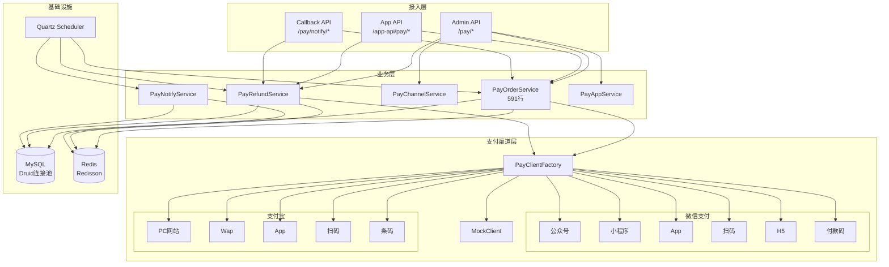
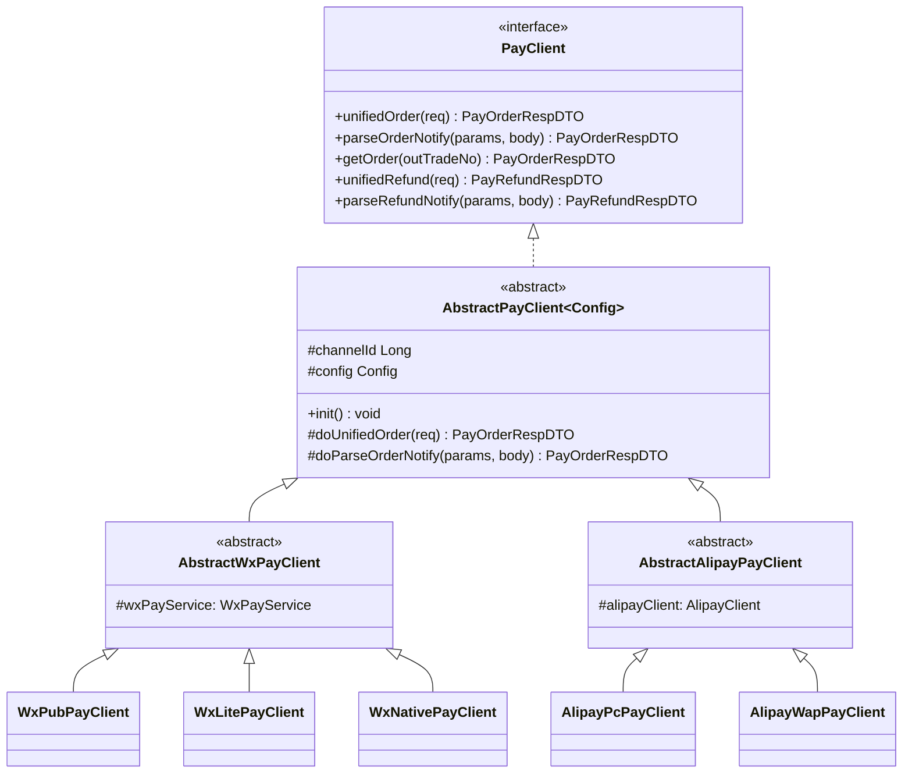
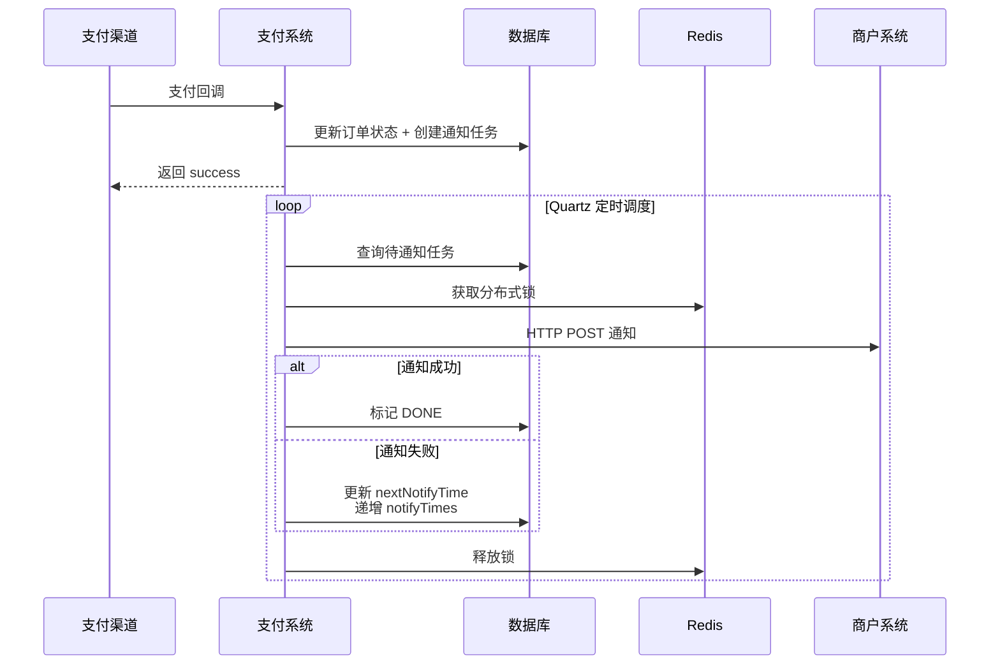
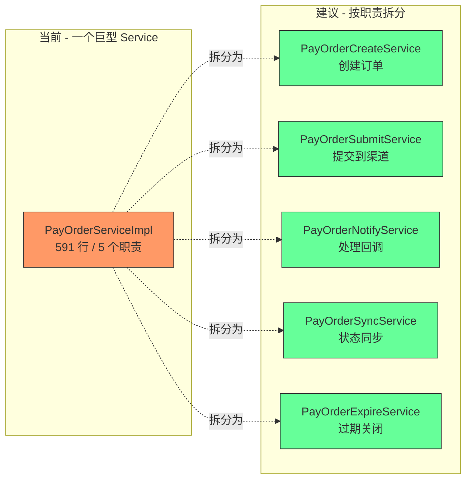
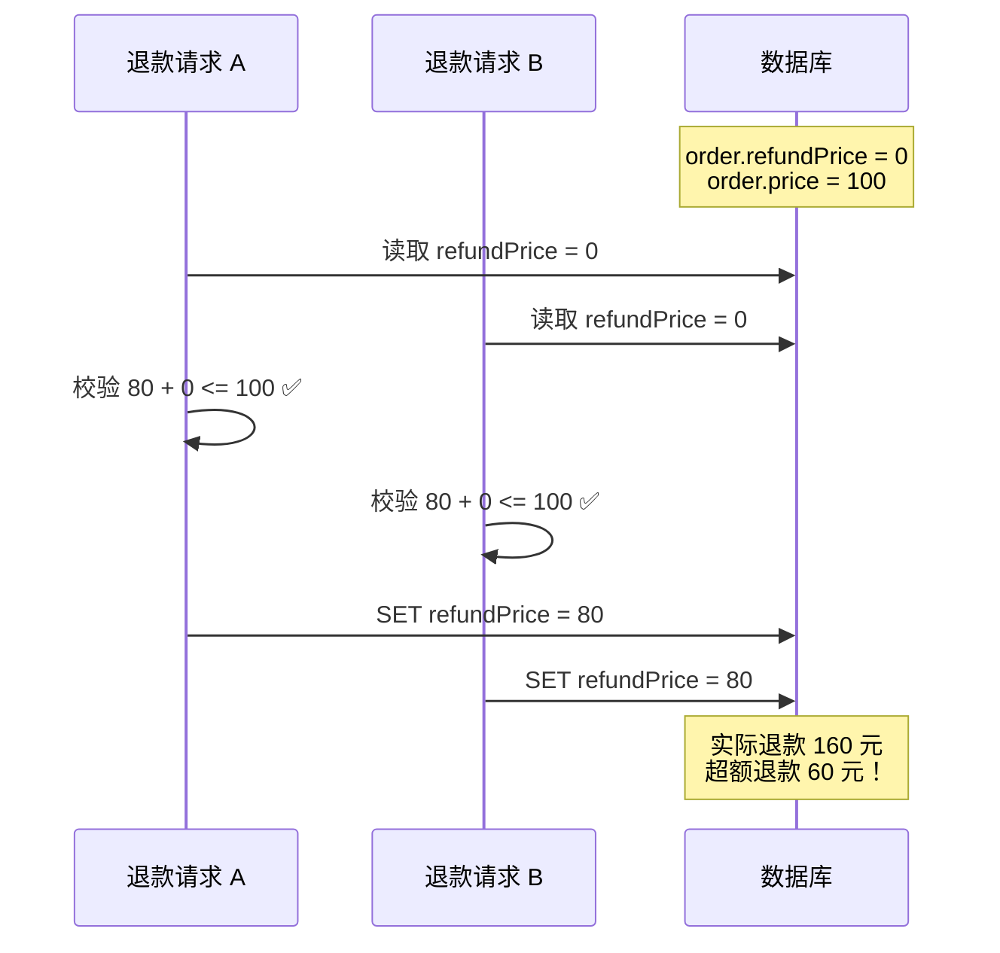
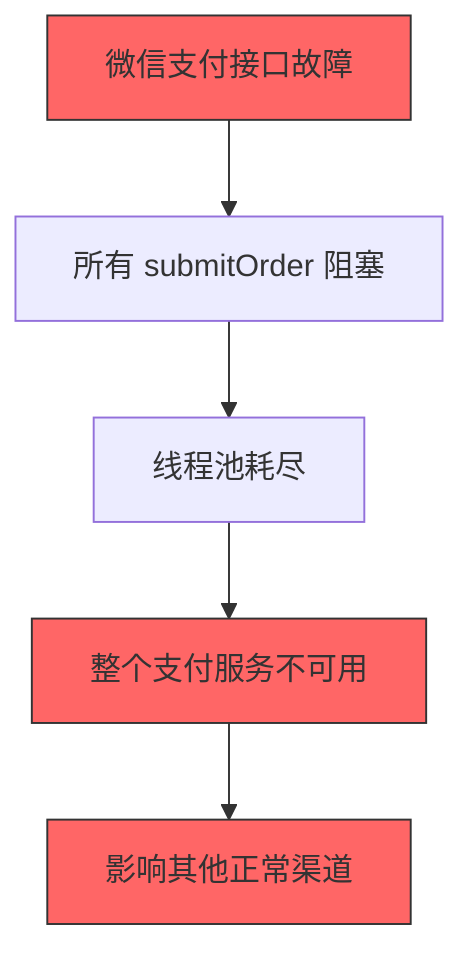
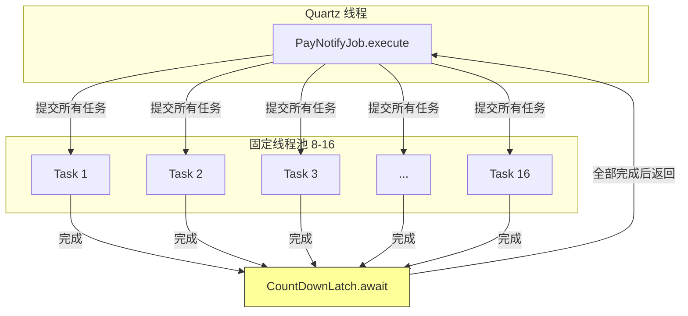
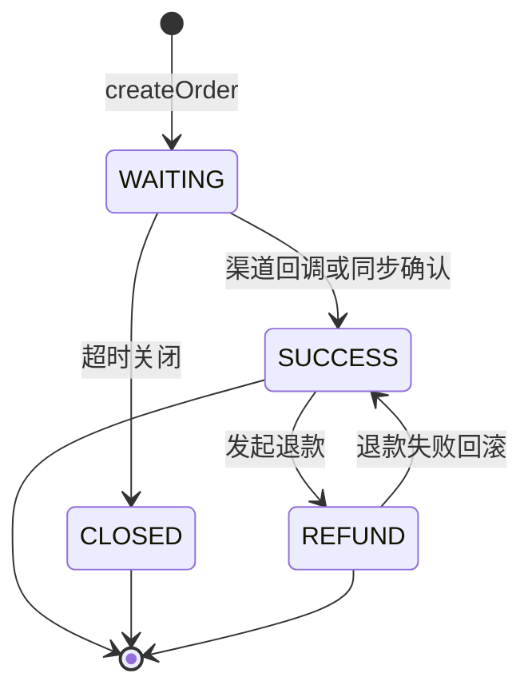
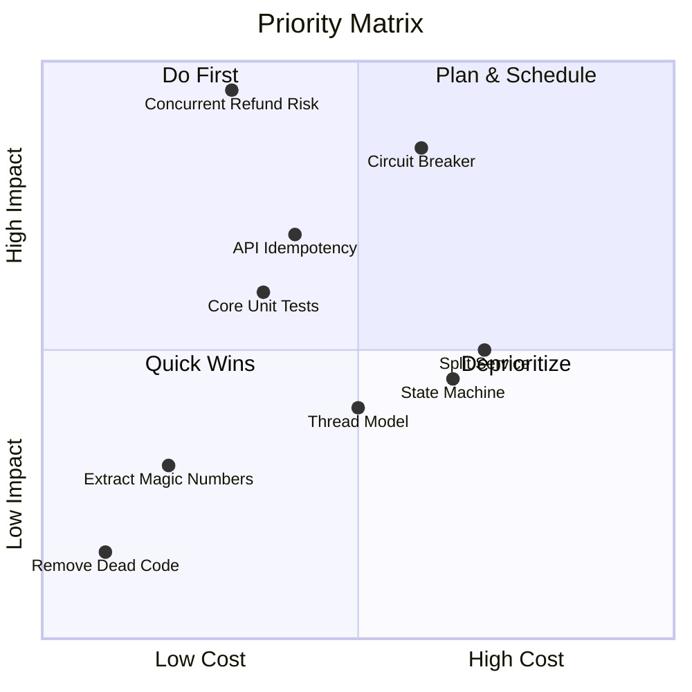

# wilddata-module-pay 架构评审报告

> 评审日期：2026-03-26
> 评审范围：系统设计、代码架构、可靠性、可扩展性、安全性

---

## 一、系统架构总览



---

## 二、核心优点（做得好的地方）

### 2.1 策略模式封装支付渠道



**评价：** 经典的策略 + 模板方法组合，新增支付渠道只需三步：加枚举、写 Config、写 Client。抽象层设计干净，12 个渠道实现统一收口，这是整个项目最出色的设计。

### 2.2 异步通知的可靠性设计



**评价：** 通知系统有完整的重试机制（9 次、跨 5 小时）、分布式锁防重复、审计日志全程记录。这是支付系统的核心保障，做得扎实。

### 2.3 订单号生成的巧妙设计

利用 Redis INCR 原子自增 + 时间前缀，保证全局唯一且有序：
- 格式：`{前缀}{yyyyMMddHHmmss}{序列号}`
- 示例：`WDO20241115143001`
- Key 设 1 分钟过期，自动回收

### 2.4 事务控制的精准拿捏

`submitOrder()` 故意不加 `@Transactional`，原因是：即使渠道调用失败，也要保留 `PayOrderExtensionDO` 记录（记录失败原因）。这是对支付场景深度理解后的设计取舍，值得肯定。

---

## 三、关键问题与改进建议

### 3.1 PayOrderServiceImpl 严重违反单一职责（严重）

**现状：** 591 行，承担了订单创建、提交、回调处理、状态同步、过期关闭 5 个职责。



**风险：** 任何修改都可能引发意想不到的副作用。多人协作时必然产生合并冲突。

**建议：** 按上图拆分为 5 个 Service，通过一个 Facade 聚合对外暴露。

---

### 3.2 并发退款存在超额风险（严重）

**现状：**

```java
// PayRefundServiceImpl 中的逻辑
if (refundPrice + order.getRefundPrice() > order.getPrice()) {
    throw exception(REFUND_PRICE_EXCEED);
}
// 然后更新 order.refundPrice
```

**问题：** 两个并发退款请求可以同时通过校验，各自加上退款金额后超额。



**建议：**
1. **最优方案：** 使用乐观锁 `UPDATE pay_order SET refund_price = refund_price + ? WHERE id = ? AND refund_price + ? <= price`
2. **备选方案：** 基于 orderId 的 Redisson 分布式锁

---

### 3.3 缺少熔断机制（严重）

**现状：** 支付渠道调用无任何保护，如果微信支付接口超时/宕机：



**建议：** 引入 Resilience4j：

```java
@CircuitBreaker(name = "wxpay", fallbackMethod = "fallback")
@TimeLimiter(name = "wxpay")
protected PayOrderRespDTO doUnifiedOrder(PayOrderUnifiedReqDTO req) {
    // ...
}
```

- 每个渠道独立熔断，互不影响
- 快速失败优于长时间等待
- 半开状态自动探测恢复

---

### 3.4 PayClientFactory 的反射实例化缺乏类型安全（中等）

**现状：**

```java
ReflectUtil.newInstance(payClientClass, channelId, config);
```

**问题：** 构造器参数顺序变化、类型变化、缺少构造器都会在运行时才暴露。

**建议：** 改用显式注册 + 函数式工厂：

```java
// 类型安全的工厂方法注册
private final Map<PayChannelEnum, BiFunction<Long, PayClientConfig, AbstractPayClient<?>>> creators
    = new EnumMap<>(PayChannelEnum.class);

public void registerPayClientClass(PayChannelEnum channel,
        BiFunction<Long, PayClientConfig, AbstractPayClient<?>> creator) {
    creators.put(channel, creator);
}

// 注册时
registerPayClientClass(WX_PUB, WxPubPayClient::new);

// 创建时 — 编译期检查构造器签名
AbstractPayClient<?> client = creators.get(channel).apply(channelId, config);
```

---

### 3.5 魔法数字散落各处（中等）

| 位置 | 魔法数字 | 含义 |
|------|----------|------|
| PayNotifyServiceImpl | `120 * 1000` | 通知超时 120 秒 |
| PayNotifyServiceImpl | `8, 16, 100` | 线程池核心/最大/队列 |
| PayOrderSyncJob | `10` | 同步最近 10 分钟的订单 |
| PayNotifyTaskDO | `{15, 15, 30, 180, ...}` | 重试间隔数组 |
| PayChannelServiceImpl | `10, SECONDS` | 客户端缓存 TTL |

**建议：** 统一收敛到配置类或 `application.yml`：

```yaml
wilddata-pay:
  notify:
    timeout-seconds: 120
    pool-core-size: 8
    pool-max-size: 16
    pool-queue-capacity: 100
    retry-intervals: [15, 15, 30, 180, 1800, 1800, 1800, 3600]
  sync:
    lookback-minutes: 10
  channel:
    cache-ttl-seconds: 10
```

---

### 3.6 通知系统的线程模型存在瓶颈（中等）

**现状：**



**问题：**
1. 线程池固定 16 线程，无法根据负载动态调整
2. `CountDownLatch.await()` 阻塞 Quartz 线程直到所有通知完成
3. 一个慢商户（120 秒超时）会拖慢整批通知
4. `CallerRunsPolicy` 可能让 Quartz 线程直接执行通知，阻塞调度器

**建议：**
- 改用 `CompletableFuture.allOf()` + 超时控制
- 或直接使用 Java 21 虚拟线程：`Executors.newVirtualThreadPerTaskExecutor()`
- 项目已经用了 Java 21，不用白不用

---

### 3.7 缺少 API 幂等性保障（中等）

**现状：** App 端 `submitOrder` 没有幂等 Key 机制。用户网络抖动重复提交会创建多个 Extension 记录。

**建议：** 在请求头中加入 `X-Idempotency-Key`，基于 Redis SETNX 实现：

```java
@PostMapping("/submit")
public CommonResult<PayOrderSubmitRespVO> submit(
        @RequestHeader("X-Idempotency-Key") String idempotencyKey,
        @RequestBody PayOrderSubmitReqVO req) {
    // Redis SETNX idempotency:{key} -> result, TTL 24h
}
```

---

### 3.8 未完成的功能残留在主干（低）

| 残留代码 | 状态 |
|----------|------|
| `TenantUtils.execute()` TODO | 多租户支持未实现 |
| Transfer 相关方法 | PayClient 有接口定义，业务层空实现 |
| `PayWalletBizTypeEnum` | 钱包功能枚举存在，服务层无实现 |

**建议：** 未完成的功能要么删除、要么用 `@Deprecated` 标记并加 Issue 跟踪。主干代码中的 TODO 是技术债的温床。

---

### 3.9 缺少测试（低但影响长远）

**现状：** 项目无任何测试代码。对于支付系统，这是一个定时炸弹。

**建议优先级：**


最低要求：退款金额计算、订单状态流转、通知重试逻辑这三个场景必须有测试覆盖。

---

## 四、订单状态机缺少显式定义

**现状：** 状态流转散落在 Service 的 if/else 中，没有统一的状态机定义。



**建议：** 引入 Spring Statemachine 或自建轻量级状态机，将状态流转规则集中管理：

```java
public enum PayOrderEvent {
    SUBMIT, CHANNEL_SUCCESS, CHANNEL_FAIL, EXPIRE, REFUND_REQUEST, REFUND_COMPLETE
}

// 非法流转在编译期/启动期就能发现，而不是等到线上出事
```

---

## 五、安全相关

| 风险项 | 现状 | 建议 |
|--------|------|------|
| 回调验签 | 依赖 SDK 内部实现，未显式校验 | 在 Controller 层增加签名校验日志 |
| 金额篡改 | 回调金额未与订单金额交叉验证 | `notifyOrder` 中增加金额一致性校验 |
| 加密密钥 | `encryptor.password` 硬编码在 yaml | 迁移到环境变量或 Vault |
| 限流 | 无 | 至少对 `/app-api/pay/order/submit` 加限流 |

---

## 六、改进优先级矩阵



---

## 七、总结

| 维度 | 评分 | 说明 |
|------|------|------|
| **架构设计** | 8/10 | 策略模式 + 模板方法组合优秀，分层清晰 |
| **可靠性** | 6/10 | 通知重试完善，但并发退款有超额风险，无熔断 |
| **可维护性** | 5/10 | Service 过大，魔法数字多，无测试 |
| **可扩展性** | 7/10 | 新增渠道非常方便，但核心流程扩展需要改 Service |
| **安全性** | 6/10 | 基本面有，细节（金额校验、限流）缺失 |
| **代码质量** | 6/10 | 核心逻辑可读，但 TODO 残留、反射使用不够安全 |

**一句话总结：** 这是一个架构骨架设计精良的支付系统（策略模式、异步通知、分布式锁），但在"最后一公里"的工程细节上存在明显短板——并发退款无保护、无熔断、无测试、Service 臃肿。好消息是这些问题的修复成本不高，建议按优先级矩阵逐步推进。
