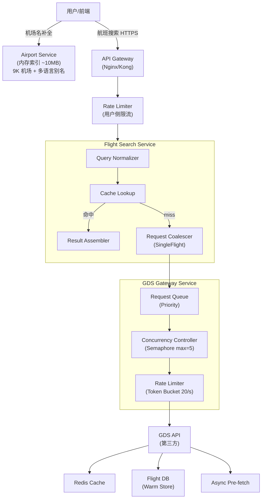
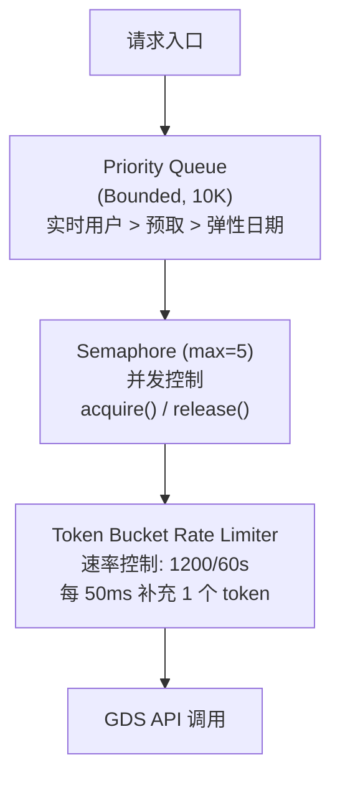
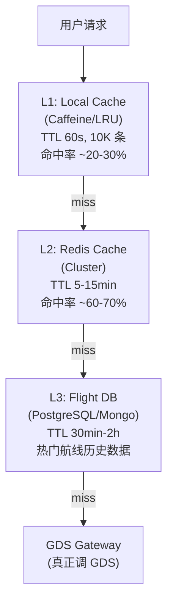
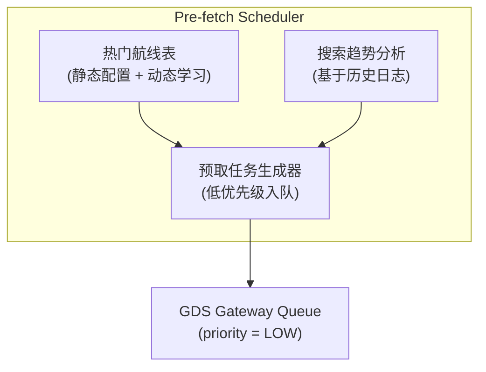
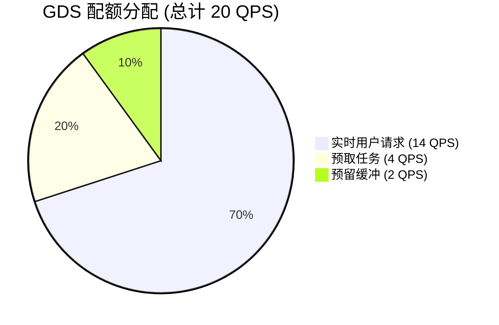
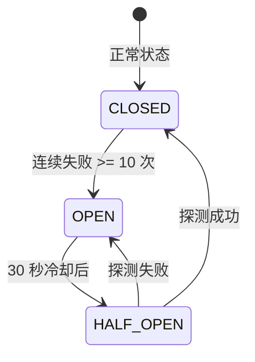
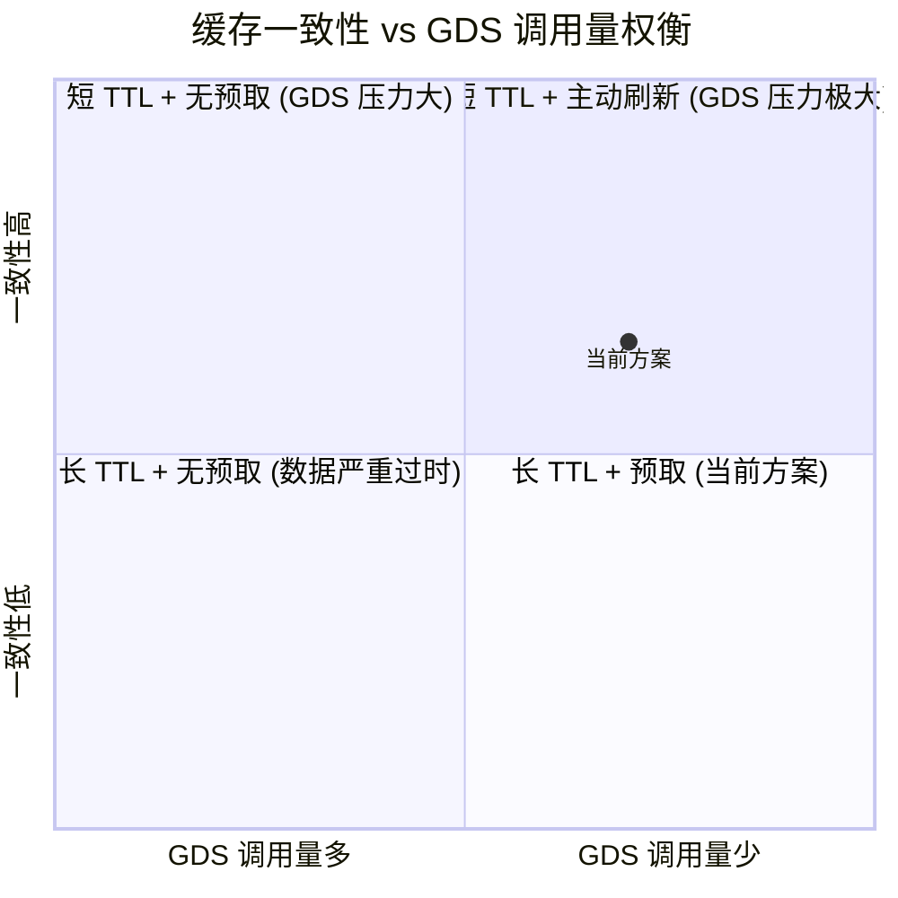
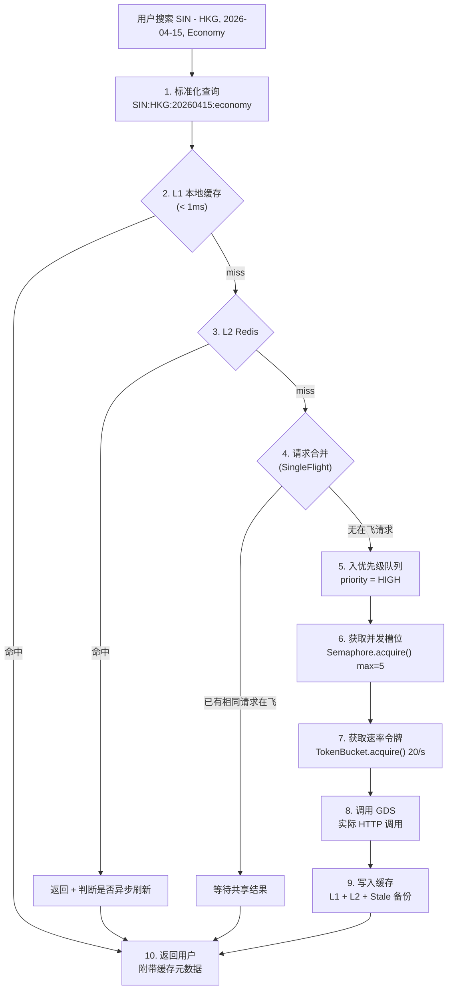

# 航班状态查询系统设计

## 题目描述

设计一个航班状态查询系统，用户可查询任意始发机场的航班状态。

**输入参数**：起始机场、目标机场、出发日期、座位舱位

**核心约束**：
- 数据源来自第三方 GDS（Global Distribution System）
- GDS 并发限制：最多同时 **5 个并发请求**
- GDS 速率限制：每 **60 秒最多 1200 次请求**（即 20 QPS）

---

## 第一步：需求澄清

### 功能性需求

| 需求 | 描述 |
|------|------|
| 航班查询 | 用户输入起始机场 + 目标机场 + 日期 + 舱位，返回匹配航班列表 |
| 机场搜索 | 用户可通过城市名/机场名（多语言）模糊搜索机场，自动补全并映射到 IATA 代码 |
| 航班详情 | 每条航班包含：航班号、起降时间、价格、剩余座位、中转信息 |
| 模糊日期 | 支持 +/- 3 天的弹性日期搜索（可选） |
| 排序/过滤 | 按价格、时长、中转次数排序 |

### 非功能性需求

| 指标 | 目标 |
|------|------|
| 延迟 | P95 < 3 秒（缓存命中），P95 < 10 秒（缓存未命中） |
| 可用性 | 99.9%（即使 GDS 短暂不可用也要有降级方案） |
| 数据新鲜度 | 航班数据最多延迟 5-15 分钟可接受（价格/座位在确认出票前实时校验） |
| 吞吐量 | 假设高峰期 500-1000 QPS 用户请求 |
| 一致性 | 最终一致性（查询阶段）；强一致性（出票阶段，不在本次范围内） |

### 核心挑战

用户请求吞吐量（500-1000 QPS）远超 GDS 限制（20 QPS、5 并发）。**供需比约 50:1**，这是整个系统设计的核心矛盾。

---

## 第二步：高层架构



### API 设计

```
GET /api/v1/flights/search
  ?origin=SIN
  &destination=HKG
  &date=2026-04-15
  &cabin=economy
  &flexible_dates=false

Response:
{
  "data": {
    "flights": [...],
    "cached": true,
    "cache_age_seconds": 120,
    "total": 42
  },
  "meta": {
    "search_id": "uuid",
    "response_time_ms": 230
  }
}
```

---

## 第三步：核心组件深入设计

### 3.0 Airport Resolution Service — 机场本地化查询

#### 为什么需要这个组件？

GDS 只接受标准 IATA 三字码（如 `SIN`、`HKG`），但用户输入是多样的：

| 用户输入 | 期望匹配 | IATA 代码 |
|---------|---------|-----------|
| 新加坡 | Singapore Changi Airport | SIN |
| changi | Singapore Changi Airport | SIN |
| 樟宜机场 | Singapore Changi Airport | SIN |
| singapore | Singapore Changi Airport | SIN |
| 东京 | NRT (成田) + HND (羽田) | NRT, HND |
| HKG | Hong Kong International | HKG |

这个转换**绝对不能消耗 GDS 配额**，必须本地化解决。

#### 方案选型：Elasticsearch vs PostgreSQL Full-Text vs 内存

| 方案 | 优点 | 缺点 | 适用场景 |
|------|------|------|---------|
| **Elasticsearch** | 模糊搜索强大、多语言分词、拼写纠错、自动补全天然支持 | 运维成本高、引入新组件 | 数据量大、搜索需求复杂 |
| **PostgreSQL + pg_trgm** | 不增加组件、trigram 索引支持模糊匹配 | 多语言分词弱、补全体验一般 | 已有 PG，搜索需求简单 |
| **内存 Trie + 倒排索引** | 极快（< 1ms）、零外部依赖 | 多语言处理需自己实现 | 数据量小（< 10K） |

**推荐方案**：对于机场数据（~9000 条），**内存方案优先，Elasticsearch 作为增强选项**。

理由：
- 数据量极小（9000 个机场，含多语言别名约 50K 条记录），全部加载到内存不到 10MB
- 机场数据几乎是静态的，每年变更极少
- 搜索延迟要求高（用户输入时实时补全），内存方案 < 1ms
- 引入 Elasticsearch 仅为 9000 条数据是过度设计

> **面试加分点**：如果系统还需要搜索酒店（数百万）、景点等，Elasticsearch 就值得引入，机场搜索可以搭便车。**架构决策取决于系统整体，而非单一模块。**

#### 数据模型

```sql
-- 机场主表
CREATE TABLE airports (
    iata_code   CHAR(3) PRIMARY KEY,      -- SIN, HKG, NRT
    icao_code   CHAR(4),                  -- WSSS, VHHH, RJAA
    city_code   CHAR(3),                  -- 城市代码（东京 TYO 对应 NRT + HND）
    latitude    DECIMAL(9,6),
    longitude   DECIMAL(9,6),
    timezone    VARCHAR(40),              -- Asia/Singapore
    country     CHAR(2),                  -- SG, HK, JP
    is_active   BOOLEAN DEFAULT TRUE
);

-- 多语言名称表（支持搜索）
CREATE TABLE airport_names (
    id          SERIAL PRIMARY KEY,
    iata_code   CHAR(3) REFERENCES airports(iata_code),
    locale      VARCHAR(5) NOT NULL,       -- en, zh, ja, ko, th, ms
    name_type   VARCHAR(20) NOT NULL,      -- city, airport, alias, colloquial
    name        VARCHAR(200) NOT NULL,
    name_ascii  VARCHAR(200),              -- ASCII 转写，方便无音调搜索
    priority    INT DEFAULT 0,             -- 同机场多个名称的排序权重

    INDEX idx_name_search (name),
    INDEX idx_locale (locale, name)
);

-- 示例数据
-- iata=SIN, locale=en, type=airport, name="Singapore Changi Airport"
-- iata=SIN, locale=en, type=city,    name="Singapore"
-- iata=SIN, locale=zh, type=airport, name="新加坡樟宜机场"
-- iata=SIN, locale=zh, type=city,    name="新加坡"
-- iata=SIN, locale=en, type=alias,   name="Changi"
-- iata=NRT, locale=zh, type=alias,   name="东京成田"
-- iata=HND, locale=zh, type=alias,   name="东京羽田"
```

#### 内存搜索引擎实现

```python
class AirportSearchEngine:
    """
    启动时加载全部机场数据到内存，构建多种索引。
    数据来源：OpenFlights 或 IATA 官方数据，每月同步一次即可。
    """

    def __init__(self):
        self.by_iata: Dict[str, Airport] = {}          # 精确匹配
        self.trie: Trie = Trie()                        # 前缀匹配（自动补全）
        self.inverted: Dict[str, Set[str]] = {}         # 倒排索引（分词后）
        self.city_to_airports: Dict[str, List[str]] = {} # 城市→机场映射

    def load(self, airports: List[Airport], names: List[AirportName]):
        for airport in airports:
            self.by_iata[airport.iata_code] = airport

        for name in names:
            # 1. 原文插入 Trie
            self.trie.insert(name.name.lower(), name.iata_code)

            # 2. ASCII 转写也插入（"樟宜" → "zhangyi"）
            if name.name_ascii:
                self.trie.insert(name.name_ascii.lower(), name.iata_code)

            # 3. 分词后构建倒排索引
            tokens = self._tokenize(name.name)
            for token in tokens:
                self.inverted.setdefault(token, set()).add(name.iata_code)

    def search(self, query: str, locale: str = "en", limit: int = 10) -> List[AirportResult]:
        query = query.strip().lower()

        # 1. 精确匹配 IATA 代码（用户直接输入 SIN/HKG）
        if len(query) == 3 and query.upper() in self.by_iata:
            return [self.by_iata[query.upper()]]

        # 2. 前缀匹配（自动补全场景）
        prefix_results = self.trie.search_prefix(query)

        # 3. 倒排索引匹配（关键词搜索，如 "东京 成田"）
        tokens = self._tokenize(query)
        if len(tokens) > 1:
            sets = [self.inverted.get(t, set()) for t in tokens]
            inverted_results = set.intersection(*sets) if sets else set()
        else:
            inverted_results = self.inverted.get(tokens[0], set()) if tokens else set()

        # 4. 合并 + 排序（按热度、locale 匹配度）
        combined = self._merge_and_rank(prefix_results, inverted_results, locale)
        return combined[:limit]

    def _tokenize(self, text: str) -> List[str]:
        """多语言分词：英文按空格，中文按字/词"""
        # 简单实现：英文空格分词 + 中文按字符 bigram
        # 生产环境可用 ICU tokenizer
        ...
```

#### 前端自动补全交互

```
用户输入: "sing"
    │
    ▼  debounce 200ms
GET /api/v1/airports/suggest?q=sing&locale=zh&limit=5
    │
    ▼
响应:
[
  { "iata": "SIN", "name": "Singapore Changi Airport",
    "city": "新加坡", "country": "SG", "highlight": "<b>Sing</b>apore" },
  { "iata": "SIA", "name": "Siangshan",
    "city": "...", "country": "TW", "highlight": "<b>Si</b>ang..." }
]
```

**设计要点**：
- 前端 debounce 200ms，避免每次按键都请求
- 返回高亮字段，前端直接渲染
- 用户选择后，前端持有 IATA 代码，后续航班查询直接传代码

#### 数据更新策略

```
频率：每月一次（机场数据极少变化）
来源：IATA 官方数据 / OpenFlights 开源数据集
方式：
  1. 下载最新机场数据
  2. Diff 对比，只更新变更项
  3. 写入 DB + 通知服务重新加载内存索引
  4. 无需停机（原子替换内存索引引用）
```

---

### 3.1 GDS Gateway — 限流与并发控制（最关键组件）

这是整个系统的**瓶颈咽喉**，必须精确控制。

#### 双重限流机制



#### 伪代码实现

```python
class GDSGateway:
    def __init__(self):
        self.semaphore = asyncio.Semaphore(5)          # 并发上限
        self.rate_limiter = TokenBucket(
            capacity=1200,
            refill_rate=20,        # 每秒补充 20 个 token
            window=60              # 60 秒窗口
        )
        self.queue = PriorityQueue(maxsize=10000)
        self.circuit_breaker = CircuitBreaker(
            failure_threshold=10,
            recovery_timeout=30
        )

    async def call_gds(self, request: GDSRequest) -> GDSResponse:
        # 1. 熔断检查
        if self.circuit_breaker.is_open():
            raise GDSUnavailableError("Circuit breaker open")

        # 2. 入队等待
        await self.queue.put((request.priority, request))

        # 3. 获取并发槽位
        async with self.semaphore:
            # 4. 获取速率 token
            await self.rate_limiter.acquire()

            # 5. 实际调用
            try:
                response = await self._do_call(request)
                self.circuit_breaker.record_success()
                return response
            except Exception as e:
                self.circuit_breaker.record_failure()
                raise
```

#### Token Bucket 实现细节

```python
class TokenBucket:
    """
    为什么选择 Token Bucket 而非 Sliding Window？

    Token Bucket 优势：
    - 允许短时间突发（消耗积累的 token）
    - 实现简单，性能好
    - 天然平滑流量

    Sliding Window 劣势：
    - 需要记录每个请求的时间戳
    - 内存开销更大
    - 边界情况处理复杂
    """

    def __init__(self, capacity: int, refill_rate: float):
        self.capacity = capacity        # 1200
        self.tokens = capacity
        self.refill_rate = refill_rate  # 20/s
        self.last_refill = time.monotonic()
        self.lock = asyncio.Lock()

    async def acquire(self, timeout: float = 30.0):
        deadline = time.monotonic() + timeout
        while True:
            async with self.lock:
                self._refill()
                if self.tokens >= 1:
                    self.tokens -= 1
                    return True

            if time.monotonic() >= deadline:
                raise TimeoutError("Rate limit queue timeout")

            # 计算下一个 token 到达时间
            wait_time = 1.0 / self.refill_rate  # 50ms
            await asyncio.sleep(wait_time)

    def _refill(self):
        now = time.monotonic()
        elapsed = now - self.last_refill
        new_tokens = elapsed * self.refill_rate
        self.tokens = min(self.capacity, self.tokens + new_tokens)
        self.last_refill = now
```

#### 为什么用 Semaphore + Token Bucket 双重控制？

| 只用 Semaphore | 只用 Token Bucket | 双重控制 |
|---|---|---|
| 控制并发但不控速率 | 控制速率但不控并发 | 同时满足两个约束 |
| 5 个请求可能在 1ms 内全部发出 | 可能瞬间发出 20 个并发请求 | 既不超并发也不超速率 |
| 违反 1200/60s 限制 | 违反 5 并发限制 | 精确遵守 GDS 约束 |

---

### 3.2 多级缓存策略

缓存是解决 50:1 供需矛盾的**核心武器**。



#### 缓存 Key 设计

```
flight:search:{origin}:{destination}:{date}:{cabin}
例: flight:search:SIN:HKG:20260415:economy
```

**关键设计决策：Query Normalization**

```python
def normalize_query(origin, destination, date, cabin):
    """
    将用户查询标准化，最大化缓存命中率。

    - 机场代码统一大写
    - 日期统一 YYYYMMDD
    - 舱位统一小写
    - 不包含用户偏好（排序、过滤在查询后处理）
    """
    return f"flight:search:{origin.upper()}:{destination.upper()}" \
           f":{date.strftime('%Y%m%d')}:{cabin.lower()}"
```

#### 缓存 TTL 策略（按场景区分）

| 数据类型 | TTL | 原因 |
|---------|-----|------|
| 航班时刻表（静态） | 24 小时 | 班次基本不变 |
| 价格信息 | 5-15 分钟 | 价格波动较频繁 |
| 座位可用性 | 3-5 分钟 | 座位变化最快 |
| 热门航线搜索结果 | 10 分钟 | 平衡新鲜度与命中率 |
| 冷门航线搜索结果 | 15-30 分钟 | 变化少，延长缓存减少 GDS 调用 |

#### 缓存更新策略：Stale-While-Revalidate

```python
async def search_flights(query: NormalizedQuery):
    cache_key = query.cache_key()
    cached = await redis.get(cache_key)

    if cached:
        result = deserialize(cached)
        age = time.now() - result.cached_at

        if age < result.ttl:
            # 新鲜数据，直接返回
            return result.with_metadata(cached=True, age=age)

        if age < result.ttl * 2:
            # 数据过期但在宽限期内：
            # 先返回旧数据，后台异步刷新
            asyncio.create_task(refresh_cache(query))
            return result.with_metadata(cached=True, stale=True, age=age)

    # 缓存完全没有或已过宽限期：走 GDS
    return await fetch_from_gds(query)
```

**为什么用 Stale-While-Revalidate？**

- 用户不用等 GDS 响应（可能 3-8 秒），直接拿到结果
- 航班数据延迟几分钟通常可接受（出票时会实时验证）
- 大幅降低 GDS 调用量

---

### 3.3 Request Coalescing（请求合并）

当缓存未命中时，多个相同查询不应各自独立调用 GDS。

```
时间线:

t=0ms   用户A 查询 SIN→HKG 4/15 经济舱 → 缓存 miss
t=5ms   用户B 查询 SIN→HKG 4/15 经济舱 → 缓存 miss
t=10ms  用户C 查询 SIN→HKG 4/15 经济舱 → 缓存 miss

没有 Coalescing:
  → 3 次 GDS 调用（浪费 2 次配额）

有 Coalescing:
  → 1 次 GDS 调用，3 个用户共享结果
```

#### 实现方式：SingleFlight 模式

```python
class RequestCoalescer:
    """
    灵感来源：Go 的 singleflight 包。
    相同 key 的并发请求只执行一次，其他请求等待并共享结果。
    """

    def __init__(self):
        self.in_flight: Dict[str, asyncio.Future] = {}
        self.lock = asyncio.Lock()

    async def do(self, key: str, fn: Callable) -> Any:
        async with self.lock:
            if key in self.in_flight:
                # 已有相同请求在执行，等待其结果
                return await self.in_flight[key]

            future = asyncio.get_event_loop().create_future()
            self.in_flight[key] = future

        try:
            result = await fn()
            future.set_result(result)
            return result
        except Exception as e:
            future.set_exception(e)
            raise
        finally:
            async with self.lock:
                del self.in_flight[key]

# 使用
coalescer = RequestCoalescer()

async def search_with_coalescing(query):
    cache_key = query.cache_key()
    return await coalescer.do(
        cache_key,
        lambda: gds_gateway.call_gds(query)
    )
```

---

### 3.4 智能预取（Pre-fetching）

主动预取热门数据，进一步降低 GDS 实时调用压力。



#### 预取策略

```python
class PreFetchScheduler:
    """
    预取策略分三层：

    1. 静态热门航线：SIN-HKG, SIN-BKK, SIN-KUL 等
       → 每 10 分钟刷新一次

    2. 动态热门航线：基于过去 1 小时的搜索日志
       → 搜索次数 Top 50 的 origin-destination-date 组合

    3. 即将出发：未来 24-72 小时的已缓存航线
       → 缩短 TTL，更频繁刷新（数据变化更快）
    """

    def generate_prefetch_tasks(self):
        tasks = []

        # 1. 静态热门航线（最高预取优先级）
        for route in self.hot_routes:
            for date in self.next_n_days(30):
                for cabin in ['economy', 'business']:
                    tasks.append(PrefetchTask(
                        route=route, date=date, cabin=cabin,
                        priority=PrefetchPriority.HIGH
                    ))

        # 2. 动态热门（基于搜索日志）
        trending = self.analyze_search_logs(window='1h', top_k=50)
        for query in trending:
            tasks.append(PrefetchTask(
                query=query,
                priority=PrefetchPriority.MEDIUM
            ))

        return tasks
```

#### GDS 配额分配策略



**动态调整**：高峰期实时请求可占用预取配额（弹性分配），低峰期预取占比提高到 40-50%。

---

### 3.5 降级与熔断



#### 降级方案层级

```python
async def search_with_fallback(query):
    try:
        # Level 0: 正常流程（缓存 + GDS）
        return await normal_search(query)
    except GDSUnavailableError:
        pass

    # Level 1: 返回过期缓存数据（标注为可能过时）
    stale = await redis.get(f"stale:{query.cache_key()}")
    if stale:
        return FlightResult(
            flights=stale.flights,
            warning="数据可能已过时，价格和座位仅供参考",
            stale=True,
            stale_age=stale.age
        )

    # Level 2: 返回历史统计数据
    historical = await db.get_historical_flights(query)
    if historical:
        return FlightResult(
            flights=historical,
            warning="当前显示历史航班数据，实际信息请以预订时为准",
            approximate=True
        )

    # Level 3: 返回空结果 + 引导
    return FlightResult(
        flights=[],
        message="航班查询服务暂时不可用，请稍后重试",
        retry_after=30
    )
```

---

### 3.6 数据模型

```sql
-- 航班搜索缓存（热数据）
CREATE TABLE flight_cache (
    cache_key       VARCHAR(128) PRIMARY KEY,
    origin          CHAR(3) NOT NULL,        -- IATA 机场代码
    destination     CHAR(3) NOT NULL,
    departure_date  DATE NOT NULL,
    cabin_class     VARCHAR(16) NOT NULL,
    response_data   JSONB NOT NULL,          -- GDS 原始响应
    fetched_at      TIMESTAMP NOT NULL,
    expires_at      TIMESTAMP NOT NULL,
    hit_count       INT DEFAULT 0,

    INDEX idx_route_date (origin, destination, departure_date),
    INDEX idx_expires (expires_at)
);

-- 搜索日志（用于预取策略分析）
CREATE TABLE search_logs (
    id              BIGSERIAL PRIMARY KEY,
    origin          CHAR(3) NOT NULL,
    destination     CHAR(3) NOT NULL,
    departure_date  DATE NOT NULL,
    cabin_class     VARCHAR(16),
    searched_at     TIMESTAMP DEFAULT NOW(),
    cache_hit       BOOLEAN NOT NULL,
    response_time   INT,                     -- ms

    INDEX idx_searched_at (searched_at),
    INDEX idx_route (origin, destination)
);

-- 热门航线配置
CREATE TABLE hot_routes (
    id              SERIAL PRIMARY KEY,
    origin          CHAR(3) NOT NULL,
    destination     CHAR(3) NOT NULL,
    priority        INT DEFAULT 0,
    prefetch_enabled BOOLEAN DEFAULT TRUE,
    prefetch_interval_min INT DEFAULT 10,

    UNIQUE(origin, destination)
);
```

#### Redis 数据结构

```
# 搜索结果缓存
SET flight:search:SIN:HKG:20260415:economy
    <serialized FlightResult>
    EX 600  # 10 分钟

# 过期数据备份（用于降级）
SET stale:flight:search:SIN:HKG:20260415:economy
    <serialized FlightResult>
    EX 3600  # 1 小时

# 搜索频次计数（用于预取决策）
ZINCRBY search:trending:hourly <timestamp_hour> "SIN:HKG:20260415"

# GDS 速率计数（分布式限流）
INCR gds:rate:{window_id}
EXPIRE gds:rate:{window_id} 60
```

---

## 第四步：关键权衡与讨论

### 4.1 为什么不用消息队列（如 Kafka）做 GDS 请求？

| 方案 | 优点 | 缺点 |
|------|------|------|
| 同步队列（当前方案） | 延迟可控，实现简单 | 需要精确控制并发 |
| Kafka/RabbitMQ | 天然削峰填谷，持久化 | 增加延迟（消费者拉取），用户需要轮询结果，架构复杂度高 |

**选择同步方案的原因**：用户搜索航班是同步交互场景，期望在几秒内看到结果。消息队列适合异步任务（如预取），但不适合实时搜索。

> **面试加分点**：可以将预取任务放入消息队列，但实时用户请求走同步路径。两条路径共享 GDS Gateway 的限流层。

### 4.2 缓存一致性 vs 新鲜度



当前方案选择**右下象限偏上**：适中 TTL + 智能预取 + Stale-While-Revalidate，在数据新鲜度和 GDS 压力之间取得平衡。

### 4.3 单实例 vs 分布式 GDS Gateway

| 场景 | 方案 |
|------|------|
| 单体部署 | 进程内 Semaphore + TokenBucket，简单可靠 |
| 多实例部署 | Redis 分布式锁 + Lua 脚本实现分布式限流 |

```python
# 分布式限流 Lua 脚本
RATE_LIMIT_SCRIPT = """
local key = KEYS[1]
local limit = tonumber(ARGV[1])
local window = tonumber(ARGV[2])

local current = tonumber(redis.call('GET', key) or '0')
if current >= limit then
    return 0  -- 拒绝
end

redis.call('INCR', key)
if current == 0 then
    redis.call('EXPIRE', key, window)
end
return 1  -- 允许
"""
```

**推荐**：如果只部署 1-2 个实例，用进程内限流即可。超过 3 个实例必须切换到分布式限流（否则每个实例各自 5 并发 = 实际 15 并发，超过 GDS 限制）。

### 4.4 如果 GDS 限制更严格怎么办？（扩展讨论）

假设 GDS 限制降到 2 并发、300 QPS：

1. **更激进的缓存**：TTL 从 10 分钟提升到 30 分钟
2. **搜索引导**：前端引导用户选择热门航线（缓存命中率更高）
3. **多 GDS 接入**：同时接入 Amadeus、Sabre、Travelport，分散调用
4. **离线索引**：每天全量拉取航班时刻表，只对价格/座位做实时查询
5. **排队机制**：高峰期展示 "正在为您搜索..." 引导用户等待

### 4.5 监控与告警

```yaml
# 关键指标
metrics:
  # GDS 健康度
  - gds.request.count          # 请求总数
  - gds.request.latency_p95    # P95 延迟
  - gds.request.error_rate     # 错误率
  - gds.concurrency.current    # 当前并发数
  - gds.rate.remaining         # 剩余配额

  # 缓存效果
  - cache.hit_rate             # 缓存命中率（目标 > 80%）
  - cache.l1_hit_rate          # L1 命中率
  - cache.l2_hit_rate          # L2 命中率
  - cache.stale_serve_rate     # 过期数据服务率

  # 用户体验
  - search.latency_p50         # 搜索延迟中位数
  - search.latency_p95         # P95 延迟
  - search.timeout_rate        # 超时率
  - search.degraded_rate       # 降级响应比例

alerts:
  - name: GDS Error Rate High
    condition: gds.request.error_rate > 10%
    severity: critical

  - name: Cache Hit Rate Drop
    condition: cache.hit_rate < 60%
    severity: warning

  - name: GDS Quota Near Limit
    condition: gds.rate.remaining < 100
    severity: warning
```

---

## 总结：请求全链路流程



### 核心设计原则回顾

| 原则 | 实现 |
|------|------|
| **精确限流** | Semaphore(5) + TokenBucket(20/s) 双重控制 |
| **多级缓存** | L1(进程) → L2(Redis) → L3(DB) 逐级兜底 |
| **请求合并** | SingleFlight 模式避免重复 GDS 调用 |
| **智能预取** | 热门航线主动刷新，降低实时调用压力 |
| **优雅降级** | 熔断 → 过期缓存 → 历史数据 → 空结果引导 |
| **可观测性** | 全链路 metrics + 告警，实时掌握系统状态 |
